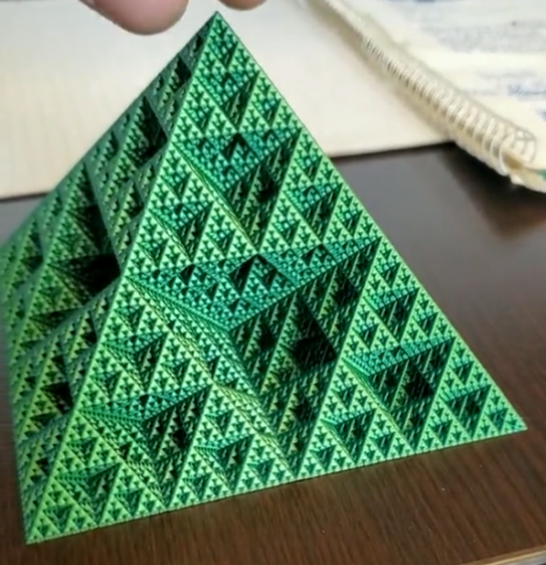

## Reference

- 1 https://twitter.com/iceslapp/status/1552690889868431363
- 2 https://www.reddit.com/r/3Dprinting/comments/w5h6q3/one_of_the_trippiest_prints_ive_done_fractal/

> I used to make these on graphing calculators and on my x386 33MHZ computer in the 90s. It’s called a Sierpinski triangle. I was memorized by them. I should print one.
>
> _Gswindle76_

## Need

- dual color PLA filament like this: https://www.amazon.ca/ERYONE-Filament-Printer-1-75mm-0-03mm/dp/B09X2VNKM9/
- 3D model https://www.thingiverse.com/thing:1356547/files

## Printing

> And I printed at 0.16mm layer height, spiralize outer contours turned on in Cura, and since my printer is upgraded I printed it at 150mm/s for speed, 1500mm/s^2 accel.
> I've upgraded my printer to use an Orbiter V2 direct drive extruder, the HeroMe Gen6 fan ducts, and I'm running Klipper, all of which allow me to print a bit faster. You can increase the max speed an acceleration in your printers configuration file for Klipper or changed in the firmware before flashing for Marlin
> _bkw_17_