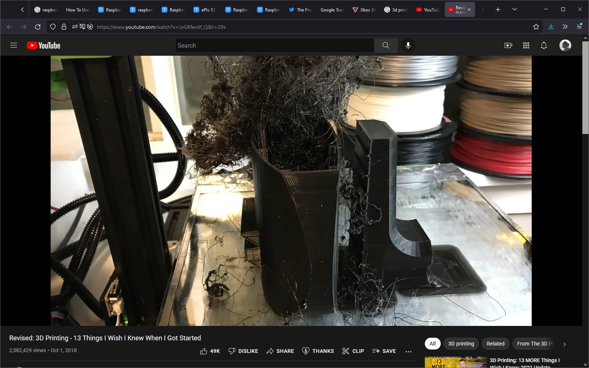
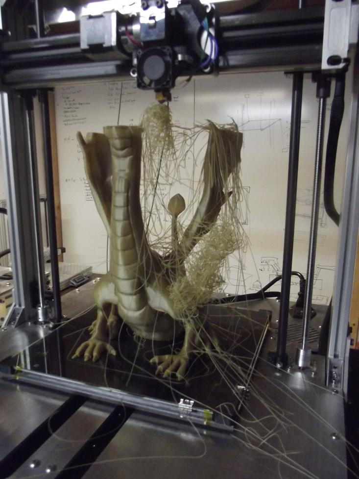
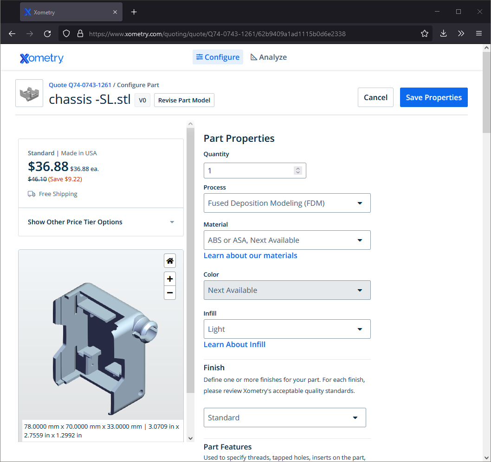

A long time ago in a far far… don't worry, the story happened in this galaxy. So, in far far pages of Wikipedia, I was reading about the RepRap project, self-replicating robots, and gray goo. "Gray goo" is a actual scientific term created by Eric Dexter.

That was the beginning of 3D printers. Every project was made of PLA. The printer is basically the frame only, no one ever thought about the enclosure. I even can try to remember the lowest price of the DYI kit.

Here is the story about it. After a few successful releases, our boss wanted to encourage our team. He defined a fund that we could spend on the office "improvements".

His idea was to buy the Xbox—that was the exact amount in the fund. $150 for Xbox 360, sounds right? But we could use the same amount for other things if we wanted to.

I don't remember why, but I searched for alternatives and found a 3D printer. The 3D printer comes disassembled, and we would spend weekends assembling it. Sounds fun, right?

But do you know what happened? The team never came to a consensus on what they wanted. Then new projects and new deadlines came, and everyone forgot about the Xbox and 3D printers.

I've read a few articles about 3D printers. The technology is so simple. The frame gives 3 axis of movement to a nozzle, and it spits melted plastic layer by layer.  But later on YouTube, I watched that 3D printing [is trickier than it seems](https://www.youtube.com/watch?v=LvGKfevdf_Q). And not be surprised if you get not satisfying results.

Besides, one should be proficient in 3D modeling and know the tools. Blender, for example.

I spent about 2 weeks creating a car model to make a birthday present for my 40-year-old brother. The car is from his favorite video game. That project was so absorbing. But somewhere along the process, when colors didn't go well, I raised my concerns to mum. She said that anything made with your hands that holds a personal meaning is more valuable than anything you can buy.

It turned out that my brother thinks the other way around. Or I don't know. He even hasn't recalled the game name. So next time, I bought him a rum bottle at the duty-free zone. He was a little happier about that.

And now, I need to print several things: a case for Raspberry Pi and Arduino, a crawler robot, and a mount for the camera. I looked for 3D printing services, I looked for 3D printer prices—I don't know if I should buy one. But even if I do, it's so scary to invest like $1000 into this and get a messy spaghetty out of filament.

## 3D printing services

Let's review a few services giving for example robot chassis that I need to print. It almost like a can, it has size 70x78x33 mm. I will be considering to print in ABS

### Xometry

### Treatstock

Another place on the same site

### Print a thing

