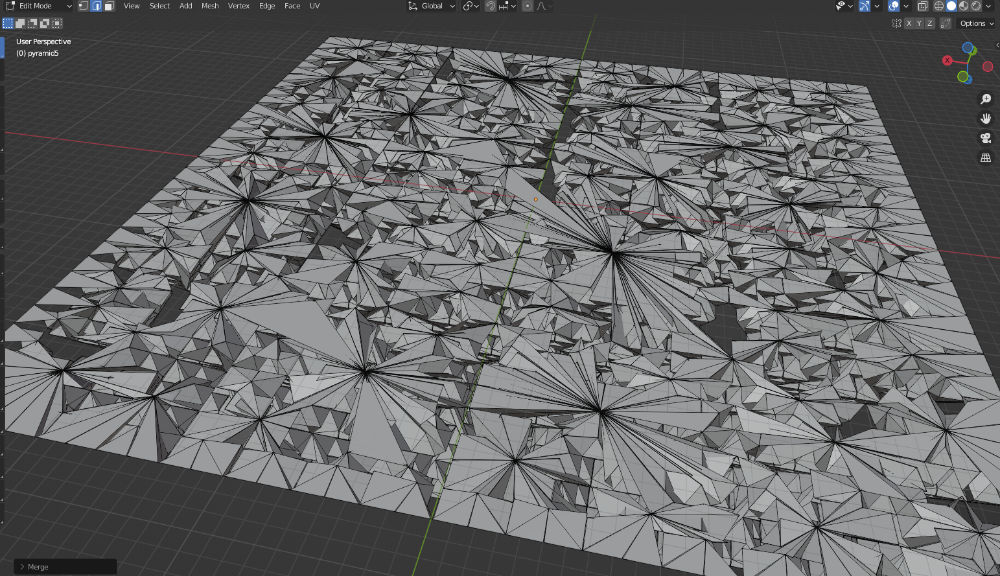
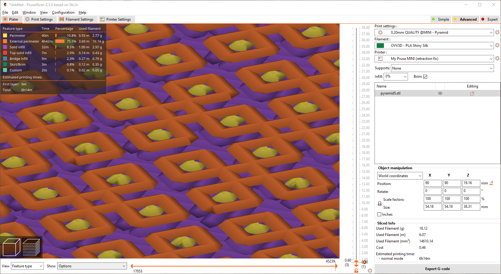
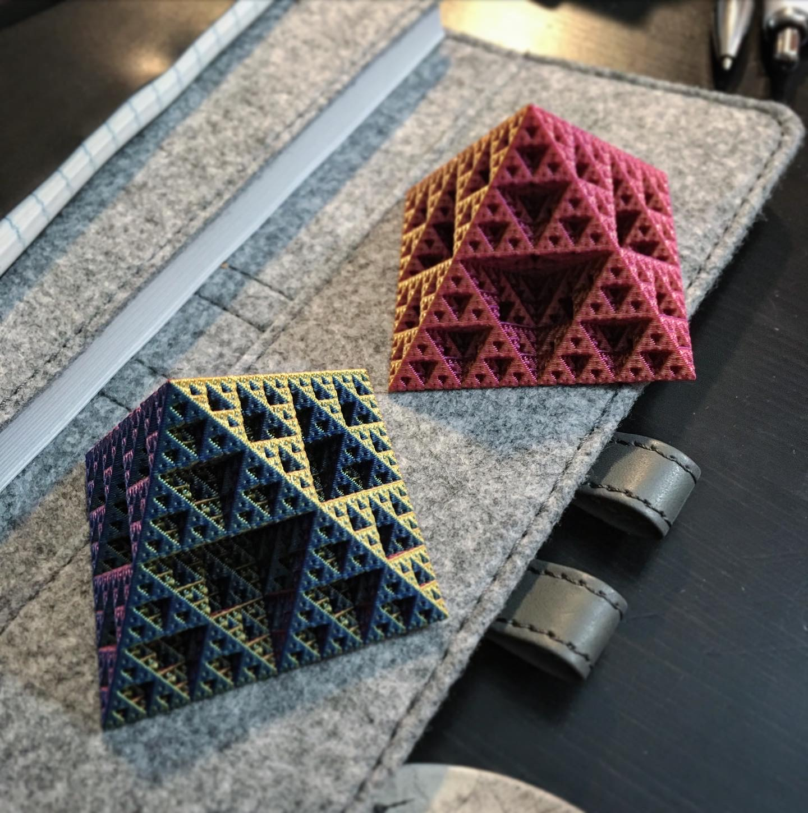
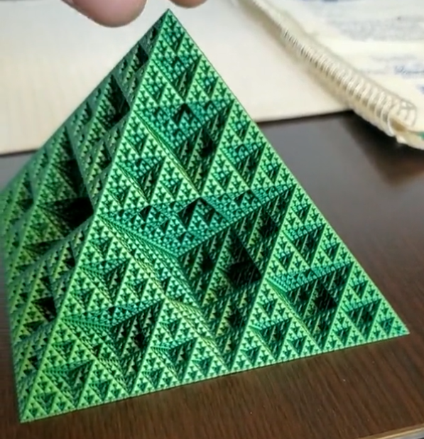

> I used to make these on graphing calculators and on my x386 33MHZ computer in the 90s. It’s called a Sierpinski triangle. I was memorized by them. I should print one.
>
> _Gswindle76_

I was going to fix a surface that supposed to be one flat  piece but was created out of small parts with holes in between them. I tried to select all meshes in one go and then I merged them - this is the result.

Here is what you need:

- [3-color silk PLA filament](https://www.amazon.com/dp/B0B3JVCMNW?th=1) is awesome for such things. The perfect fit. [dual color PLA filament](https://www.amazon.ca/ERYONE-Filament-Printer-1-75mm-0-03mm/dp/B09X2VNKM9/) ?
- 3D model on [Thingiverse](https://www.thingiverse.com/thing:1356547/files)

## Printing

> And I printed at 0.16mm layer height, spiralize outer contours turned on in Cura, and since my printer is upgraded I printed it at 150mm/s for speed, 1500mm/s^2 accel.
> I've upgraded my printer to use an Orbiter V2 direct drive extruder, the HeroMe Gen6 fan ducts, and I'm running Klipper, all of which allow me to print a bit faster. You can increase the max speed an acceleration in your printers configuration file for Klipper or changed in the firmware before flashing for Marlin
>
> _bkw_17_

 Luckily I found out that Cura slicer can make this print retraction free. I was shocked by the result of PrusaSlicer. It was producing ridiculous second layer. 
 
 

 So I blamed the model. But then I tried the Surface mode in Cura and OMG I love these pyramids and colors 😍

 

 ## Reference

- 1 https://twitter.com/iceslapp/status/1552690889868431363
- 2 https://www.reddit.com/r/3Dprinting/comments/w5h6q3/one_of_the_trippiest_prints_ive_done_fractal/
- Someone also found that the spiral vase mode amazing for this print https://www.printables.com/model/2311-spiral-vase-mode-sierpinski-pyramid/comments
