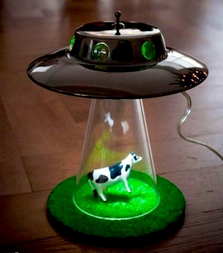
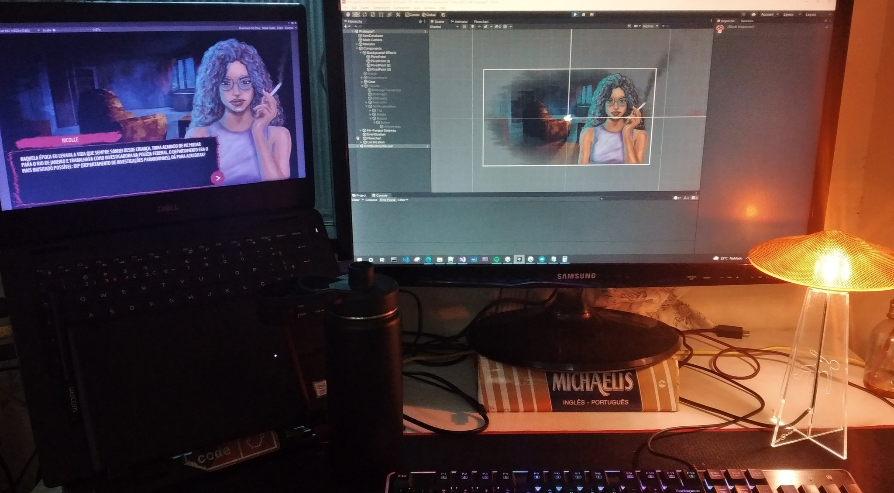

A 3D printed desk lamp that looks like a UFO abducting a cow! 
Yes, you heard me right. 
This lamp is not only a cool and quirky decoration for your home or office, but also a tribute to one of the most iconic scenes in sci-fi history.

And yes, I need a lamp for my desk, so I’m adding [one project](https://twitter.com/mikolasan/status/1528078099568414721) to my todo list.

Here’s a reference

Then I've started searching on 3D printing hubs for a model

- https://cults3d.com/en/3d-model/home/ufo-abduction-lamp-with-blinking-lights
- https://cults3d.com/en/3d-model/home/ufo-lamp-oneidmonstr
- https://twitter.com/mikolasan/status/1531475951803985921

## Materials needed

- LED strip lights
- Electrical wires
- Soldering iron and solder
- Power supply or adapter
- Hot glue gun and glue sticks

## The plan

1. First of all, we need a 3D printer and some filament. I'm going to use PLA and PVB filament. PVA because it is easy to work with, and PVB because it's transparent.
2. Then, find a free model of a UFO on Thingiverse. Or design the UFO model in Fusion 360
3. Then use Cura to slice the model and prepare it for printing.
4. Adjust the settings to make sure the print quality is high and the infill is low (TODO: add more results here).
5. Print with fingers crossed.
6. Assemble the UFO structure.
7. Cut LED strips, solder electrical wires. Connect the wires from the LED strip to a power supply or adapter.
8. Connect the power supply, and behold the otherworldly glow

 This post outlines the initial steps and serves as a starting point for your project. Until next time, keep calm and print on!