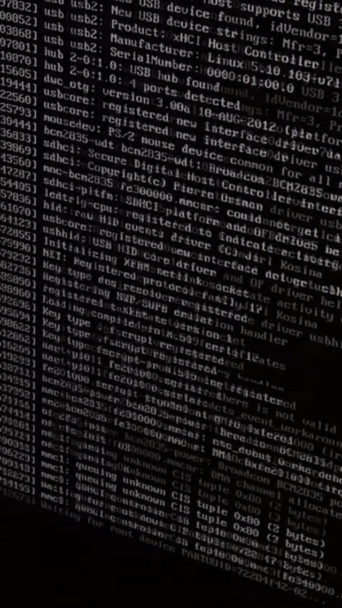

This is a third day when I'm trying to install Raspbian/Ubuntu/Manjaro system on Raspberry Pi 4.

I tried different images and 3 different SD cards.

In all cases it goes to a reboot loop.

I cannot do a simple thing. Am I cursed?

I'm 100% sure that my SD card slot is broken on RPi 4, that is why I have to use USB flash drive instead. It will not be a problem for RPi 5 where one can use NVME.

What's the last thing that executes?

It's hard to say it flashes so quickly. I record it on camera and then replay it in slo-mo. It somewhere where it mounts rootfs or starts the init script.

I will need to check the power supply, though it's the official one that provides 5V 3A, I doubt that the problem is there.

But first, I need to get a multimeter from work, then somehow interject it between PSU and USB type C connector. Which is a project by itself.

Another theory is that Windows version of the Imager is not creating good ext4 partitions. I have Linux at work, but no card readers.

More exotic theory is that MMC driver in the Linux kernel starting from version 5 is broken. I think that because RISC OS and LibreELEC worked just fine. And kernel 5 is in all distributions now *sigh*

Now I'm running Raspberry Pi (v1 model B) and the latest Raspbian works.

I will try this SD card in RPi4 after it finishes updating.

And also I will try to boot from Live CD and burn SD card from RPi itself. I think that no one has done this yet. I will be a pioneer 🤠

I successfully switched the bootloader to USB, but even from the USB it restarts right after the kernel init. I must check root=PARTUUID=72284f42-02 option—it looks fishy.

Also I measured voltage on the board: ~5.2V with little fluctuations when the boot fires.

Raspberry Pi Imager v1.7.2 is giving me wrong partition ID on Windows 10. 

Considering that I boot from USB (not SD card), I put instead root=/dev/sda2

"sdx" is used for HDD, SSD and USB drives
"a" - because only one drive present
"2" - the second partition (1 = boot)

I'm finally in. Honestly I do not understand how.

Later I will look into the firstrun script that resizes partitions on the first boot.

sometimes it takes 2 or 3 reboots to resolve.

Stay tuned! This weekend I will [connect the camera](/make/lens-for-raspberry-pi-hq-camera), and later I will add some boring object recognition

## Reference

- [Three Different Ways to Boot a Raspberry Pi From a USB Drive](https://thesecmaster.com/three-different-ways-to-boot-a-raspberry-pi-from-a-usb-drive/)