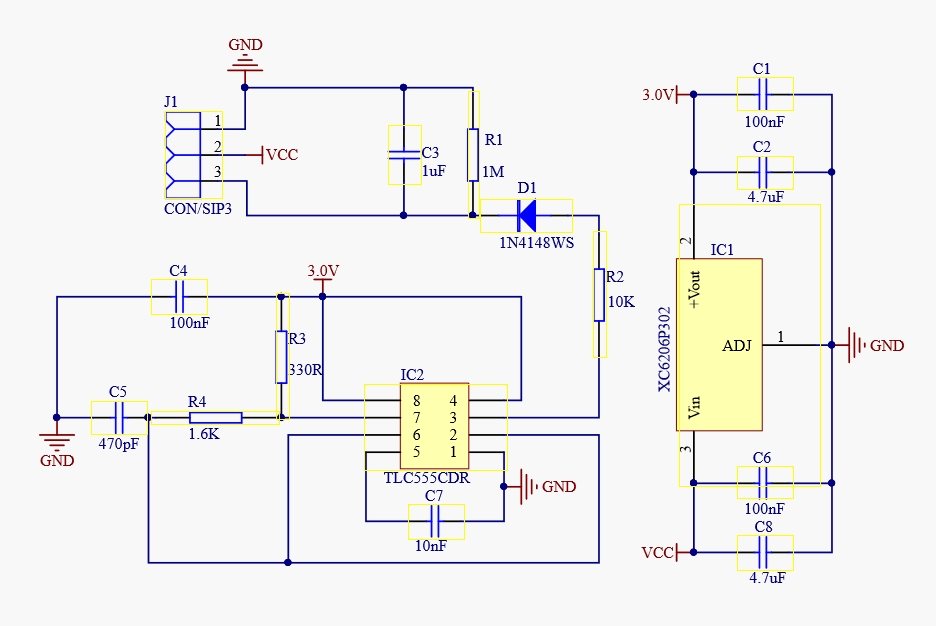

It's a simple analog sensor, for compatibility with Raspberry Pi (see, [no analog inputs](https://pinout.xyz/)) you will need an extra ADC converter. The Arduino analog input voltage is 1V max, and the output voltage of the capacitive sensor is about 3V (if powered by 3.3V), which means you have to use a voltage divider at the output of the sensor.

## Before you buy

- One SOT-23 component marked as **662K** is 3.3V 200mA Positive Fixed LDO Voltage Regulator ([XC6206P332MR](https://product.torexsemi.com/system/files/series/xc6206.pdf)) which gives the board an operating voltage range of 3.3-5.5V
- And 555 timer. Be careful with greedy sellers that might put the wrong version of the timer that can only work with 5V. So verify this info with the datasheet. I have [NE555](https://www.ti.com/lit/ds/symlink/ne555.pdf) from Texas Instruments which only works from the voltage in the range between 4V and 16V. Instead it should be TLC555C or TLC555I or an outlier NE555 with a second line **20M**

## Calibration

Calibrate or not calibrate? Don't do it but _normalize_ ([as science people say](https://www.daf.qld.gov.au/__data/assets/pdf_file/0018/55170/Capacitance-Probe-Calibration.pdf)).

>Probes are normalised by matching the raw readings from each sensor at both 0% (held in air) and 100% water levels (submerged in water). Without normalising, these devices would only provide a range of irrelevant raw data that varies slightly with each sensor. By matching the raw reading from each sensor to both 0% and 100% water levels, a comparison of readings taken by different sensors can be made on a common scale. Equipment suppliers should provide you with procedures for normalising their product.


## Sketch

1. Open the serial port
2. Record the sensor value when the probe is exposed to the air. This is the minimum value of dry soil "Moist: 0%"
3. Take a cup of water and insert the probe into it (the probe, not the whole board)
4. Record the sensor value when the probe is exposed to the water. This is the maximum value of moist soil "Moist: 100%"

```c
void setup() {
  Serial.begin(9600);
}

void loop() {
  int val = analogRead(0); //connect sensor to Analog 0
  Serial.print(val);
  delay(100);
}
```

## Schematics




## Reference

- [How it works](https://www.biomaker.org/block-catalogue/2021/12/17/soil-moisture-sensor-aideepen-v12) and [more about 555 timers](https://www.nutsvolts.com/magazine/article/using-the-555-timer-ic-in-special-or-unusual-circuits) and later you will need [this online calculator](https://www.digikey.com/en/resources/conversion-calculators/conversion-calculator-555-timer)
- [Constant reading of 1023](https://forum.arduino.cc/t/capacitive-soil-moisture-sensor-v1-2/628094/8)
- [Schematics](https://raw.githubusercontent.com/Arduinolibrary/DFRobot_Capacitive_Soil_Moisture_Sensor/master/SEN0193%20%20Capacitive%20Soil%20Moisture%20SensorV1.0.PDF)
- [DFRobot wiki](https://wiki.dfrobot.com/Capacitive_Soil_Moisture_Sensor_SKU_SEN0193)
- [Adafruit alternative](https://www.adafruit.com/product/4026)
- [Check R1 resistor](https://www.youtube.com/watch?v=QGCrtXf8YSs) if readings are slow
- [Many sensors are defective](https://www.youtube.com/watch?v=IGP38bz-K48)
- My model from [AliExpress](https://www.aliexpress.us/item/3256805444580337.html)
