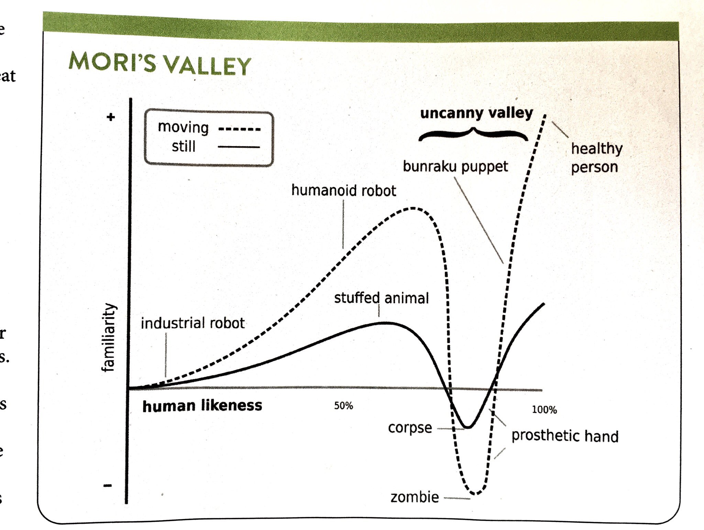
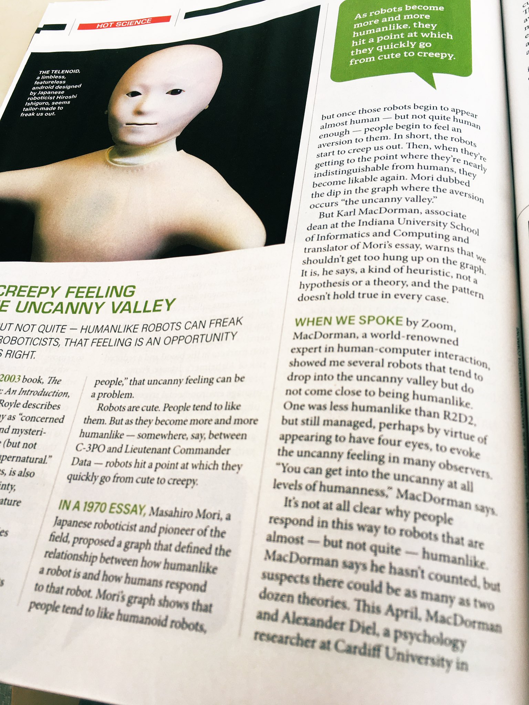

I'm convinced that any robot should have a creepy aspect. Like big tracking you eyes that can drive people crazy.

> MacDorman and Alexander Diel, a psychology researcher at Cardiff University in Wales, published a paper that organized the current explorations [of the "uncanny valley"] into nine categories.
>
> Discover magazine

