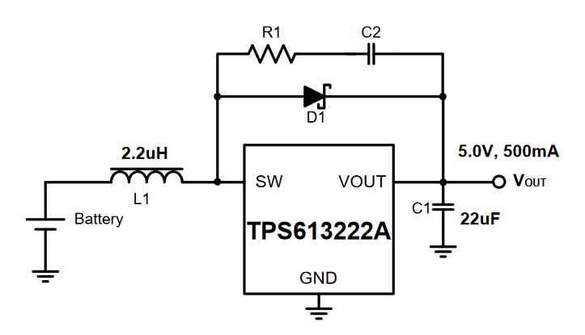

Design a robot in three easy steps:

- 3d print
- buy components
- assemble

mu-ha-ha in reality you need a little bit more steps

## The look

I'm convinced that any robot should have a creepy aspect. Like big tracking you eyes that can drive people crazy.

> MacDorman and Alexander Diel, a psychology researcher at Cardiff University in Wales, published a paper that organized the current explorations [of the "uncanny valley"] into nine categories.
>
> Discover magazine

- [Paper 1](https://www.semanticscholar.org/paper/Creepy-cats-and-strange-high-houses%3A-Support-for-in-Diel-Macdorman/da9f0e4fdd00d32c58d44308f312b487563dd52c) - 9 theories
- [Paper 2](https://www.researchgate.net/publication/353373476_A_Meta-analysis_of_the_Uncanny_Valley%27s_Independent_and_Dependent_Variables) - the latest paper probably mentioned in the article

## Electrical components

Motors normally require higher voltage (6V, 12V, 24V) and current, and it's a good practice to keep motors, LEDs, switches electronically seperated from the logic (3.3V). But how do you decouple it when the whole project should work from the battery? 

Do you use two batteries? Just imagine what a headache is to keep two separate batteries charged. I can only think about sophisticated system where there is an assumption that motors can kill the battery often, but at the same time the main brain must continue operating, therefore it remains only one option: to send a signal about help to other robots. But I've never seen such design.

So what normal people use instead? 

Power supply needs to be protected from Back EMF when motors abruptly stop or reverse the rotation direction. But rechargeable battery only wins from this effect. The only concern will be values above maximum ratings especially for li-poly batteries that are very sensitive.

Read more: [Operating an Arduino for a Year from Batteries](https://analysisnorth.com/articles/arduino-for-a-year.html)

### Battery charger

Let's design our custom board for powering the robot from one lithium polymer battery, say 3.7V and 2500mAh.

First of all, even before using the battery in any way, we should think about charging it. Here's a [battery charger](https://www.adafruit.com/product/259) from Adafruit based on [MCP73833](https://cdn.sparkfun.com/assets/b/a/7/6/8/MCP73833Datasheet.pdf) (evaluation board [doc](https://ww1.microchip.com/downloads/en/DeviceDoc/51626a.pdf)). For a second I thought that I found cheaper option - [MCP73831](https://ww1.microchip.com/downloads/en/DeviceDoc/MCP73831-Family-Data-Sheet-DS20001984H.pdf) on Digi-Key in a 5-lead SOT-23 package, but it consumes 4x times less current during charging which means that it's going to charge much slower and has less indication signals. The datasheet provides PCB layout example.

Old alternative for these chips is [MAX1555](https://datasheets.maximintegrated.com/en/ds/MAX1551-MAX1555.pdf).

**Additional components**: 

- 3x LED (2x yellow and white)
- 2x capacitors 4.7uF (Voltage Rating 10VDC)
- 3x resistors 470 (for LEDs, so for 20mA the Power Rating would be >100mW)
- 1x resistor 1K (for 25mA current (?), therefore the Power Rating >125mW)

### Step up voltage regulator

We need to boost 3.7V voltage from our battery to 5V level where Arduino and motors can work. Preferably we should supply 3.3V to logic board and separate 5V or 6V or even more to motors. But we must keep the first version simple.

Again we start with a popular at this time [breakout board](https://www.adafruit.com/product/2190) and look at the main chip (TPS63060). For logic board AND motors I found 1.8A [TPS613222](https://www.ti.com/general/docs/suppproductinfo.tsp?distId=10&gotoUrl=http%253A%252F%252Fwww.ti.com%252Flit%252Fgpn%252Ftps61322) and 3.6A [TPS61032](https://www.ti.com/general/docs/suppproductinfo.tsp?distId=10&gotoUrl=https%3A%2F%2Fwww.ti.com%2Flit%2Fgpn%2Ftps61030) switch current boost converters from Texas Instruments. The datasheet provides PCB layout example.

Old alternative for these chips is [TPS6109](https://www.ti.com/lit/ds/symlink/tps61090.pdf?ts=1666623681120&ref_url=https%253A%252F%252Fwww.ti.com%252Fproduct%252FTPS61090).

**Additional components**: 

- coil (inductor) 2.2uH (max DC current > 1.18A)
- schottky diode
- 3x capacitors 10uF (Voltage Rating 6.3VDC)
- capacitor 22uF
- RC snubber

### Motors

Main question here is power and torque which is created by series of spur gears called a _gear train_. It could be simple as 2 gears or **planetary gear train** (higher gear reduction, very compact) and this can be implemented in non-circular form 🤤 (They are not as compact as round ones, and at specific points they hold higher stalled resistance than in others which makes movement obviously uneven.) Planetary gearing (or **epicyclic gearing**) is cool, but there is also **cycloidal drive**, that eliminates a _backlash_ - it's that imperfection between gear teeth that is noticeable when rotation direction has been changed. And the last but not least in this list is **strain wave gearing** that is used in the wheels of Apollo Lunar Rover. It requires a flexible spline, but oversteps advantages of the above systems.

I'll try micro gear motors with [75 RPM](https://www.digikey.com/en/products/detail/pimoroni-ltd/COM0806/6873670) and [155 RPM](https://www.digikey.com/en/products/detail/dfrobot/FIT0483/7087160).

### Motor driver

Motor driver [breakout board](https://www.adafruit.com/product/2448) based on [TB6612](https://cdn-shop.adafruit.com/datasheets/TB6612FNG_datasheet_en_20121101.pdf) that supports 2 motors and 1.2A per channel. Or [DRV8833C] (0.7) or [DRV8836](https://www.ti.com/general/docs/suppproductinfo.tsp?distId=10&gotoUrl=https%3A%2F%2Fwww.ti.com%2Flit%2Fgpn%2Fdrv8836) (1.5)

Alternative: bipolar motor driver [SIP2100](https://www.vishay.com/docs/63949/sip2100.pdf) from Vishay

### Connectors

- Power for Arduino or Raspberry Pi (1/2 - in theory) - [Micro USB Type B Male Vertical](https://www.digikey.com/en/products/detail/gct/USB3150-30-130-A/9859649) - connector is perpendicular to the board's surface thus it connects to Arduino or Raspberry Pi perpendicular as well. Raspberry Pi 1/2 where lower power consumption. Some components not rated for the current greater than 1A, so with Raspberry Pi 4 it can fry them)
- Battery to the board - [JST PH Connector](https://www.digikey.com/en/products/detail/jst-sales-america-inc/S2B-PH-K-S-LF-SN/926626)
- For charging USB cable let's be modern and use type C - [USB Type C Female](https://www.digikey.com/en/products/detail/adam-tech/USB-C31-S-VT-CS4-BK-PP-T-R/9832222)

### Shopping list

- battery charger [Digi-Key](https://www.digikey.com/en/products/detail/microchip-technology/MCP73833T-AMI-MF/1223181)
- boost converter [Digi-Key](https://www.digikey.com/en/products/detail/texas-instruments/TPS61032PWPR/550687)
- motors 75 RPM [Digi-Key](https://www.digikey.com/en/products/detail/pimoroni-ltd/COM0806/6873670)
- motors 155 RPM [Digi-Key](https://www.digikey.com/en/products/detail/dfrobot/FIT0483/7087160)
- accelerometer [Adafruit](https://www.adafruit.com/product/2019) vs [Digi-Key](https://www.digikey.com/en/products/detail/stmicroelectronics/IIS328DQTR/5268013)
- motor driver [Adafruit](https://www.adafruit.com/product/2448) vs [Digi-Key](https://www.digikey.com/en/products/detail/vishay-siliconix/SIP2100DY-T1-GE3/5086514)

### Eagle

- https://www.youtube.com/watch?v=Eu5XMEh79XM

## Miscellaneous

### Film vs ceramic vs electrolytic vs tantalum

Ceramic - high frequency response due to lower inductance (therefore good HF filtering bypass incoming and outgoing noise), non-polar

Electrolytics - low cost, effective at low frequency, large capacitance, lifetime goes down and depends on temperature and voltage (therefore stick to ceramics for anolog filters), polarised

Interesting note:  An electrolytic capacitor relies on an oxidisation layer as an insulator so capacitance will drift more over time if it run at low voltage

Tantalum - light, small, precise, higher cost

Film - linear characteristics (voltage-temperature-capacitance)

**Reference**: [1](https://electronics.stackexchange.com/questions/232631/ceramic-caps-vs-electrolytic-what-are-the-tangible-differences-in-use), [2](https://electronics.stackexchange.com/questions/69919/ceramic-vs-film-capacitor-which-one-is-preferred-in-audio-circuits)

### Selecting voltage rating for capacitors

Multiply voltage by 4/3 or 3/2 (electoolytic caps) and up to 2 (ceramic caps)

**Reference**: [1](https://electronics.stackexchange.com/questions/15700/selecting-voltage-rating-for-capacitors), [2](http://www.learningaboutelectronics.com/Articles/What-does-the-voltage-rating-on-a-capacitor-mean), [3](https://resources.pcb.cadence.com/blog/2022-ceramic-capacitor-voltage-ratings-here-is-what-you-need-to-know)

### SMD Package Types

SMD Package Type | Dimensions (mm) | Dimensions (inches)
-----|-----------|-------------
2920 | 7.4 x 5.1 | 0.29 x 0.20
2512 | 6.3 x 3.2 | 0.25 x 0.125
2010 | 5.0 x 2.5 | 0.20 x 0.10
1825 | 4.5 x 6.4 | 0.18 x 0.25
1812 | 4.6 x 3.0 | 0.18 x 0.125
1806 | 4.5 x 1.6 | 0.18 x 0.06
1210 | 3.2 x 2.5 | 0.125 x 0.10
1206 | 3.0 x 1.5 | 0.12 x 0.06
0805 | 2.0 x 1.3 | 0.08 x 0.05
0603 | 1.5 x 0.8 | 0.06 x 0.03
0402 | 1.0 x 0.5 | 0.04 x 0.02
0201 | 0.6 x 0.3 | 0.02 x 0.01
01005 | 0.4 x 0.2 | 0.016 x 0.008