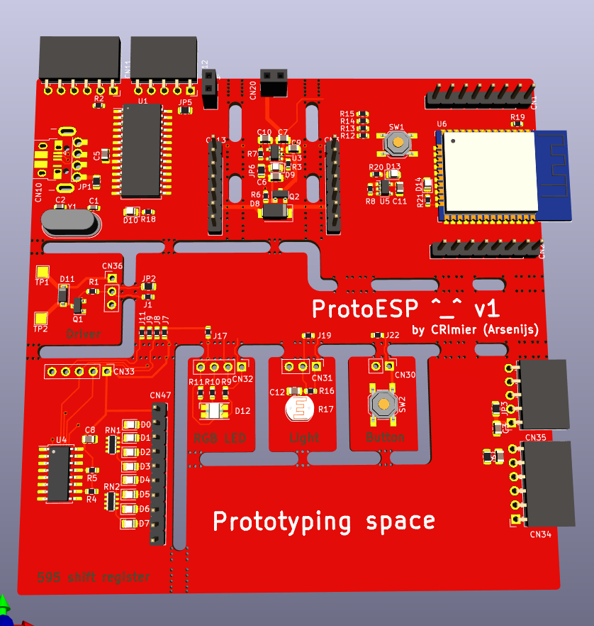

## Specs

32-bit MCU (Xtensa LX7) from Espressif ESP32-S2-WROOM. [Datasheet](https://www.espressif.com/sites/default/files/documentation/esp32-s2-wroom_esp32-s2-wroom-i_datasheet_en.pdf), [hardware design guidelines](https://docs.espressif.com/projects/esp-hardware-design-guidelines/en/latest/esp32s2/schematic-checklist.html). Not recommended for new designs (4/20/2024), that's why I got them from SparkFun with discount.

To compare with Arduino Uno, ATMega328, or other boards: WROOM has 128 KB ROM, 320 KB SRAM

Peripherals include 43 GPIOs, 1 full-speed USB OTG interface, SPI, I2S, UART, I2C, LED PWM, LCD interface, camera interface, ADC, DAC, touch sensor, temperature sensor.

- Power from 3.7V battery ? 3.0V - 3.6V
- Wi-Fi (802.11 b/g/n) for communication
- About ADC. 2 ADC 10 channels each. [ADC Attenuation](https://docs.espressif.com/projects/esp-idf/en/v4.4/esp32/api-reference/peripherals/adc.html#adc-attenuation)
- Arduino IDE support.
- SPI for TFT display.

## Board designs

[ProtoESP](https://twitter.com/FairywrenTech/status/1475555741222199302) - Prototyping board for ESP32

