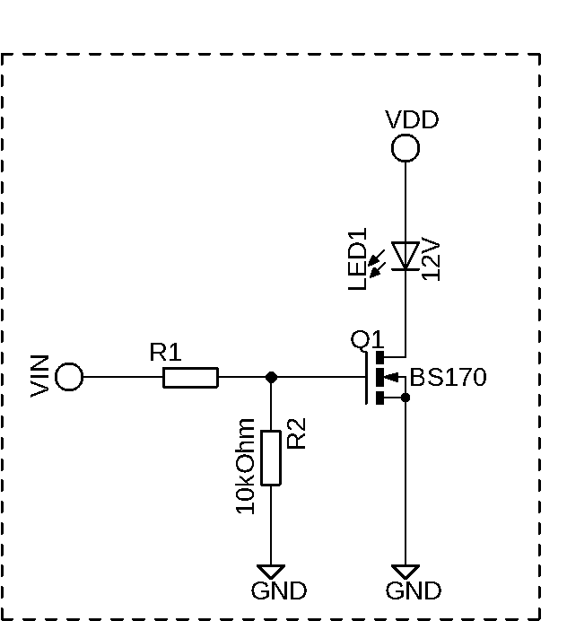
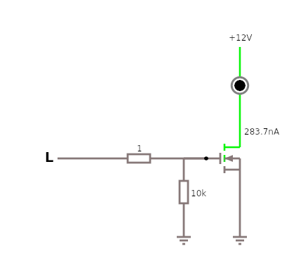
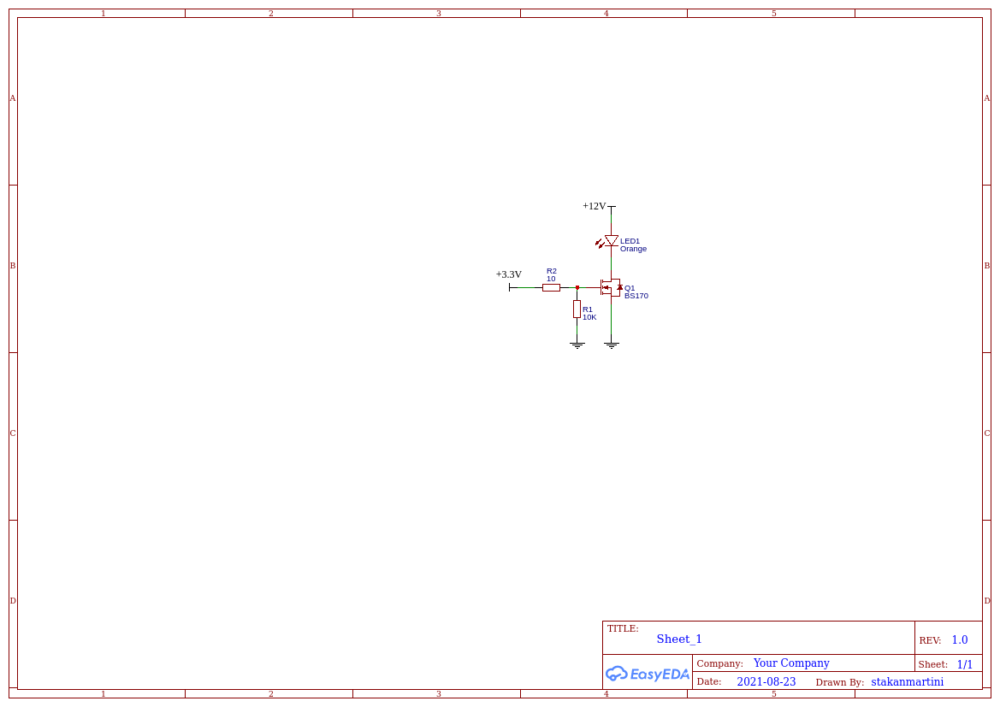
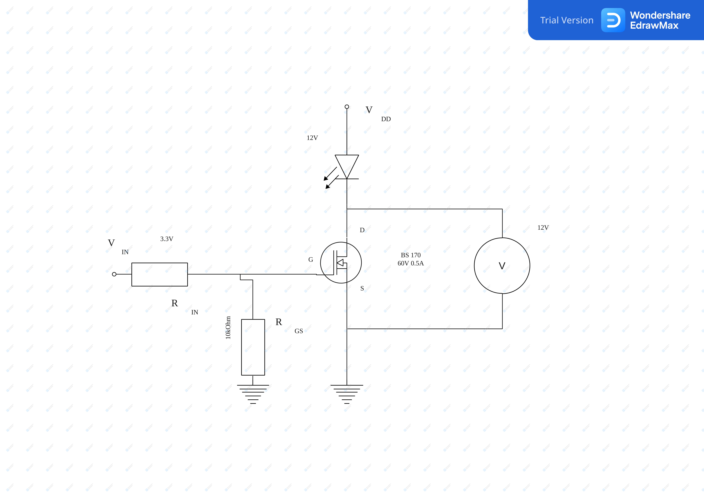
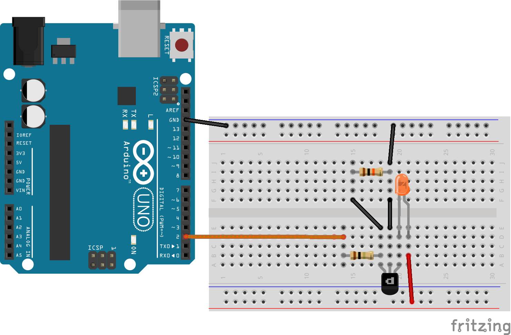
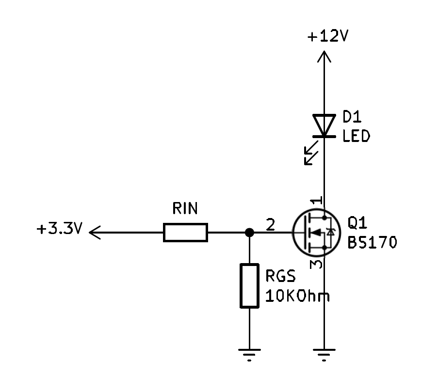
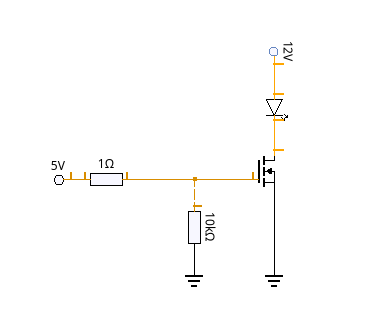
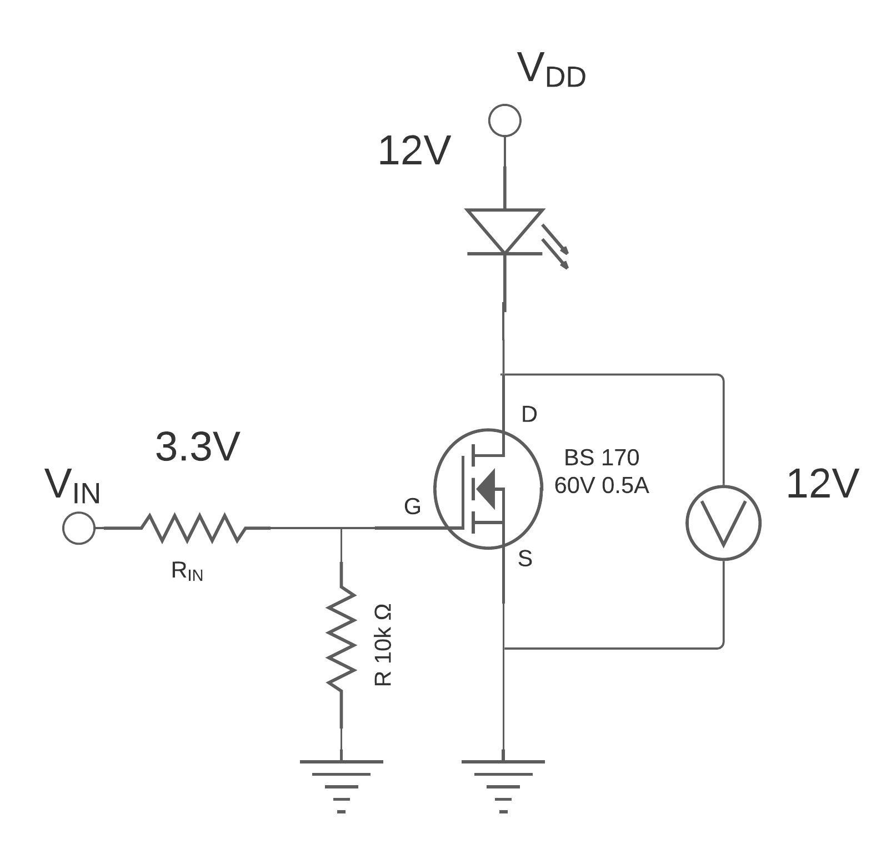
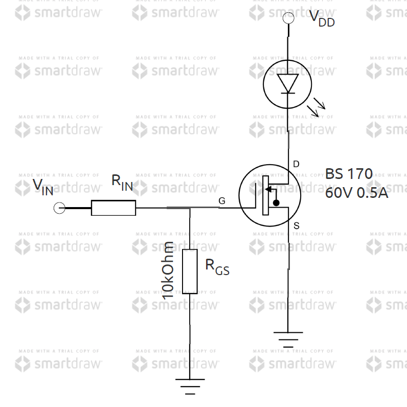
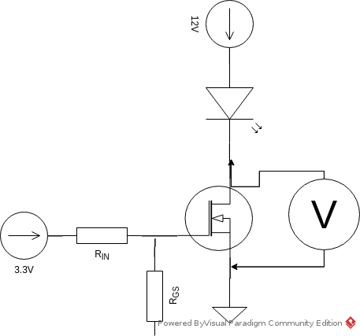

Plan for this Saturday: find a software where I can easily draw schematics for my experiments. I need two versions: one colorful with breadboard, Arduino boards and many wires; and more important version is simplistic black and white diagrams (not those vermilion green!).

## Tested

I've made a video about these circuit schematics tools. It's on my YouTube channel.

### Circuit Lab

No result

### Autodesk Eagle

### Circuit JS1

### Easy EDA

### EdrawMax

### Fritzing

### KiCAD

### KTechlab

### Lucidchart

### Multisim Live

### SmartDraw

### Visual Paradigm

## I will try soon

### DipTrace

https://www.diptrace.com/diptrace-software/schematic-capture/

### CircuiTikz

https://texample.net/tikz/examples/circuitikz/

## Reference

My list is based on these good compilations

- https://electronics.stackexchange.com/questions/38134/anyone-knows-what-software-tool-is-used-to-draw-these-circuit-schematics
- https://electronics.stackexchange.com/questions/1024/good-tools-for-drawing-schematics
- https://www.smashingrobotics.com/useful-tools-for-drawing-electrical-circuits/