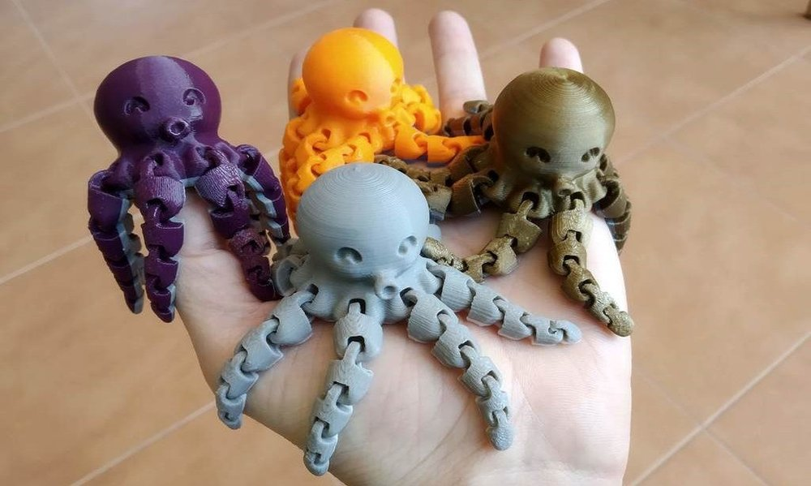

The idea is simple. Find a working example with a small neural network and make all neurons physical, and train it much faster because all neuron is independent. Each neuron is a FPGA that just immediately reacts on incoming signal, adjusts its weights and carry on.

- 3d printed case [like this](https://www.thingiverse.com/thing:3505006)
- led strip
- FPGA chip: [atmega](/make/arduino-soul-possession)?

It should be cute and interactive as japanese toy Tuttuki Bako (ツッツキバコ - easy to remember: 3 smiles, high-voltage power line, uphill, downhill and me on the bike, then dead end...)

# Research

I spend the Autumn of 2022 [trying to figure out](/science/neuron) what approach I should use for my robots.

TODO: result will be concluded <here>

# 3d model

I'm looking for cute neuron

- https://sketchfab.com/3d-models/neuron-03a5173f3d2e46958b6f8be81b1c88be
- https://www.turbosquid.com/3d-models/neuron-cell-max/412770#
- https://cults3d.com/en/3d-model/game/76-spydyr

## Inspiration

### Flexible snakes

Model by Cinderwing3D printed with rainbow PLA filament. Called **crystal dragon**

### Mini octopus

Model by McGybeer

# FPGA

There are tutorials on [how to program one FPGA to work as a neural network](https://www.youtube.com/watch?v=Qgjawf20v7Y) (even non real FPGA, but [in the cloud](https://towardsdatascience.com/neural-network-inference-on-fpgas-d1c20c479e84)). Such thing use very perfomant chips like

- [mojo 3](https://www.nutsvolts.com/magazine/article/July2015_Clarke)
- [Perf-v](https://www.electromaker.io/shop/product/perf-v-based-on-xilinx-artix-7-fpga-risc-v-opensource)
- [Arty S7](https://digilent.com/shop/arty-s7-spartan-7-fpga-development-board/)
- [Alchitry Au](https://www.sparkfun.com/products/16527)

But I want small tiny FPGAs to be independent ([how tiny FPGA could be](https://hackaday.com/2015/07/03/hackaday-prize-entry-they-make-fpgas-that-small/), an example [that still in stock](https://www.adafruit.com/product/4332)), that will allow on physical level to see the process when every activation will be illuminated be LEDs on neuron's case.

## ATMega8

ATmega8 has three multi-bit multipurpose I/O ports: 

- **PORTB** with 8 bits, 
- **PORTC** with 7 bits, and 
- **PORTD** with 8 bits. 

Total of 23 bits. Reserve a few bits for I2C communication with an LED strip. With Arduino-type board we a looking for 5V strip

### LED curcuit chips

Chip   | Voltage  | LEDs per chip | Data pins
-------|----------|---------------|----------
WS2811 | 12-24V   |  3            |  1
[WS2812](https://www.amazon.com/BTF-LIGHTING-Individual-Addressable-Flexible-Non-Waterproof/dp/B088FKZWDQ/) | 3.5-5.3V |  1            |  1
WS2813 | 3.5-5.3V |  1            |  2
WS2815 | 9-13.5V  |  1            |  2
WS2818 | 12/24V   |  3            |  2

I don't know if there's good LED review in English, but [this one](https://alexgyver.ru/ws2812_guide/) is all you need 🔥