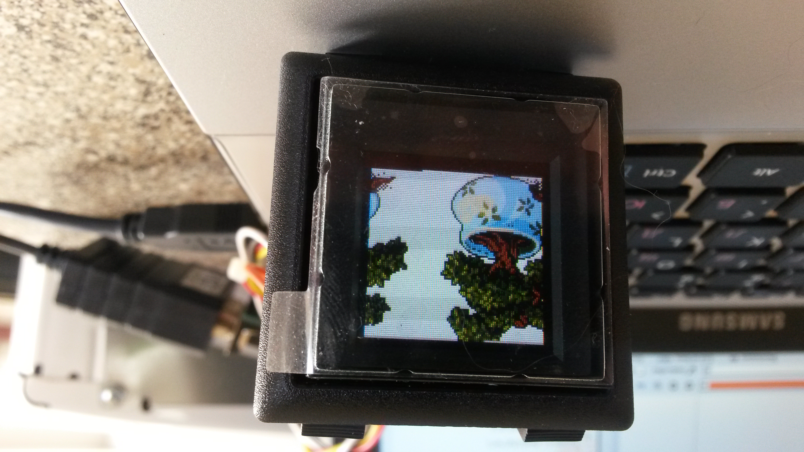

I proudly present [OledButton class and tools](https://github.com/mikolasan/oledbutton) that is created to manage [evaluation kit **CY-7031**][1] for OLED button **CY-3031** through serial port (RS485).

 

## Install

Written on Python 3.5. I have no idea how it works on other previous versions. Do not try Python 2 because of new types such as `bytes` and `bytearray`.

You need:

Inevitable [**PySerial**][2]
```
pip install pyserial
```

Advisable [**Pillow** (PIL fork)][3]
```
pip install Pillow
```

**numpy** to [convert][4] any image to bmp565 format
```
pip install numpy
```

## Run

Look inside `main.py`, write your own workflow and run

```
python main.py
```



[1]: http://www.cyo.com.tw/evaluation_kit.htm
[2]: http://pyserial.readthedocs.org/en/latest/pyserial_api.html
[3]: https://pillow.readthedocs.org/en/3.1.x/handbook/tutorial.html
[4]: https://toster.ru/q/298153
