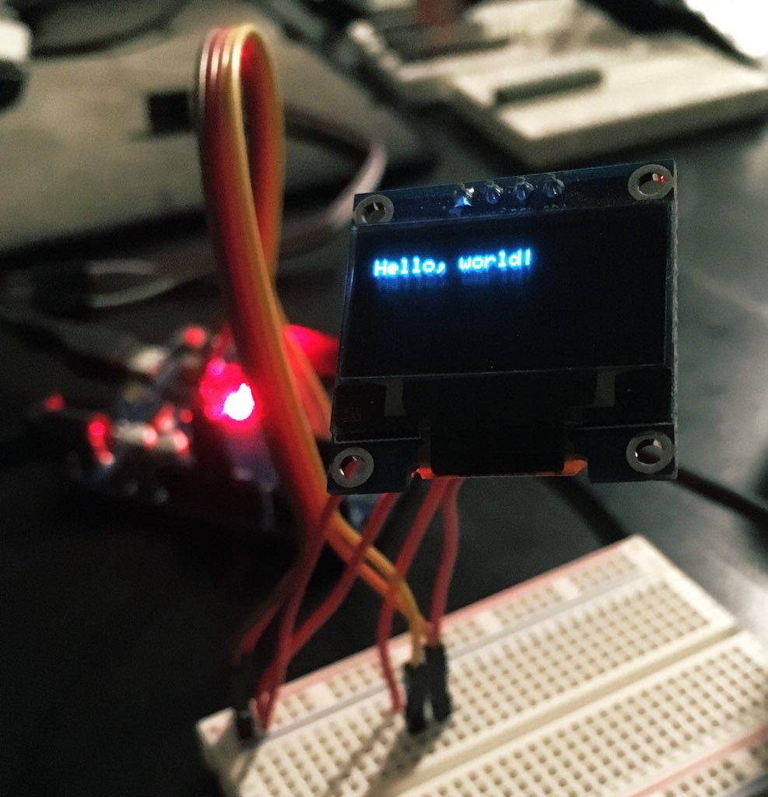

I have OLED monochrome display module 128x64 pixels blue color based on SSD1306 chip. It's can take 3.3V and 5V as well. We are going to connect it to Arduino UNO using I2C. Also I2C wil be shared with [the temperature sensor](/make/temperature-sensor-rpi4).

Just a few small tips that will save hours:

- Find the original datasheet (especially for any [cheap clone](https://s.click.aliexpress.com/e/_DcQKqy7))
- Update ALL libraries. I [installed](https://learn.adafruit.com/monochrome-oled-breakouts/arduino-library-and-examples) the latest Adafruit_GFX and [Adafruit_SSD1306](https://github.com/adafruit/Adafruit_SSD1306), but it started working only after I updated other libraries (like **Adafruit BusIO**). All those defines are fragile.
- Don’t trust silkscreen labels. My display has a resistor that switches between `0x78` and `0x7A` I2C address acording to the silkscreen, but it uses address `0x3C`

About connection and short test example cannot say anything better than [this tutorial](https://randomnerdtutorials.com/guide-for-oled-display-with-arduino/)

## Questions

- Does it require resistors 3.3kOm or 4.7kOm before SCL and SDA ports on the board? If yes, why?
- Why Arduino has duplicating pins? Should I use them for multiple I2C devices.