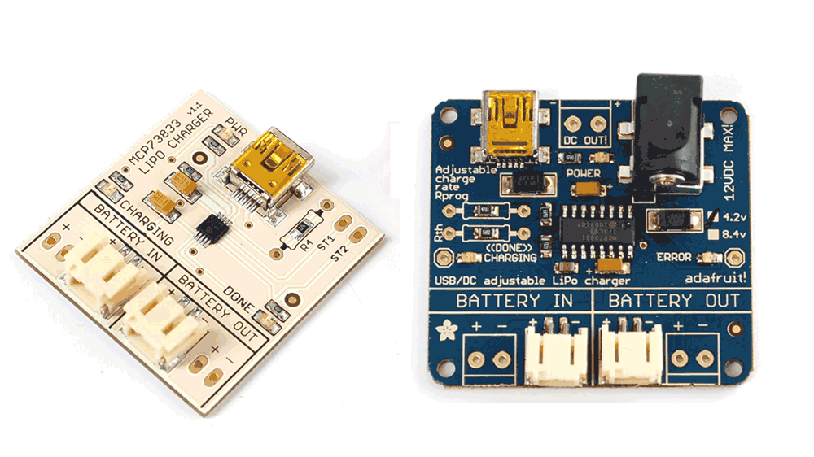

## Component selection

### Film vs ceramic vs electrolytic vs tantalum

Ceramic - high frequency response due to lower inductance (therefore good HF filtering bypass incoming and outgoing noise), non-polar

Electrolytics - low cost, effective at low frequency, large capacitance, lifetime goes down and depends on temperature and voltage (therefore stick to ceramics for anolog filters), polarised

Interesting note:  An electrolytic capacitor relies on an oxidisation layer as an insulator so capacitance will drift more over time if it run at low voltage

Tantalum - light, small, precise, higher cost

Film - linear characteristics (voltage-temperature-capacitance)

**Reference**: [1](https://electronics.stackexchange.com/questions/232631/ceramic-caps-vs-electrolytic-what-are-the-tangible-differences-in-use), [2](https://electronics.stackexchange.com/questions/69919/ceramic-vs-film-capacitor-which-one-is-preferred-in-audio-circuits)

### Selecting voltage rating for capacitors

Multiply voltage by 4/3 or 3/2 (electrolytic caps) and up to 2 (ceramic caps)

**Reference**: [1](https://electronics.stackexchange.com/questions/15700/selecting-voltage-rating-for-capacitors), [2](http://www.learningaboutelectronics.com/Articles/What-does-the-voltage-rating-on-a-capacitor-mean), [3](https://resources.pcb.cadence.com/blog/2022-ceramic-capacitor-voltage-ratings-here-is-what-you-need-to-know)

## Eagle

- Eagle PCB tutorials by Ilya Mikhelson: [Layout part 1](https://www.youtube.com/watch?v=a1l6N7BVINA&t=1135s), [part 2](https://www.youtube.com/watch?v=Eu5XMEh79XM)
- Keep your components in one library: [Custom library](https://www.youtube.com/watch?v=yvRGmltr_P8), [Add 3D models to the library](https://support.snapeda.com/en/articles/3545085-how-to-import-a-3d-model-into-eagle)
- Manufacturer specifications: [Design Rules files for OSHPARK](https://docs.oshpark.com/design-tools/eagle/design-rules-files/), [Cutouts](https://docs.oshpark.com/design-tools/eagle/cutouts-and-slots/), [Drill specs](https://docs.oshpark.com/submitting-orders/drill-specs/)
- Arduino shield template for Eagle [from Adafruit library](https://github.com/adafruit/Adafruit-Eagle-Library): ARDUINOR3 -> ARDUINOR3-BPLACE
- Footprints and 3D model collections: [SnapEDA](https://www.snapeda.com/), [Ultra Librarian](https://www.ultralibrarian.com/), [SamacSys](https://componentsearchengine.com/) on Mouser
- Change PCB color: Board view -> Manufacturing -> Configure Preview -> Copper Color / Soldermask Color

### Cheatsheet

- create schematics document in Eagle
- Edit -> Add... -> Scroll down to **frames**, Choose LETTER_L
- If silkscreen and soldermask colors are swapped in Fusion 360, then check silkscreen contours outside of the board. Also measurements are not allowed

## Fusion 360

- Change PCB color: go back to Eagle

## SMD Package Types

SMD Package Type | Dimensions (mm) | Dimensions (inches)
-----|-----------|-------------
2920 | 7.4 x 5.1 | 0.29 x 0.20
2512 | 6.3 x 3.2 | 0.25 x 0.125
2010 | 5.0 x 2.5 | 0.20 x 0.10
1825 | 4.5 x 6.4 | 0.18 x 0.25
1812 | 4.6 x 3.0 | 0.18 x 0.125
1806 | 4.5 x 1.6 | 0.18 x 0.06
1210 | 3.2 x 2.5 | 0.125 x 0.10
1206 | 3.0 x 1.5 | 0.12 x 0.06
0805 | 2.0 x 1.3 | 0.08 x 0.05
0603 | 1.5 x 0.8 | 0.06 x 0.03
0402 | 1.0 x 0.5 | 0.04 x 0.02
0201 | 0.6 x 0.3 | 0.02 x 0.01
01005 | 0.4 x 0.2 | 0.016 x 0.008

## Miscellaneous

The purpose of the bulk capacitor is to overcome the voltage drop caused by the inductive effects of PCB traces. 

- connector and solder in options
- old school and SMD layout options

- LED indicators: battery ON, USB connected