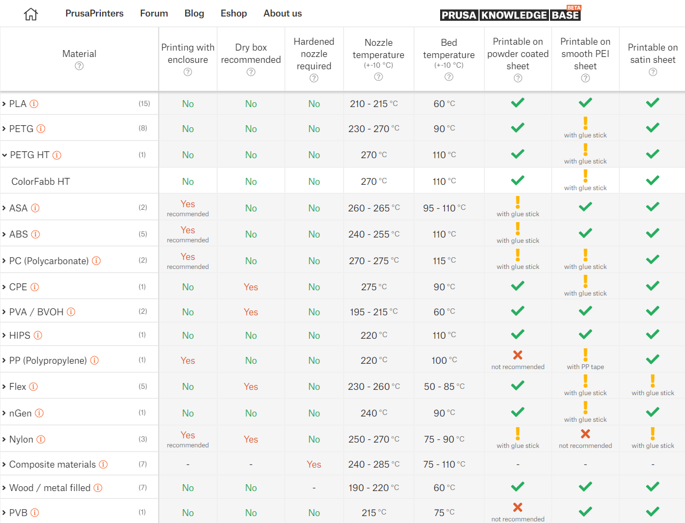

# Assembly

- https://help.prusa3d.com/guide/1-introduction_203948
- https://www.youtube.com/watch?v=vA954VvdquA

# Filament cheatsheet

# Alternatives

- https://store.creality.com/collections/ender-series-3d-printer

## Test prints

- fancy bency https://www.printables.com/model/124521-voronoi-lattice-benchy#preview
- all angles, holes, and columns. it takes hours to print though, so I skipped it https://www.printables.com/model/112181-complete-3d-printer-test-all-in-one-stress-test-be/comments