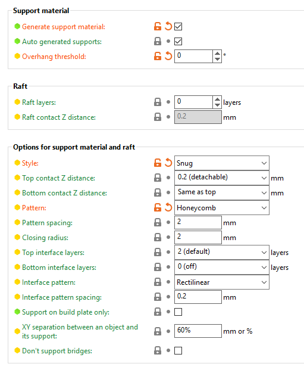

# Assembly

Here it is

This is gonna be fun, right?

Starting with the first bag.

When I assemble a wardrobe or a desk I can figure out all nuts and bolts without a manual, but this kit is intimidating.

Reading every step very carefully. Just enjoying the process 😊

Somewhere halfway through with the bottom platform. Slow progress, call it a night 😴

I’m at the step where I need to eat a couple of gummy bears

By looking at this PCB and stylish brown silkscreen, by touching the smooth matte surface I was reminded that there are still companies that care about quality of each component. Even invisible ones.

1-to-1 sized cheatsheet is very helpful

They use nylon nuts in some places to fight with vibration I guess. Will see if I need to tighten anything up after many prints

Can you get this emotion? Is it astonishment, indignation or concentration?

Just don’t tell me that I’ll need to do cable management

I don’t know what this means, but it looks cool

> It says shaken but not stirred

Last check before hiding the mess

Almost done, no more bags with screws. Should be ready for its first calibration tomorrow. If I will be lucky, then also some test print.

What’s funny that this night I had a dream where I followed a step by step tutorial similar to what I used in the last 3 evenings. But in the dream that tutorial was explaining how to hide a treasure and put future treasure hunters on a false track 😆

I successfully finished the assembly of my first 3d printer. It was really fun. Now I know a little bit about moving mechanisms on smooth rods and aluminum profiles

Reference: https://help.prusa3d.com/guide/1-introduction_203948

Test print in progress. I still don’t understand why it poops before the start and after, and if this is normal. Also I needed to calibrate it during the print (good, that there’s live adjustment of Z axis)

## Filament cheatsheet

## Test prints

- test stringing https://www.thingiverse.com/thing:533472 http://domoticx.com/3d-printer-retraction-instellen-en-calibreren/
- temperature tower https://www.thingiverse.com/thing:2615842
- fancy benchy https://www.printables.com/model/124521-voronoi-lattice-benchy#preview
- all angles, holes, and columns. it takes hours to print though, so I skipped it https://www.printables.com/model/112181-complete-3d-printer-test-all-in-one-stress-test-be/comments

## Problems, questions

- Stringing. Increase retraction (5mm distance), lower nozzle temperature (200C PLA)
- Unloading a filament is hard because a big blob is created on the end melted by the nozzle
- During auto bed leveling and preheating filament pured a little and then wiped on the south edge. It's expected behaviour, but no one will tell you that.
- Some models are terrible to print and might need an adjustment in 3D editor (not in the slicer)
- G-code is a set of instructions very specific to the printer and they include all settings you carefully tinker in the slicer. So normally you cannot find them online.
- 15% infill makes nozzle to quickly move, so against such jolts you need to make the print to stick to bed (increase temperature and lower the speed)

- How to make small/minimal support platform in PrusaSlicer? Print Settings -> Support material -> Overhang threshold = 0 (auto)

- [Prusa profiles for cura](https://help.prusa3d.com/guide/how-to-import-profiles-to-cura-4-x-windows-macos_17848#17856). Just use the new path `C:\Program Files\Ultimaker Cura 5.2.1\share\cura\resources`

More tips on [dedicated page](/make/3d-printer-lessons)

## Extra equipment

- Isopropyl alcohol > 90%
- Paper towels
- Brass brush
- Container for spools (dry box) - under discussion
- 