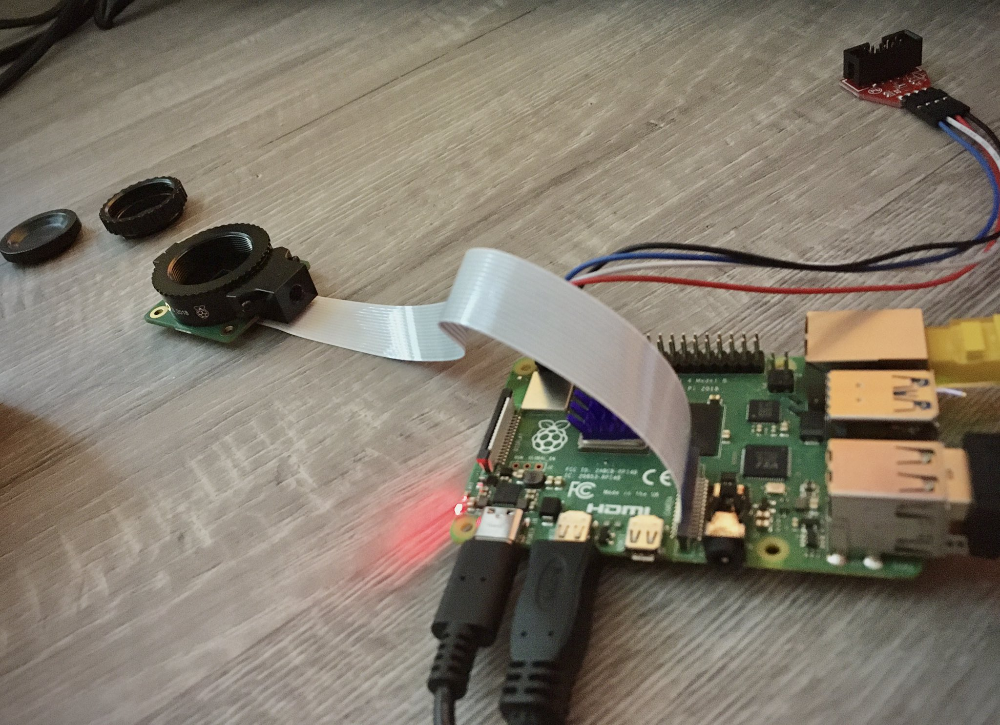
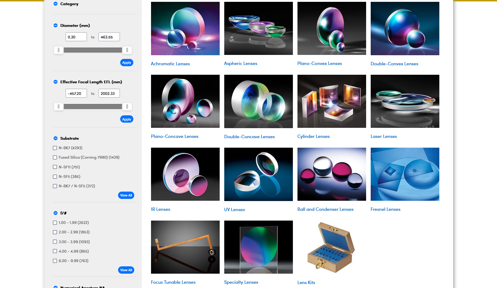
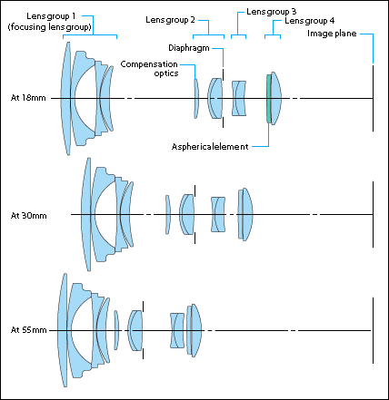
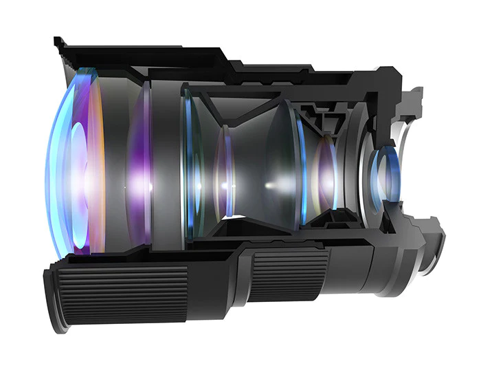
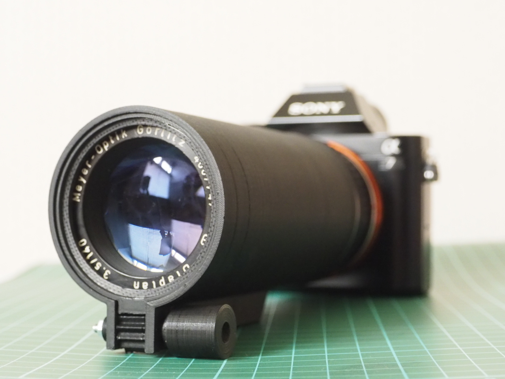
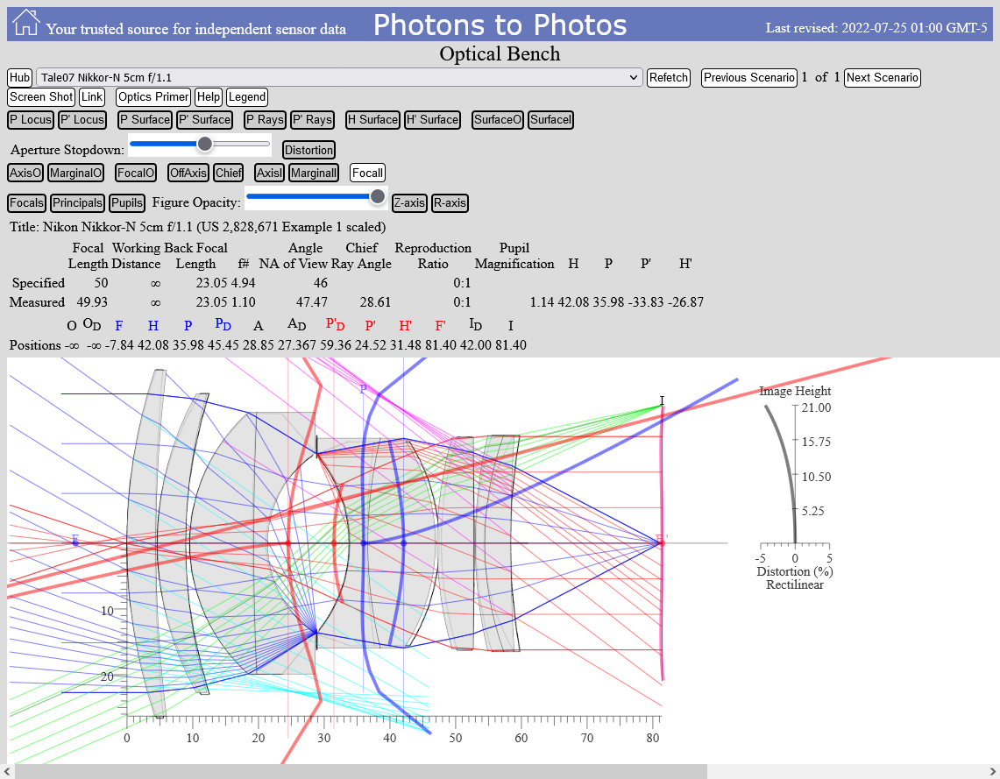
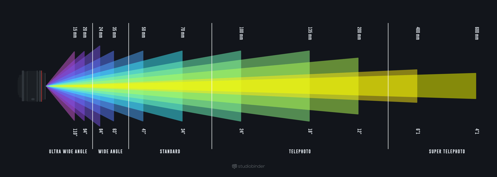
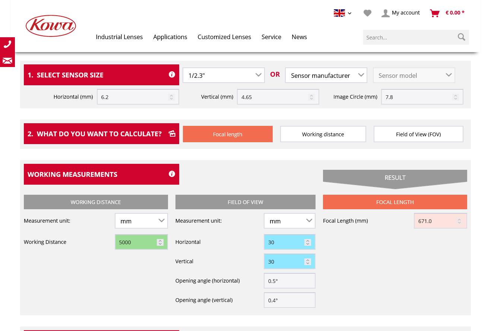
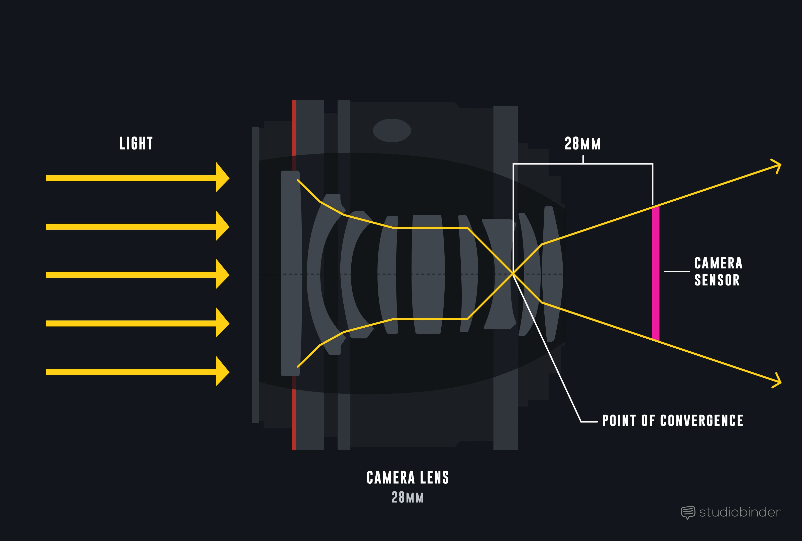

I wouldn't be so puzzled if I had to choose what I buy, but this was left from [playing cards recognition system](/projects/playing-card-recognition-system) I did at work. Raspberry Pi [High Quality HQ Camera](https://www.adafruit.com/product/4561) requires a lens. A lens!

That strange cylinder connected with white ribbon is the camera. It only shows pink or blue, because this thing requires a lens! I'm surprised.

### Specs

- Sony IMX477 sensor [datasheet](https://www.sony-semicon.co.jp/products/common/pdf/IMX477-AACK_Flyer.pdf)
- 12.3 megapixels
- Sensor size: diagonal 7.857 mm (Type 1/2.3) 
- FPC cable for connection to a Raspberry Pi computer

# Lens

Lens for Raspberry Pi HQ Camera? Anyone?

Speaking of lenses. I'm thinking to make my own lens instead of buying an official one for $50.

Of course I first looked up [how to make camera lens DIY](https://www.youtube.com/watch?v=miuhxhodpiQ) so to speak, but then I found sets of glass lenses on Amazon. Which means I need to find a formula and scheme of camera lens.

Also: 

- **Fabrication of optical components using a consumer-grade lithographic printer** ([link](https://opg.optica.org/oe/fulltext.cfm?uri=oe-27-21-30405&id=422075))
- **3D and 4D printing for optics and metaphotonics** ([link](https://www.degruyter.com/document/doi/10.1515/nanoph-2019-0483/html))

## What type?

I found a lot on Amazon that offers [6x 50mm Diameter](https://www.amazon.com/Amlong-Crystal-Premium-Optical-Diameter/dp/B07Z3CVFMB/)

- 3 Double Convex (20, 30, 50cm FL) and
- 3 Double Concave (20, 30, 50cm FL)

Or what if made out of acrylic https://www.amazon.com/Hemobllo-Pcs-Optical-Lens-Magnifying/dp/B083Y27K3S. And I guess that 1.5" is accurate size https://www.amazon.com/Optical-Double-Convex-Diameter-Length/dp/B00CLC7USU

So what do I need? 

Real lenses are complex inside. For example here's Canon EF-S 18-55 mm f/ 3.5-5.6 IS optical design

https://www.ni.com/en-us/support/documentation/supplemental/18/calculating-camera-sensor-resolution-and-lens-focal-length.html

## Camera lens inside

- https://www.photoreview.com.au/news/canon-unveils-two-new-lenses/
- https://www.photonstophotos.net/GeneralTopics/Lenses/Optics_Primer/Optics_Primer.htm
- https://www.photonstophotos.net/GeneralTopics/Lenses/OpticalBench/OpticalBench.htm

https://www.myminifactory.com/object/3d-print-3d-printed-photography-lens-mechanism-for-projector-lens-125175

- depth of field?

- aperture?

On the diagrams you can see that lenses usually come by 2-3 touching each other. This has nothing to do with zoom or focus. Their sole purpose is to [fight](https://www.dpreview.com/articles/0173425621/flat-elements-developed-by-harvard-could-make-camera-lenses-smaller-lighter-and-better) with [chromatic abberation](http://hyperphysics.phy-astr.gsu.edu/hbase/geoopt/aber2.html)

## Dive into physics

### Literature

- Apparently optics is no joke. Here is a free book **Optics by A.N. Matveev** with differential equations, Fourier transformations and other fun https://archive.org/details/matveev-optics/page/n181/mode/2up
- https://study.com/academy/lesson/focal-length-definition-equation-examples.html
- https://escooptics.com/blogs/news/concepts-in-light-and-optics-lenses-part-1
- https://www.edmundoptics.com/knowledge-center/application-notes/optics/understanding-optical-lens-geometries/
- macro extension tubes https://www.cambridgeincolour.com/tutorials/macro-extension-tubes-closeup.htm

> My favourite textbook of all time remains Introduction to Fourier Optics by Goodman. There are some chapters I must have read 100s of times!
>
> [Stephen Gruppetta](https://twitter.com/s_gruppetta_ct/status/1552345687316205568)

### Calculators

- https://www.kowa-lenses.com/en/lens-calculator
- Magnification of lens https://www.omnicalculator.com/other/lens-magnification#optics-101
- Extension tube magnification https://thingsupclose.com/tools/extension-tube-magnification-calculator/
- Compound lens focal length calculator https://www.azcalculator.com/calc/compound-lens-focal-length.php

## Two lens system

Let's start with two lens system.

- https://www.livephysics.com/tools/optics-tools/lens-system-tool-image-distance-magnification/
- https://www.fxsolver.com/browse/formulas/Compound+lens%27+focal+length

https://www.studiobinder.com/blog/focal-length-camera-lenses-explained/

https://www.photonstophotos.net/GeneralTopics/Lenses/OpticalBench/OpticalBench.htm

## Photo, video and streaming

So how to take pictures, record video and stream from the camera?

What software to use, and how to stream covered in [this article](https://www.tomshardware.com/how-to/use-raspberry-pi-camera-with-bullseye)

## Reference

Projects:
- https://learn.adafruit.com/raspberry-pi-hq-camera-low-light-long-exposure-photography

Theory:
- https://learn.adafruit.com/raspberry-pi-hq-camera-lenses/crop-factor
