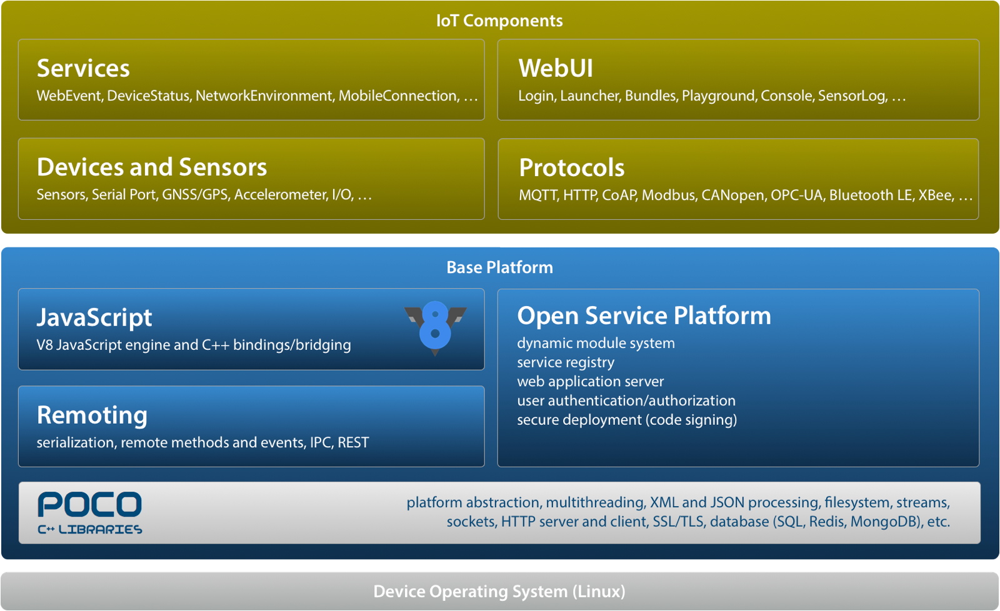
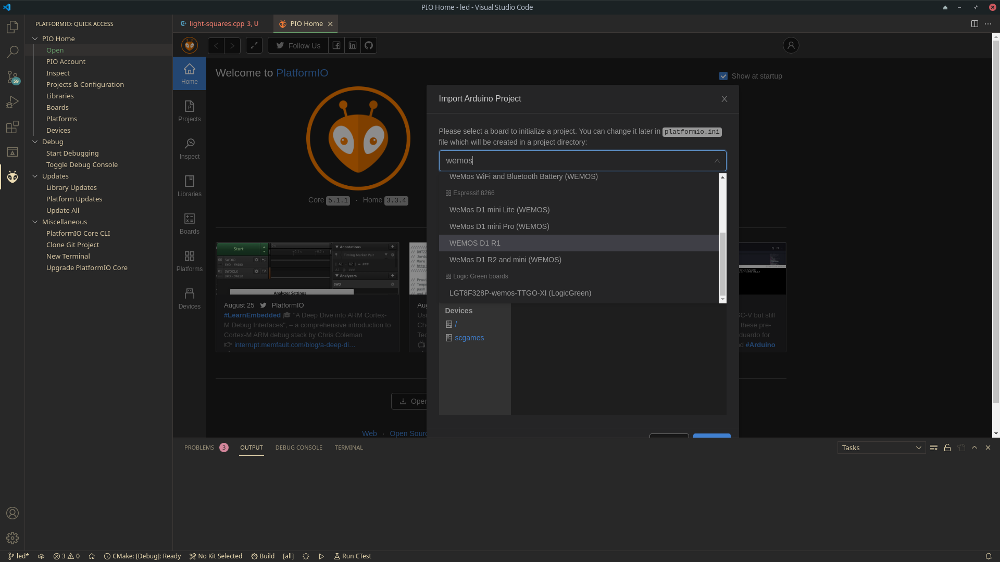

## Blogs

- [Tokyo bird](https://burariweb.info)
- [Jeremy Cook](https://jeremyscook.com/macro-keyboard-makes-music/)
- [Stargirl](https://blog.thea.codes/starfish-a-control-board-with-the-rp2040)
- Other blogs in a [blogroll](https://benjaminhollon.com/blogroll/) (maybe offtopic)

## Things

- [motherboard schematics](https://community.mnt.re/t/im-building-my-own-reform/759)
- 

## Services

Helpful links for DIY hobbyist playing with system on a chip (SoC) and microcontrollers

### 1. WOKWI

https://wokwi.com

WOKWI - Online Arduino Simulator

### 2. macchina.io

https://macchina.io

macchina. io - JavaScript SDK for IoT (extended Poco library)

### 3. PlatformIO

https://platformio.org

PlatformIO - Arduino IDE alternative which integrates with VS Code

### 4. Fritzing

Fritzing - circuit drawing app. Nice breadboard schemes created with it.

### 5. Raspberry Pi Pinout

https://pinout.xyz

Interactive reference to the Raspberry Pi GPIO pins. Interactive!

Also hats!

