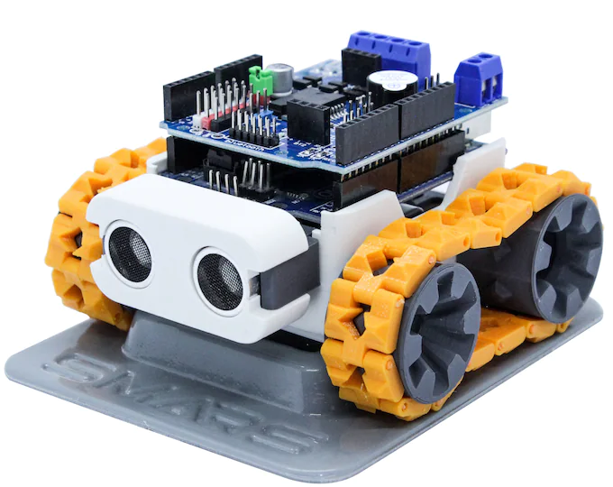
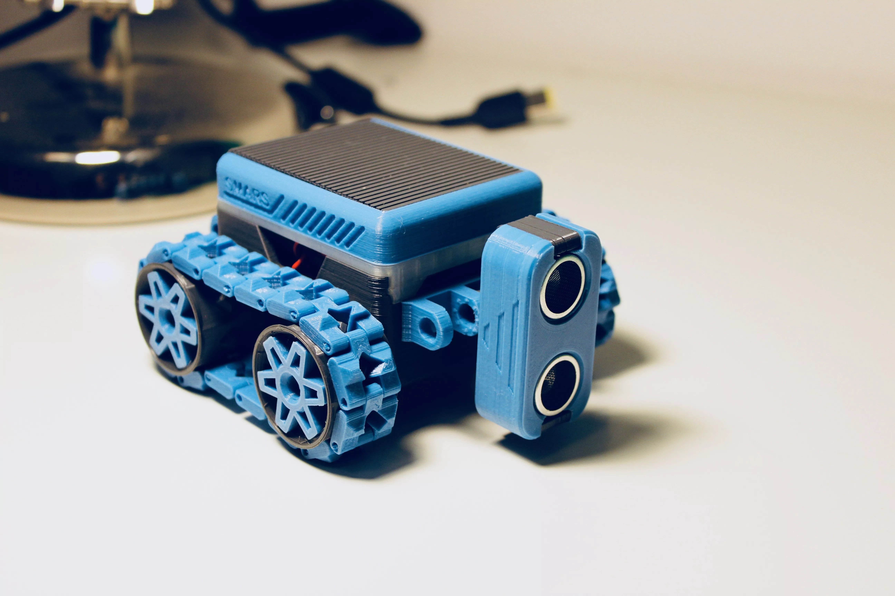
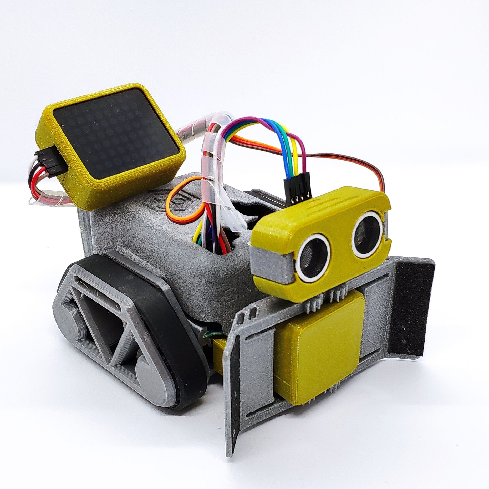

Andrew Male https://twitter.com/andym84/status/1521733648051052546?s=12
If anyone is bored and into robotics, I need one that will sit on my desk and when it sees me reading code for more than an hour it will ask me out loud if I really need to refactor the code.

https://twitter.com/mikolasan/status/1533941270594277376

I decided to start simple. Robot-companion – it is sitting on your desk and monitors you. 

It plans and organizes your work.
If you stuck on social media website, it will tell you get back to work.
And the opposite, it reminds when to do a break.

Plus a screen with emotion expressions and wheels to poke around on the table and find a charger station when needed.

So it’s like a coach. It should pose an angry reaction when you are out of track in your plan.

I'm aiming for a physical device. It will sit on a desk - a physical table where my laptop is. 

Like [this](https://cults3d.com/en/3d-model/gadget/smars-v4-lite)
https://www.thingiverse.com/thing:2662828

Creator https://cults3d.com/en/users/Tuitxy/creations?page=2

I saved the link originally where I saw interface similar to **Thingeverse** and the download button. But then I noticed that in one yaer the creator has made 3000 euro selling this model by 5 euro for the zip.

Looks like a good business model for hobby. But I'm a guy from Soviet Union, which means I am okay to spend some time to recreate it by my own, because engineering is in my blood.

## 3D model description

> This new version of SMARS is reduced to the essential.
> The chassis has been eliminated to reduce printing time, motion system is an updated version of the pro tracks model, it gives smooth and precise movement.
> This model moved the trade off between modularity and flexibility to another level, 
> SMARS V4 lite is Arduino based but can easily mount Raspberry PI 3B/ 4B or a Microbit by adding a simple adapter.

This pack contains the following parts:

- SMARS V4 Lite core unit
- ultrasonic sensor
- claw
- connector extensions
- line sensor

### Core unit:

- 2x 150RPM 6v N20 motors
- 1x Arduino UNO
- 1x Adafruit Motor Shield V1 or V2
- 6x 5x10x4 bearings
- 12x 5x8x2.5 bearings
- 2x silicone wristbands
- 1x velcro strip

### Sensor

- 1x HC-SR04 Ultrasonic Sensor

### Claw

- 1x MG90S 9g Servo Motor

### Line sensor

- 1x KY-032 infrared sensor

### Battery

- 8.14Wh 7.4V 1100mAh 35C Li-ion-Po Battery with JST Plug
- 20 AWG JST Plug Connector 2 Pin

OR

- USB Rechargeable 9V Lithium Batteries - 5400mWh
- 9V battery connector

OR

- PS3 controller 1800mAh 3.7V Li-Ion Battery

### Optional

- I2C Interface 8X8 LED Dot Matrix Display

## 3D printing

chassis

Silicone wristbands can be used as tracks. this solution gives an incredible grip to the robot and a more fluid motion due to the bearings system

If the robot gets stuck, the transmission should automatically decouple the wheel from the motor shaft preventing current peaks. This new wheel concept will avoid damages to motors or electronics controller. 

Settings: 0.2mm, 15% infill

Wheel update https://www.thingiverse.com/make:434760