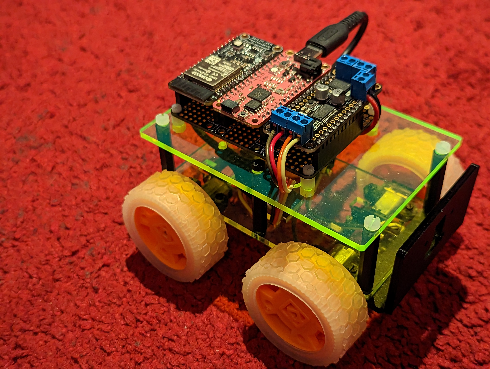

Design a robot in three easy steps:

- [3d print](/make/3d-printer-dilemma)
- [buy components](/make/where-to-buy-electronic-components-in-us)
- assemble

mu-ha-ha 🤣 In reality you need to overcome a little bit more steps.

## The look and shape

In this light I put on the first place the functional capabilities of the thing you want to build.

- Does it move? Mechanical tracks, or wheels, or legs?
- Inside or outside? It needs a battery.
- How complex its movements in the space? Just moving or also make interactions with the world: drawing, grab things? Extra servomotors.
- What obstacles it needs to conquer? Lidar or ultrasonic sensors. 
- Flat floor and walls and doors? Climb stairs? Think about adding more legs for stability like hexapod and gyro sensor.
- Jump on the desk and from it? Fly? You are building a drone now.
- Should it collect information? Add sensors 

It worth looking through [popular designs](/make/robot/encyclopedia). I started a research about [appearance design](/make/robot/appearance-design) in order to understand how to make it look cute or evil.

## Hardware components

- Battery charger and step up voltage regulator in one [power board](/make/robot/power-board)
- [Motors](/make/robot/motors)
- [Motor driver board](/make/robot/motor-board) in case we decide to add motors for any purpose
- Accelerometer
- Gyro
- Tilt sensor
- Ultrasonic sensor
- Time of flight sensor
- 

To design a printed circuit board you will need to learn at least some basics of CAD software like Eagle, Fusion 360, KiCAD. Here is mine notes: [PCB design 101](/make/pcb-design-101)

Modular design dictates to find a way to put the boards together. For example with [castellated mount holes](/blog/castellated-vias).

## Prototype

Before really doing [version 1](/make/robot/prototype-1) I plan to look closer into targeting it as a board for making [Arduino-based drone](/make/robot/arduino-drone) and flexible for [constructor kit](/make/robot/constructor) purposes.

Many other things get postponed to [version 2](/make/robot/prototype-2).
 
## See also

- If it looks too intimidating, then take a look on Kevin McAleer's video [How to design and make a robot](https://www.youtube.com/watch?v=lKxJUViQsW8) that will show how simple it can be
- Perception of sensors and actuation of motors reviewed alos from [developmental psychology perspective](/science/developmental-psychology-studies)
- #Tiny4WD on Twiter

