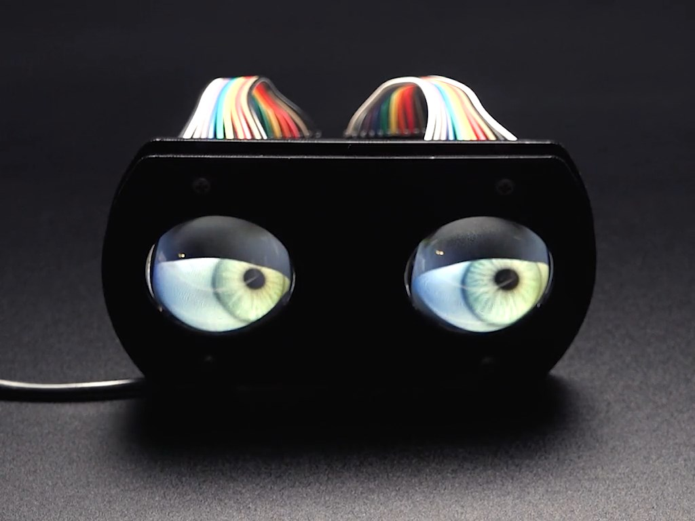
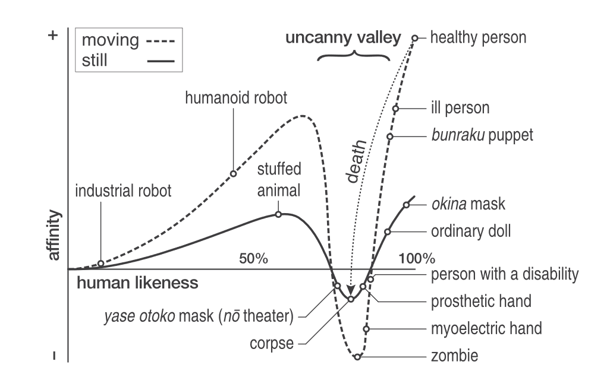
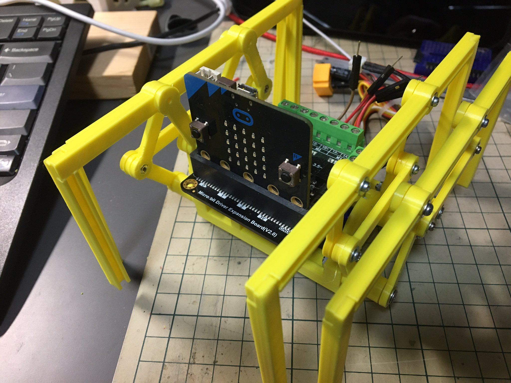
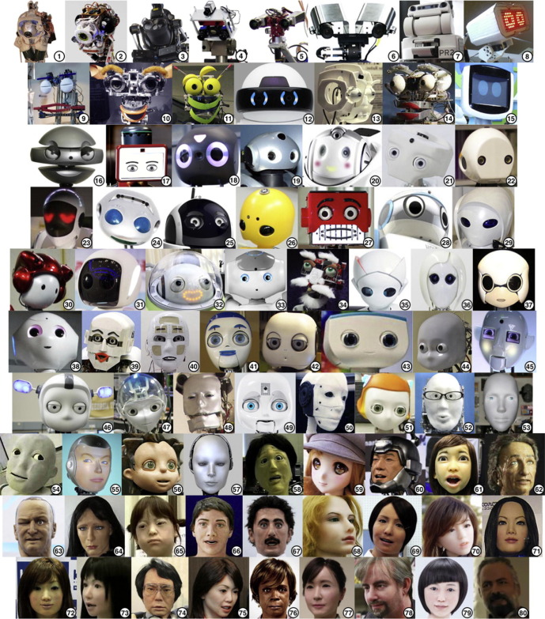
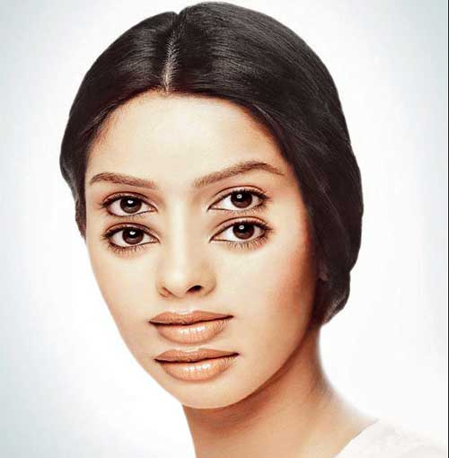
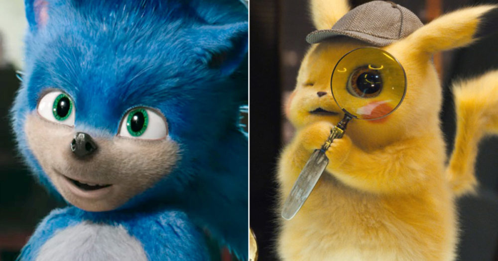

I'm convinced that any robot should have a creepy aspect. Like [tracking you big eyes](https://www.adafruit.com/product/3813) that can drive people crazy.

I've read in Discover magazine that MacDorman and Alexander Diel (psychology researcher at Cardiff University in Wales) published a paper where they organized nine categories of the uncanny valley effect - a feeling in the perception of living beings that something is off.

This sounds in fact cool that some researchers put in their time and collected information enough for nine (9!) categories. And first thing I think is that **I want to build nine robots, one for every category!**

Something like this interesting rectangular spider by Namako. If it's not creepy for you then you haven't [seen it in action](https://twitter.com/KantenNamako/status/1577672677497896961).

But these nine categories really disappointed me.

1. Thatcher humans elicit a stronger UV effect than humans.
2. Thatcher cats elicit a stronger UV effect than cats.
3. Thatcher houses elicit a stronger UV effect than houses.
4. Thatcherization elicits a stronger UV effect when applied to humans than to cats.
5. Thatcherization elicits a stronger UV effect when applied to cats than to houses.
6. Faces with distorted proportions elicit a stronger UV effect than undistorted faces.
7. Greebles elicit a stronger UV effect than familiar objects like humans, cats, and houses.
8. People with a disability resulting in facial dysmorphism elicit a stronger UV effect than people without one.
9. Diseased body parts elicit a stronger UV effect than humans

I don't understand what cats and houses supposed to do here. But I don't want to give robots any deceased traits. Don't we already have data to categorize robots by their creepiness? Here it is

Also I can say that thatcher effect is worth considering though. But why not to go a bit further? Internet has so many wild pictures.

### Four eyes

### Sonic

[Why Pokemon Detective Works, but Sonic the Hedgehog does not](https://www.writingintotheether.com/the-uncanny-valley-why-pokemon-detective-works-but-sonic-the-hedgehog-does-not/) post by Amy Ether

## Conclusion

The article in the magazine and a few robot pictures made me create this post. I'm curious to get practical recommendations on how to get (or avoid) the effect when you design a robot. And I'm not saying about very realistic robots when it is all about their moves. But I'm not satisfied neither with classification nor the term applied to robotics by mass media. That's why I created this page as a starting point. This is all I've got about creepy robots for now., but I just started my research and development.

## Reference

- [Paper 1](https://www.semanticscholar.org/paper/Creepy-cats-and-strange-high-houses%3A-Support-for-in-Diel-Macdorman/da9f0e4fdd00d32c58d44308f312b487563dd52c) [ [PDF](https://pdfs.semanticscholar.org/6c45/f56d81df1e67dd3ea90be780541e0859516d.pdf) ] - 9 theories (not "categories")
- [Paper 2](https://www.researchgate.net/publication/353373476_A_Meta-analysis_of_the_Uncanny_Valley%27s_Independent_and_Dependent_Variables) - the latest paper probably mentioned in the magazine

