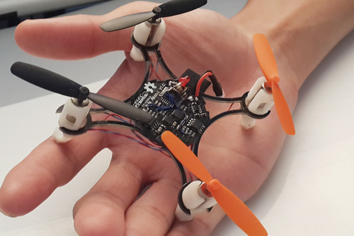

- [YMFC-AL](http://www.brokking.net/ymfc-al_main.html) ?
- [YMFC](https://www.crowdsupply.com/shaos-gadget/ymfc-flight-controller-and-mini-drone) Open Source: https://github.com/jamesshao8/ymfc-mini-drone
- Based on [indiegogo campaign](https://www.indiegogo.com/projects/elf-the-hd-video-streaming-nano-drone#/), ElecFreaks seems like a scam company, they promised to develop open sourced mini drones 

but didn't deliver them, their app is removed from app stores and no code, no PCBs https://www.thingiverse.com/thing:501904

- Flip MWC
- Hobbypower APM
- Crazepony I
- Crazyflie