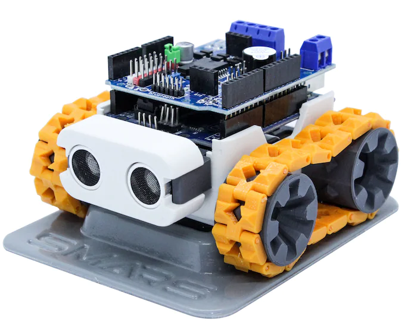
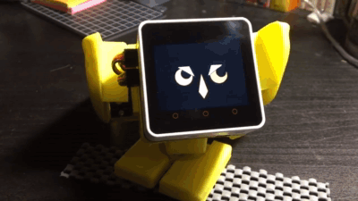
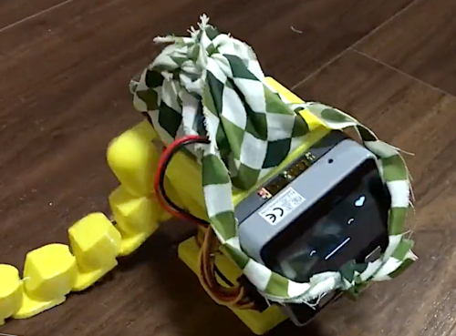

### Tank-like robot

SMARS [version 1](https://www.thingiverse.com/thing:2662828), [version 4 (lite)](https://cults3d.com/en/3d-model/gadget/smars-v4-lite) created by [Kevin Thomas](https://cults3d.com/en/users/Tuitxy/creations?page=2).

I originally saved a link to **Cults 3D** where I saw similar interface to **Thingeverse** and the download button. But that doen't allow you to take the files. And then I noticed that in one year the creator has made 3000 euro selling this model by 5 euro for the zip. Looks like a good business model for hobby. 

But I'm a guy from Soviet Union, which means I am okay to spend some time and create my own version, because engineering is in my blood. Here's helpful [design walkthrough](https://www.smarsfan.com/learn/design/) from Kevin McAleer.

Similar [tank from Japan](https://burariweb.info/electronic-work/mini-tank-esp8266.html).

### Dog-like robot

From https://www.thingiverse.com/thing:5403752

### Kawaii robot

[Stack-chan](https://hackaday.io/project/181344-stack-chan-javascript-driven-super-kawaii-robot) robots created by [Shinya Ishikawa](https://twitter.com/meganetaaan) and its community. For example [this](https://protopedia.net/prototype/3299) sad yellow lizard by [Namako](https://twitter.com/KantenNamako)

It has "stack" in it's name because it uses [M5Stack](https://m5stack.com/) which is a tiny box 5 cm on the side with a screen based on very popular low-cost system on a chip - **ESP32**. I remember first hearing about M5 from [YouTube video reviewing](https://www.youtube.com/watch?v=v9sNzmtMSXo) their [E-ink display kit](https://shop.m5stack.com/products/m5paper-esp32-development-kit-comm-edition)

https://protopedia.net/prototype/3277