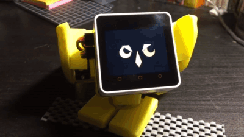

### Kawaii robot

[Stack-chan](https://hackaday.io/project/181344-stack-chan-javascript-driven-super-kawaii-robot) robots created by [Shinya Ishikawa](https://twitter.com/meganetaaan) and its community. For example [this](https://protopedia.net/prototype/3299) sad yellow lizard by [Namako](https://twitter.com/KantenNamako)

It has "stack" in it's name because it uses [M5Stack](https://m5stack.com/) which is a tiny box 5 cm on the side with a screen based on very popular low-cost system on a chip - **ESP32**. I remember first hearing about M5 from [YouTube video reviewing](https://www.youtube.com/watch?v=v9sNzmtMSXo) their [E-ink display kit](https://shop.m5stack.com/products/m5paper-esp32-development-kit-comm-edition)

https://protopedia.net/prototype/3277
