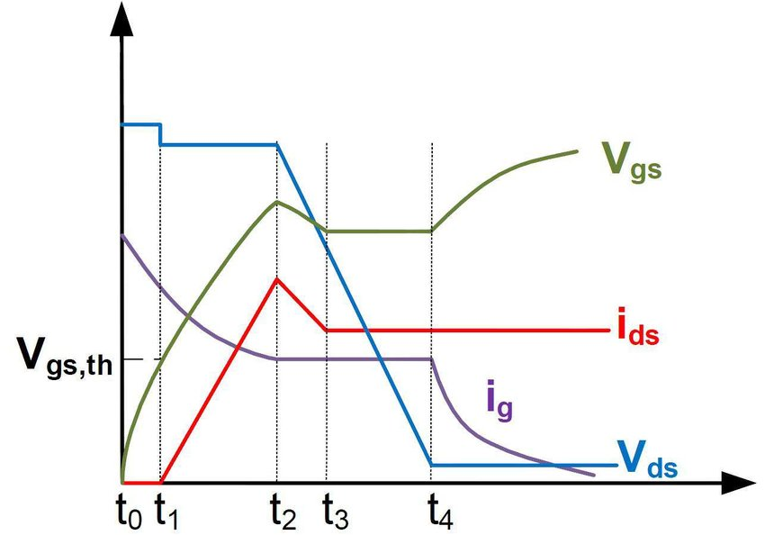

One more thing I advise him to do, is to put in an a-d to verify current control. 
Mosfets have a turn on current, and then a rise current. 

That's if it's range is 5 volts, and it's turn on is one point five volts, you only have a 3.5 volt overall range. 
Also once the turn on current is reached, there is a bit of breakdown so that once it crosses 1.5 volts, it's activation current is now only 1.2 volts. 
You need to tailor the overall current. 
An a-d does an excellent job however that is not conclusive. 
The actual conclusion should be reached from the actual performance. 

Example. I want a motor to rotate at 3.5 RPM. 
Current says that should be 3.2 volts. 
I can set my a-d to keep my d-a at 3.2 volts. 
However that does not guarantee that the motor will travel at 3.5 RPM. 
The only way to guarantee that (?) is to put in an encoder and set the control to 3.5 RPM.
However if at 3.2 volts, I do not achieve 3.5 RPM, there is additional load and drag. 
If the desired RPM is not even close, then we have a problem and should abort. 
It's a lot of extra work, but it achieves a significantly _superior product_.

I need to know more about what he is using it for.
If for positioning, it is different than if for speed control.

Also, have him look up snubber circuits. These take the backflow and shunt it into a cap to reduce feedback voltage. It helps us not blow up on an instant reverse. 

On positioning, if exact is needed and it's fair mass, 
then you need a ramp up, down, and hold function.
This needs encoder feedback.
There is a 1 chip control solution but is fairly expensive.

Drive power should always tailor to the load and thus discrete components. 

Let me know what he wants to do with it and I'll give more. 
Microchip and stm are great control chips for high power apps.
Also let me know if the control needs to be synced with other controls.

---------

Mosfets are controlled by voltage (opposite to normal transistors that are controlled by current)