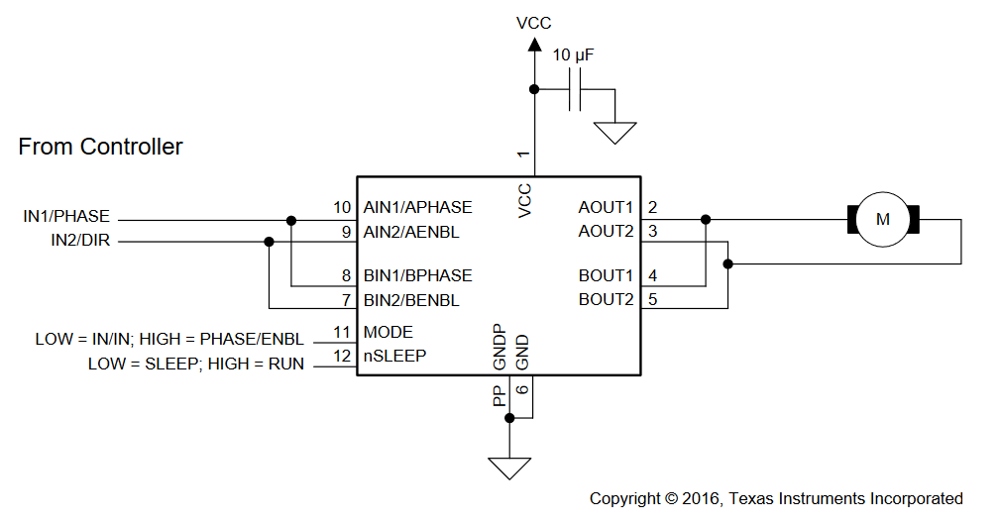

## Alternatives

- [A-Star 32U4 Robot Controller LV with Raspberry Pi Bridge](https://www.pololu.com/product/3117)

## Motors

Main question here is power and torque which is created by series of spur gears called a _gear train_. It could be simple as 2 gears or **planetary gear train** (higher gear reduction, very compact) and this can be implemented in non-circular form 🤤 (They are not as compact as round ones, and at specific points they hold higher stalled resistance than in others which makes movement obviously uneven.) Planetary gearing (or **epicyclic gearing**) is cool, but there is also **cycloidal drive**, that eliminates a _backlash_ - it's that imperfection between gear teeth that is noticeable when rotation direction has been changed. And the last but not least in this list is **strain wave gearing** that is used in the wheels of Apollo Lunar Rover. It requires a flexible spline, but oversteps advantages of the above systems.

I'll try micro gear motors with [75 RPM](https://www.digikey.com/en/products/detail/pimoroni-ltd/COM0806/6873670) and [155 RPM](https://www.digikey.com/en/products/detail/dfrobot/FIT0483/7087160).

_Note:_ voltage defines RPM, not current

## Motor driver

[H-bridge](https://www.uni-weimar.de/kunst-und-gestaltung/wiki/H-Bridge)  (aka full bridge, not half bridge) motor driver [breakout board](https://www.adafruit.com/product/2448) based on [TB6612](https://cdn-shop.adafruit.com/datasheets/TB6612FNG_datasheet_en_20121101.pdf) that supports 2 motors and 1.2A per channel. Texas Instruments offers  [DRV8210](https://www.mouser.com/ProductDetail/595-DRV8210DSGR) 1 channel, [1.76A](https://www.ti.com/general/docs/suppproductinfo.tsp?distId=26&gotoUrl=https://www.ti.com/lit/gpn/drv8210) or [DRV8836](https://www.digikey.com/en/products/detail/texas-instruments/DRV8836DSSR/3088190) 2 channels, [1.5A](https://www.ti.com/general/docs/suppproductinfo.tsp?distId=10&gotoUrl=https%3A%2F%2Fwww.ti.com%2Flit%2Fgpn%2Fdrv8836).

Alternative: [TMC7300](https://www.mouser.com/datasheet/2/256/TMC7300_Datasheet_V105-2066925.pdf) that includes DC converter and can work from the battery directly.

**Additional components**: 

- 1x capacitors [10uF](https://www.mouser.com/ProductDetail/81-GRM188R60J106ME4D) - voltage Rating 6.3VDC