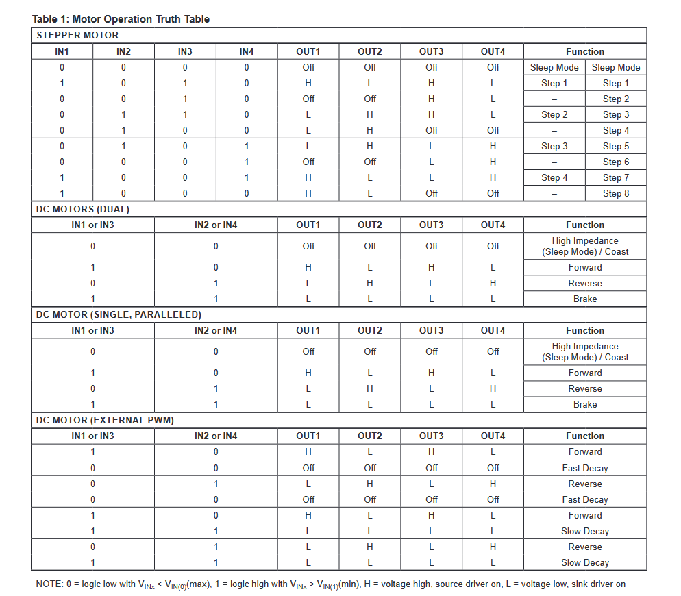
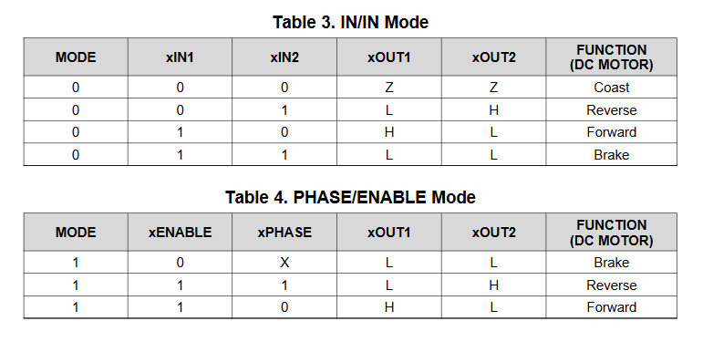
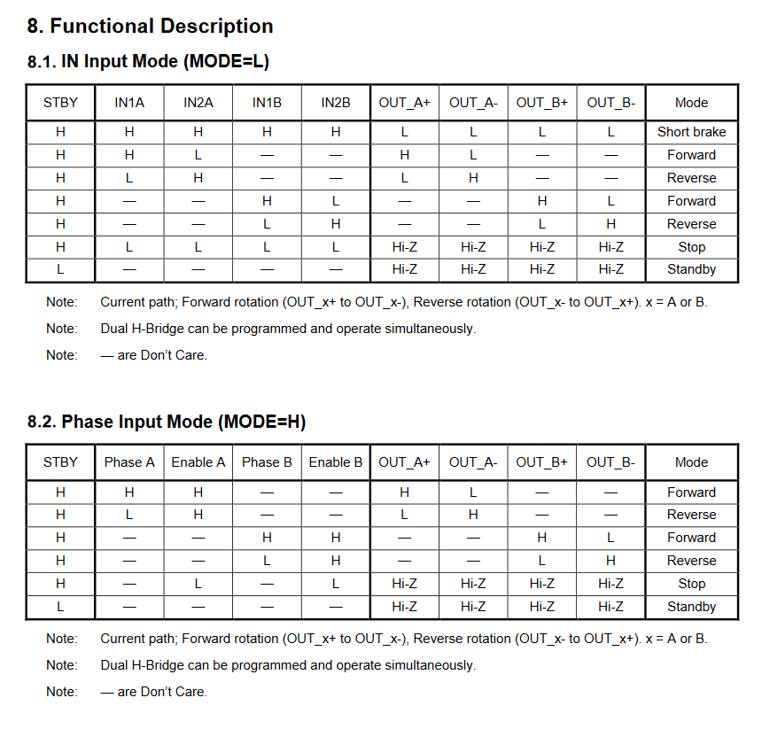
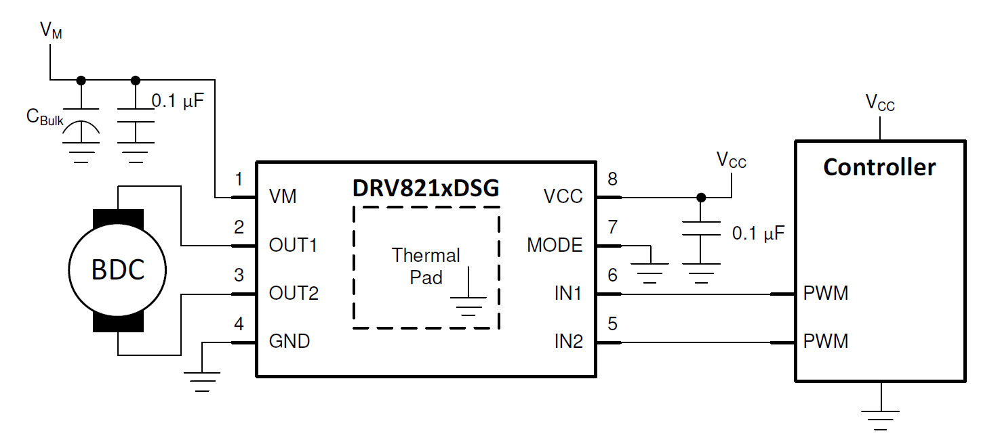
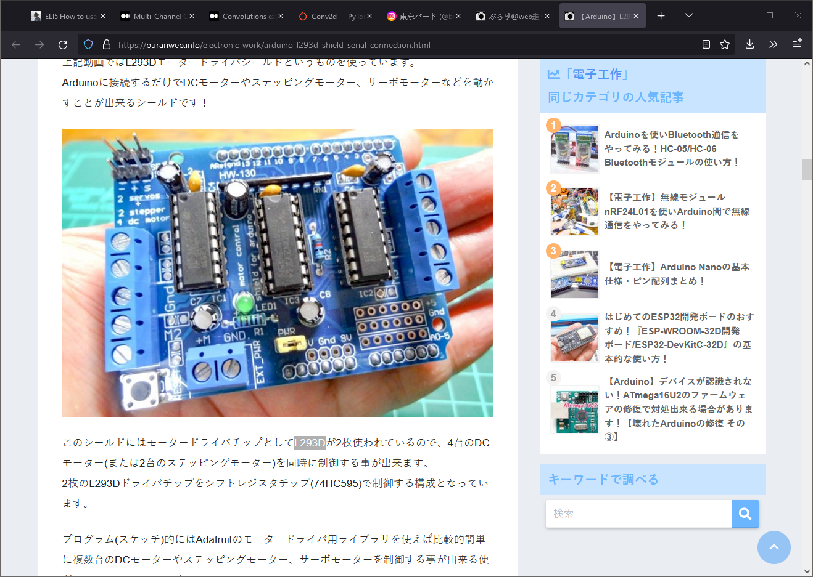

## H-Bridge

[H-bridge](https://www.uni-weimar.de/kunst-und-gestaltung/wiki/H-Bridge), also called as _full bridge_ (but not half bridge), is a motor driver that allows the motor to rotate forward and back. H-Bridge can be created with the help of four MOSFETs and diodes.

> Unwise to power an H-bridge with two d-a's, forward and reverse, you run risk of powering both sides on at once. This destroys the H-bridge and can destroy the motor. Be really careful. You can only power one at a time.
>
> _Tony about homemade H-Bridge implementation_

Or it can be an IC. I looked into this [breakout board](https://www.adafruit.com/product/2448) based on classic [TB6612](https://cdn-shop.adafruit.com/datasheets/TB6612FNG_datasheet_en_20121101.pdf) that supports 2 motors and 1.2A per channel. 
Other super classic options will be **L293D** and **L298**.

So why not to use classic bridges like L298N, or L293D, or TB6612? Because they cost $12 per chip, and they are out of stock 😭 

Next, I check what chips are available at the moment. Texas Instruments offers 

- [DRV8210](https://www.mouser.com/ProductDetail/595-DRV8210DSGR) 1 channel [1.76A](https://www.ti.com/general/docs/suppproductinfo.tsp?distId=26&gotoUrl=https://www.ti.com/lit/gpn/drv8210) or 
- [DRV8836](https://www.digikey.com/en/products/detail/texas-instruments/DRV8836DSSR/3088190) 2 channels [1.5A](https://www.ti.com/general/docs/suppproductinfo.tsp?distId=10&gotoUrl=https%3A%2F%2Fwww.ti.com%2Flit%2Fgpn%2Fdrv8836).

I had a gut feeling that I didn’t check all specs for my H-Bridges. I stopped my choice on 

- **DRV8836** Dual Low-Voltage H-Bridge IC from Texas Instruments and
- **A3909** Dual Full Bridge Motor Driver from Allegro Microsystems

I was checking **level input voltage**, how many motors it can drive (checking the type of connection that is different for DC motor, bipolar DC motor, and stepper motor), and was comparing **stall motor current** with **maximum output current**.

## Speed control

First I started worrying what kind of input is required. UART, I2C protocol, PWM signal? How to implement speed control? Do I need Digital-to-analog converter?

My friend Tony asked his engineer the same questions and he [raised many questions](/make/robot/letter-from-the-engineer) about the design, ADC and precautions against H-Bridge.

Let's think. It’s not a stepper motor, therefore we don’t need to send pulses, just ON or OFF signals. PWM might produce different speed. I need to check how many PWM outputs on ATMega chips. But the question is: is it possible to simulate PWM on regular DOUT?

## Dual channel

Guess how I was surprised today that _Dual Full Bridge_ means that the second motor is moving exactly as the first one. And we are talking about bipolar DC motors. Yes, it’s not another independent channel. IT IS NOT. 

Looking at TI's DRV8210 and Toshiba's [TC78H660FTG](https://toshiba.semicon-storage.com/info/TC78H660FTG_datasheet_en_20200714.pdf?did=68604&prodName=TC78H660FTG) now 😋 Another alternative can be [TMC7300](https://www.mouser.com/datasheet/2/256/TMC7300_Datasheet_V105-2066925.pdf) that includes DC converter and can work from the battery directly.

**How to verify it?** Datasheets should include a control table - output levels corresponding to input signals. Here's for example **A3909** that disappointed me (DC Motor section, INs are merged - not independent)

For **DRV8836** we will see completely different picture. There one small table that works for both channels (1 and 2) and marked as 'x'

And compare both previous tables with this clear table and extra notes from Toshiba **TC78H660FTG** 😍

## Schematics

### Full-Bridge driving typical application

Note: Pay attention to a paragraph about bulk resistance

**Additional components**: 

- 1x capacitors [10uF](https://www.mouser.com/ProductDetail/81-GRM188R60J106ME4D) - voltage Rating 6.3VDC

## Alternative boards

- [Adafruit TB6612 1.2A DC/Stepper Motor Driver Breakout Board](https://www.adafruit.com/product/2448) (TB6612)
- [A-Star 32U4 Robot Controller LV with Raspberry Pi Bridge](https://www.pololu.com/product/3117) (DRV8838). Using [their schematics](https://www.pololu.com/file/0J950/a-star-32u4-robot-controller-lv-with-raspberry-pi-bridge-schematic.pdf) I verified that there is no need to add more capacitors or resistors to the original scheme.
- [X-NUCLEO-IHM08M1](https://www.st.com/en/ecosystems/x-nucleo-ihm08m1.html) (L6398). Half bridge, but oriented on brushless motors that require a special algorithm to supply power, which is a part of hardware.
- [MAX22007 Peripheral module](https://www.mouser.com/datasheet/2/256/MAX22007PMB-3002184.pdf) `
- [Driver for stepper motors](https://blog.poscope.com/stepper-motor-driver/)

## Questions

**Q** I plan to do 4 motors. A chip per motor or dual channel ICs? What if I do more motors? 🤔

**A** ...

**Q** Software PWM VS Hardware PWM

**A** In the nutshell: CPU cycles VS accuracy (Reference: [1](https://youngkin.github.io/post/pulsewidthmodulationraspberrypi/) [2](https://raspberrypi.stackexchange.com/questions/100641/whats-the-difference-between-soft-pwm-and-pwm))