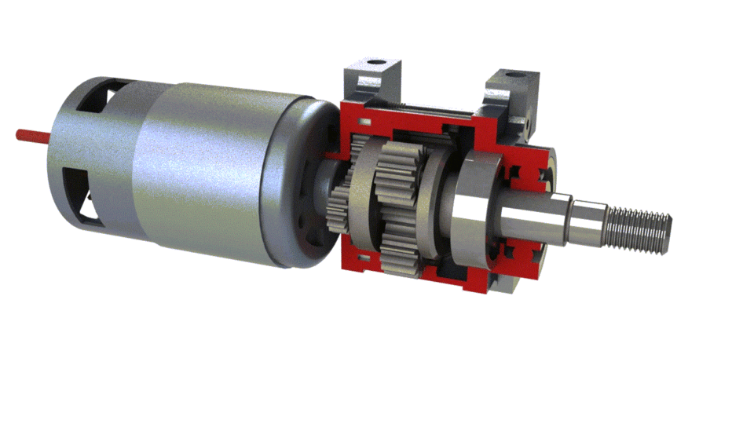
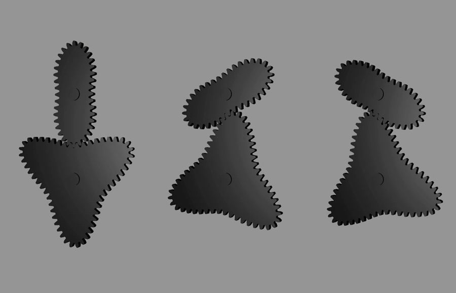
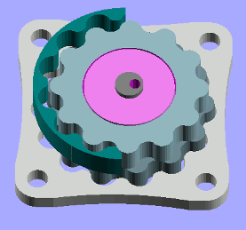
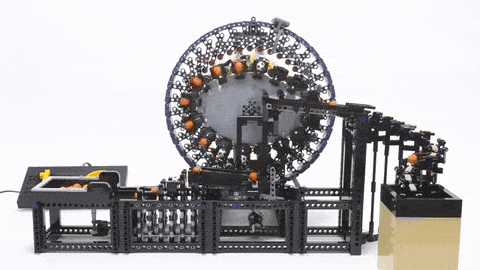
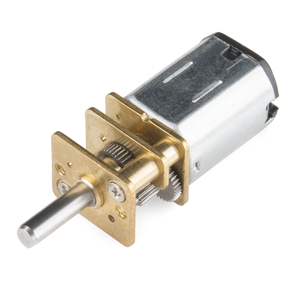

## Planetary gear train

Main question here is power and torque which is created by series of spur gears called a _gear train_. It could be simple as 2 gears or **planetary gear train** (higher gear reduction, very compact) 

and this can be implemented in non-circular form 

"Credit: YouTube channel Rail and Oak"

They are not as compact as round ones, and at specific points they hold higher stalled resistance than in others which makes movement obviously uneven.

## Epicyclic gearing

Planetary gearing (or **epicyclic gearing**) is cool, but there is also **cycloidal drive**, that eliminates a _backlash_ - it's that imperfection between gear teeth that is noticeable when rotation direction has been changed. 

## Strain wave gearing

And the last but not least in this list is **strain wave gearing** that is used in the wheels of Apollo Lunar Rover. It requires a flexible spline, but oversteps advantages of the above systems.

"Credit: YouTube channel Akiyuki Brick Channel"

## Micro gearmotors

For [the first prototype](/make/robot/prototype-1) I will try brushed DC micro gear motors with [75 RPM](https://www.digikey.com/en/products/detail/pimoroni-ltd/COM0806/6873670) and [155 RPM](https://www.digikey.com/en/products/detail/dfrobot/FIT0483/7087160).

_Note:_ voltage defines RPM, not current. 

[Brushless DC motors VS brushed DC motors](https://www.renesas.com/us/en/support/engineer-school/brushless-dc-motor-01-overview). Controlling BLDC is not a trivial task, but Field oriented control (FOC) algorithm is not that hard. Look at this [Arduino implementation](https://docs.simplefoc.com/)
