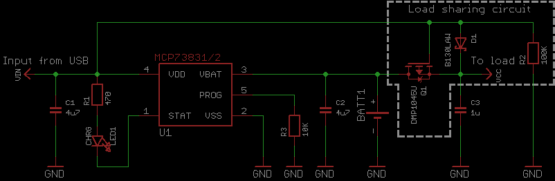

Zak [well explained](https://blog.zakkemble.net/a-lithium-battery-charger-with-load-sharing/) how to add a MOSFET that will help with situations like

- using only battery
- USB connected, charging battery, battery is not used for powering the load. What USB cannot provide enough power, will charging suffer?
- USB connected but battery is missing (MOSFET has nothing to do here, this is on MCP73831)

Which is in its turn an adaptation of [a note from Microchip](https://ww1.microchip.com/downloads/en/AppNotes/01149c.pdf) (_Designing A Li-Ion Battery Charger and Load Sharing System With Microchip’s Stand-Alone Li-Ion Battery Charge Management Controller_ by Brian Chu)

Interesting that I found these links in one very long rant on a [EEVblog forum](https://www.eevblog.com/forum/beginners/tips-for-designing-a-usb-battery-powered-mcu-project-with-built-in-charging/). Very confusing discussion full of MOSFET dyslexia ()

But it was much more constructive discussion than on Electronics Stackexchange where I found very confusing topics:

- [How to add MOSFET](https://electronics.stackexchange.com/questions/139600/how-to-use-coin-cell-cr2032-in-parallel-with-a-power-supply) to switch between battery and external source. Doesn't look like the source is connected right
- [Two diodes or MOSFET?](https://electronics.stackexchange.com/questions/495845/best-way-to-have-circuit-powered-by-usb-when-plugged-in-and-battery-when-not) but the answer is to buy a board. Otherwise, mind bending schematics without ground. No ground at all!
- [Idea with the comparator](https://electronics.stackexchange.com/questions/130932/switching-between-battery-and-usb-using-diode-or-logic). And also with two comparators that detect a voltage range ([window comparator curcuit](https://www.electronics-tutorials.ws/opamp/op-amp-comparator.html)). Though it's interesting but doesn't look flexible: first you need to understand the window and comparators, then calculate values (take into account battery charged and discharged states, and difference between USB and battery voltage), then why one MOSFET is not enough?

On hackster.io I found [some concerns](https://www.hackster.io/spurga_zr/esp8266-development-board-battery-powered-and-solar-powered-f3fccd) about LDO voltage regulator (suggesting HT7333 as a solution)

> most boards such as Wemos, NodeMCU and others have an AMS117 voltage regulator that has an extremely high drop-out voltage of 1.3V, which makes them unusable for battery power

 and proper battery level readings (this is about separate LipoFuelGauge system)
 
> In order to be able to accurately measure the state of the battery, you cannot do it through resistors and ADC Pins, because the voltage of lithium-ion batteries does not drop linearly, while this chip has a special algorithm that calculates the state of the battery.

More complex control - [voltage multiplexer](https://www.mikrocontroller.net/attachment/176412/Power_Multiplexer.pdf) from Power Electronics Technology magazine
## Alternatives

- [PCB design alternative](https://grabcad.com/library/stbc08-high-current-lipo-battery-charger-1)
- [LiPo charger from Adafruit](https://learn.adafruit.com/li-ion-and-lipoly-batteries/downloads)

Power distribution boards

- [Matek PDB-XT60 w/ BEC 5V & 12V](http://www.mateksys.com/?portfolio=pdb-xt60) (what chip is used there?)
- Matek Systems PDB Supports 3S Battery for FPV Racing Drone HUB5V12V

## Plan

- search for a prototype board for ESP32
- add USB connector
- voltage stabilizer (buck converter)
- battery charger chip
- solar panel connector
- battery connector
- SPI line connectors and power for display
- voltage divider between ADC and battery (to read battery level)

## Power source

Motors normally require higher voltage (6V, 12V, 24V) and current, and it's a good practice to keep motors, LEDs (like very long strips of LEDs), switches electronically seperated from the logic (3.3V). But **how do you decouple it** when the whole project should work from the battery?

Do you use two batteries? Just imagine what a headache is to keep two separate batteries charged. I can only think about sophisticated system where there is an assumption that motors can kill the battery often, but at the same time the main brain must continue operating, therefore it remains only one option: to send a signal about help to other robots. But I've never seen such design.

So what normal people use instead?

Power supply needs to be protected from Back EMF when motors abruptly stop or reverse the rotation direction. But rechargeable battery only wins from this effect. The only concern will be values above maximum ratings especially for li-poly batteries that are very sensitive.

Read more: [Operating an Arduino for a Year from Batteries](https://analysisnorth.com/articles/arduino-for-a-year.html)

## Battery charger

Let's design our custom board for powering the robot from one lithium polymer battery, say 3.7V and 2500mAh.

First of all, even before using the battery in any way, we should think about charging it. Here's a [battery charger](https://www.adafruit.com/product/259) from Adafruit based on [MCP73833](https://cdn.sparkfun.com/assets/b/a/7/6/8/MCP73833Datasheet.pdf) (evaluation board [doc](https://ww1.microchip.com/downloads/en/DeviceDoc/51626a.pdf)). For a second I thought that I found cheaper option - [MCP73831](https://ww1.microchip.com/downloads/en/DeviceDoc/MCP73831-Family-Data-Sheet-DS20001984H.pdf) on Digi-Key in a 5-lead SOT-23 package, but it consumes 4x times less current during charging which means that it's going to charge much slower and has less indication signals. The datasheet provides PCB layout example.

Old alternative for these chips is [MAX1555](https://datasheets.maximintegrated.com/en/ds/MAX1551-MAX1555.pdf) and [TP4056](https://dlnmh9ip6v2uc.cloudfront.net/datasheets/Prototyping/TP4056.pdf).

**Additional components**: 

- 3x indicator LEDs: 2x [yellow](https://www.mouser.com/ProductDetail/755-SML-D11YWT86) and 1x [white](https://www.mouser.com/ProductDetail/720-LWQ38EQ2R23K5L)
- 2x capacitors [4.7uF](https://www.mouser.com/ProductDetail/963-LMK107BJ475MAHT) - Voltage Rating 10VDC
- 3x resistors [470 Ohms](https://www.mouser.com/ProductDetail/71-CRCW0805470RFKEAC) - for LEDs, so for 20mA the Power Rating would be >100mW
- 1x resistor (to set maximum charging current) [1K](https://www.mouser.com/ProductDetail/755-SDR10EZPF1001) - for 25mA current (?), therefore the Power Rating >125mW
- 1x resistor (to skip temperature control) [10K](https://www.mouser.com/ProductDetail/71-CRCW040210K0FKEDC) - for 50uA and 1.25V = 62.5uW

## Load sharing

Even an LED can cause the battery to never finish charging.

USB should work as input and charge the battery too.

**Power multiplexer**. Add diodes to prevent flow from solar panel to USB (as they will share input lines).
What MOSFET specs to use?

## Step up voltage regulator

We need to boost 3.7V voltage from our battery to 5V level where Arduino and motors can work. Preferably we should supply 3.3V to logic board and separate 5V or 6V or even more to motors. But we must keep the first version simple.

Again we start with a popular at this time [breakout board](https://www.adafruit.com/product/2030) and look at the main chip (TPS61030). For logic board AND motors I found 1.8A [TPS613222](https://www.ti.com/general/docs/suppproductinfo.tsp?distId=10&gotoUrl=http%253A%252F%252Fwww.ti.com%252Flit%252Fgpn%252Ftps61322) and 3.6A [TPS61032](https://www.ti.com/general/docs/suppproductinfo.tsp?distId=10&gotoUrl=https%3A%2F%2Fwww.ti.com%2Flit%2Fgpn%2Ftps61030) switch current boost converters from Texas Instruments. The datasheet provides PCB layout example.

Old alternative for these chips is [TPS6109](https://www.ti.com/lit/ds/symlink/tps61090.pdf?ts=1666623681120&ref_url=https%253A%252F%252Fwww.ti.com%252Fproduct%252FTPS61090).

**Additional components**: 

- 1x coil (inductor) [2.2uH](https://www.mouser.com/ProductDetail/81-DFE201612E-2R2MP2) (max DC current > 1.18A)
- 1x [schottky diode](https://www.mouser.com/ProductDetail/771-PMEG1020EAT-R) ([alt](https://www.mouser.com/ProductDetail/652-CD1206-B240)) (required for >250mA loads) - find average and peak current from [the inductor](https://www.mouser.com/datasheet/2/281/reference_specification_DFE201612E-1101893.pdf) (1.8A, 2.4A)
- 1x resistor [5 Ohms](https://www.mouser.com/ProductDetail/603-RC0201JR-075R6L) (for RC snubber) - [power dissipation of the snubber](https://www.maximintegrated.com/content/dam/files/design/technical-documents/design-solutions/ds32-correct-snubber-power-loss-estimate-saves-the-day.pdf) is calculated as CV^2f = 150pF x (5V)^2 x 1MHz = 3.75mW (frequency of the circuit is calculated by the formula in datasheet with values V_in = 4V, V_out = 5V, n = 0.9, L = 2.2uH, I_lh = 0.5A)
- 1x capacitor [150pF](https://www.mouser.com/ProductDetail/710-885012005014) (for RC snubber) - x3 of [schottky diode capacitance](https://www.mouser.com/datasheet/2/916/PMEG1020EA-2938861.pdf) (45pF x 3 = 135pF) and voltage rating 10V
- 3x capacitors [10uF](https://www.mouser.com/ProductDetail/81-GRM188R60J106ME4D) - voltage Rating 6.3VDC

## Connectors

- Arduino uses **barrel jack** connector, and more precisely 2.10mm ID (0.083"), 5.50mm OD (0.217")
- Power for Arduino or Raspberry Pi (1/2 - in theory) - [Micro USB Type B Male Vertical](https://www.digikey.com/en/products/detail/gct/USB3150-30-130-A/9859649) - connector is perpendicular to the board's surface thus it connects to Arduino or Raspberry Pi perpendicular as well. Raspberry Pi 1/2 where lower power consumption. Some components not rated for the current greater than 1A, so with Raspberry Pi 4 it can fry them)
- Battery to the board - [JST PH Connector](https://www.digikey.com/en/products/detail/jst-sales-america-inc/S2B-PH-K-S-LF-SN/926626)
- For charging USB cable let's be modern and use type C - [USB Type C Female](https://www.digikey.com/en/products/detail/adam-tech/USB-C31-S-VT-CS4-BK-PP-T-R/9832222)

## Don't forget

- Programmer connector. Two options: USB to UART with chips like CP210x or CH340, and see [DevKitM](https://dl.espressif.com/dl/schematics/ESP32-S2-DevKitM-1_V1_Schematics.pdf) for [WROOM](/make/esp32-s2-wroom); or COM port (or USB to Serial converter) directly connected to RXD and TXD pins (this [might not work on every system](https://forum.arduino.cc/t/debugging-my-esp32-programmer/703334/13), maybe because DTR and RTS which just automatically trigger **Reset** and **Boot** buttons)
")
- Add several buttons in a joystick formation plus functional buttons (for setup, menu)

## Solar Panel

- Solar panels [https://solar.lowtechmagazine.com/2023/12/how-to-build-a-small-solar-power-system/#withbattery](https://solar.lowtechmagazine.com/2023/12/how-to-build-a-small-solar-power-system/#withbattery)
- Mcp 7387 (not 3, not 1) and big big big capacitor will handle unstable panels [https://learn.adafruit.com/usb-dc-and-solar-lipoly-charger/using-the-charger?view=all#downloads](https://learn.adafruit.com/usb-dc-and-solar-lipoly-charger/using-the-charger?view=all#downloads)

And then carefuly think about power consumption and try to save on some functionality that you don't use. For example, here an amazing list [from](https://www.gammon.com.au/power)

- Run the processor at a lower frequency
- Run the processor at a lower voltage
- Turn off unneeded internal modules in software (eg. SPI, I2C, Serial, ADC)
- Turn off brownout detection
- Turn off the Analog-to-Digital converter (ADC)
- Turn off the watchdog timer
- Put the processor to sleep
- Don't use inefficient voltage regulators - if possible run directly from batteries
- Don't use power-hungry displays (eg. indicator LEDs, backlit LCDs)
- Arrange to wake the processor from sleep only when needed
- Turn off (with a MOSFET) external devices (eg. SD cards, temperature sensors) until needed

## Q&A

- Do you know that batteries can have multiple cells. One cell is **3.7V**. 2 cells (2S) - **7.4V**. 3 cells (3S) - **11.1V**

- Why capacitors are basically everywhere?

## Extra

- Serial port debugging with [Bray++ terminal](https://sites.google.com/site/terminalbpp/)