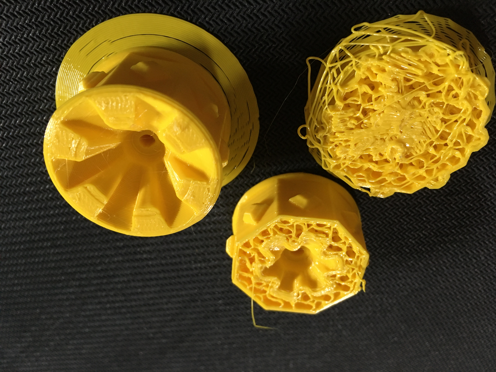

## 3D printing

### Tracks

PLA Prusament Black Galaxy

### Wheels

2x Yellow PLA Prusament, 2x PETG

### Body

Yellow PETG

## Shopping list

- battery charger [Digi-Key](https://www.digikey.com/en/products/detail/microchip-technology/MCP73833T-AMI-MF/1223181)
- boost converter [Digi-Key](https://www.digikey.com/en/products/detail/texas-instruments/TPS61032PWPR/550687)
- motors 75 RPM [Digi-Key](https://www.digikey.com/en/products/detail/pimoroni-ltd/COM0806/6873670)
- motors 155 RPM [Digi-Key](https://www.digikey.com/en/products/detail/dfrobot/FIT0483/7087160)
- accelerometer [Adafruit](https://www.adafruit.com/product/2019) vs [Digi-Key](https://www.digikey.com/en/products/detail/stmicroelectronics/IIS328DQTR/5268013)
- motor driver [Adafruit](https://www.adafruit.com/product/2448) vs [Digi-Key](https://www.digikey.com/en/products/detail/vishay-siliconix/SIP2100DY-T1-GE3/5086514)

