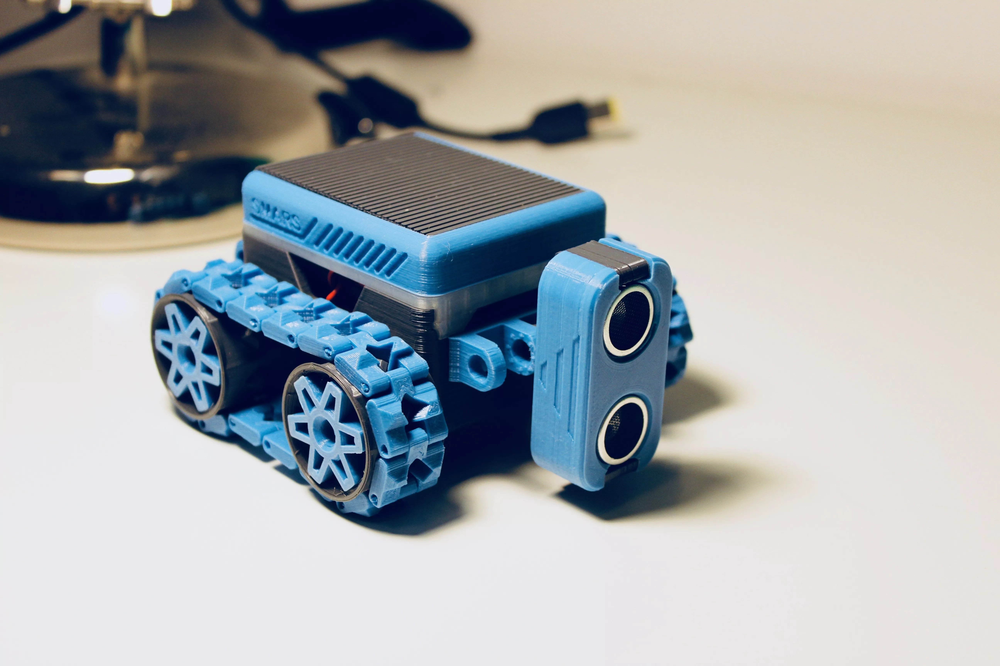
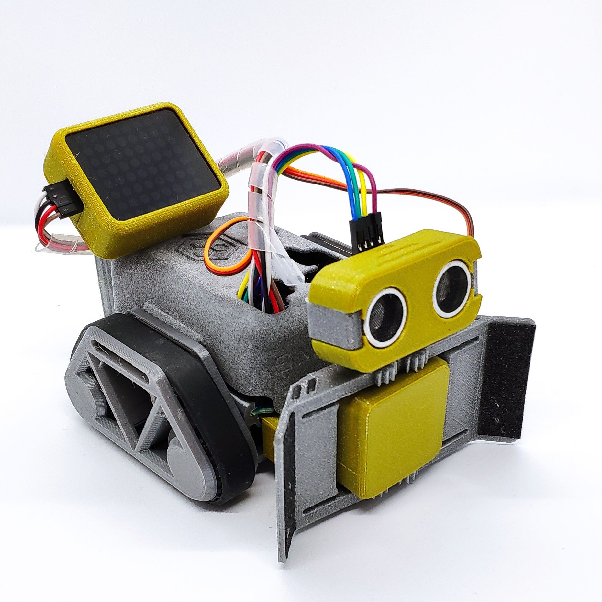
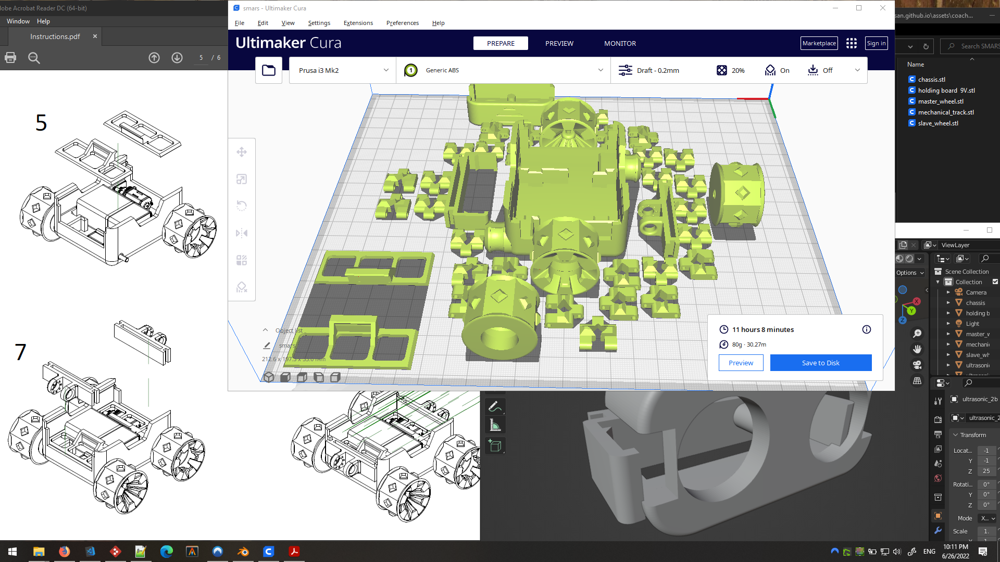

## 3D model description

> This new version of SMARS is reduced to the essential.
> The chassis has been eliminated to reduce printing time, motion system is an updated version of the pro tracks model, it gives smooth and precise movement.
> This model moved the trade off between modularity and flexibility to another level, 
> SMARS V4 lite is Arduino based but can easily mount Raspberry PI 3B/ 4B or a Microbit by adding a simple adapter.

This pack contains the following parts:

- SMARS V4 Lite core unit
- ultrasonic sensor
- claw
- connector extensions
- line sensor

### Core unit:

- 2x 150RPM 6v N20 motors
- 1x Arduino UNO
- 1x Adafruit Motor Shield V1 or V2
- 6x 5x10x4 bearings
- 12x 5x8x2.5 bearings
- 2x silicone wristbands
- 1x velcro strip

### Sensors

- 1x HC-SR04 Ultrasonic Sensor
- 1x KY-032 infrared sensor (Line sensor)

### Claw

- 1x MG90S 9g Servo Motor

### Battery

- 8.14Wh 7.4V 1100mAh 35C Li-ion-Po Battery with JST Plug
- 20 AWG JST Plug Connector 2 Pin

OR

- USB Rechargeable 9V Lithium Batteries - 5400mWh
- 9V battery connector

OR

- PS3 controller 1800mAh 3.7V Li-Ion Battery

### Optional

- I2C Interface 8X8 LED Dot Matrix Display

### Chassis

**Silicone wristbands** can be used as tracks. Such solution gives an incredible grip to the robot and a more fluid motion due to the bearings system.

**Mecanum wheel** (ilon wheels) [hack](https://www.thingiverse.com/make:434760). If you put 4 motors in the robot, thus one motor for each wheel, then you can unlock benefits of mecanum wheels:

- no need to turn wheels
- moving straight, sideway, diagonal
- turning araound one wheel, its center, one of the wheel axis

*Note:* If the robot gets stuck, the transmission should automatically decouple the wheel from the motor shaft preventing current peaks. This will avoid damages to motors or electronics controller.

## 3D printing

Settings: 0.2mm, 15% infill

Arduino UNO size is 69mm x 53mm. Geometry is in mm (not in)

> The joints of the tracks are simply pieces of 1.75mm filament cutted at the right length.

I used toothpicks instead :) [Also possible](https://www.thingiverse.com/thing:3710272) to use binding rivets (size 1/8") as pins