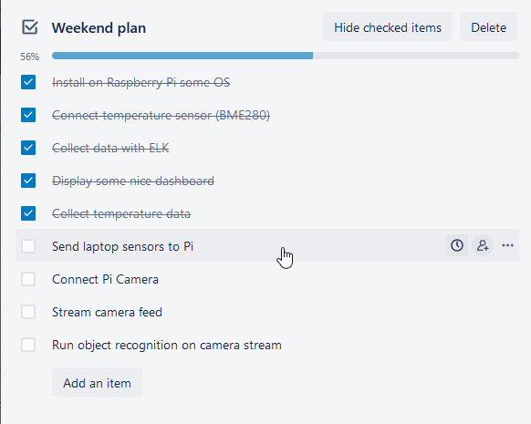
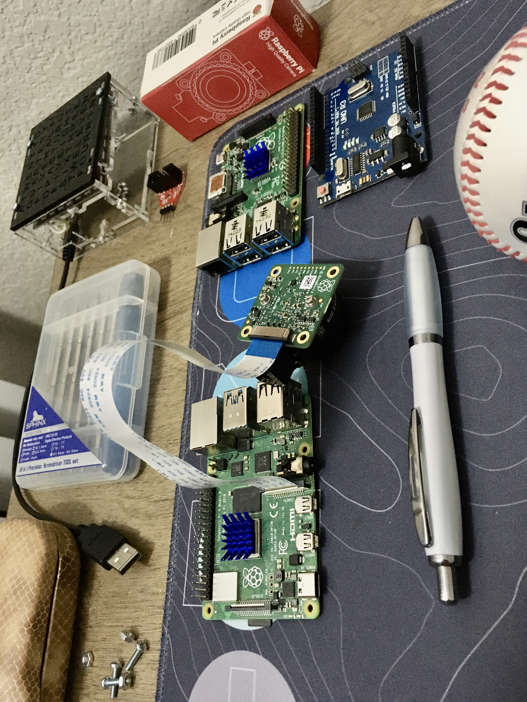
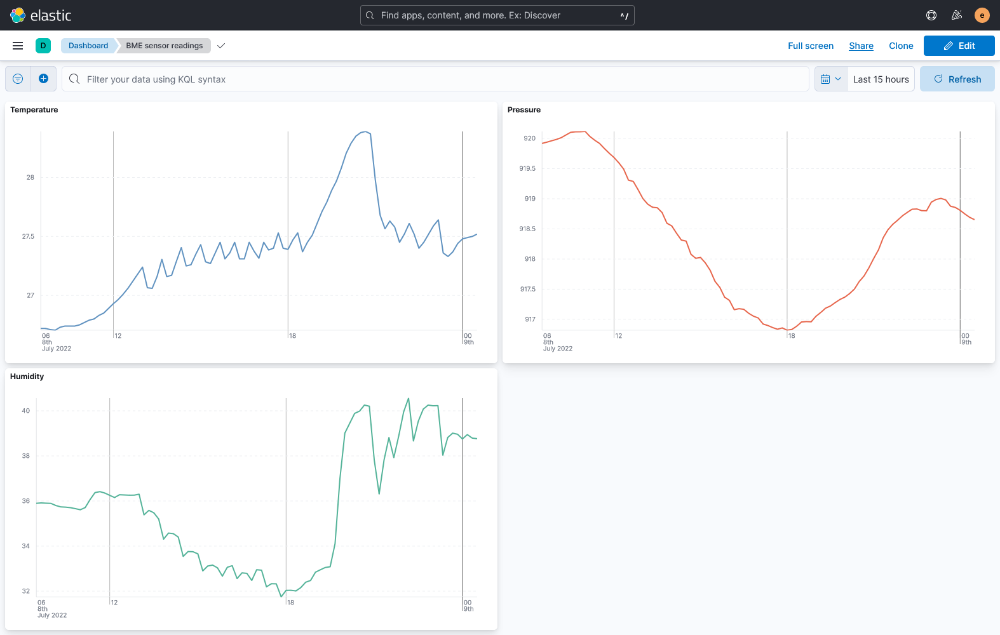
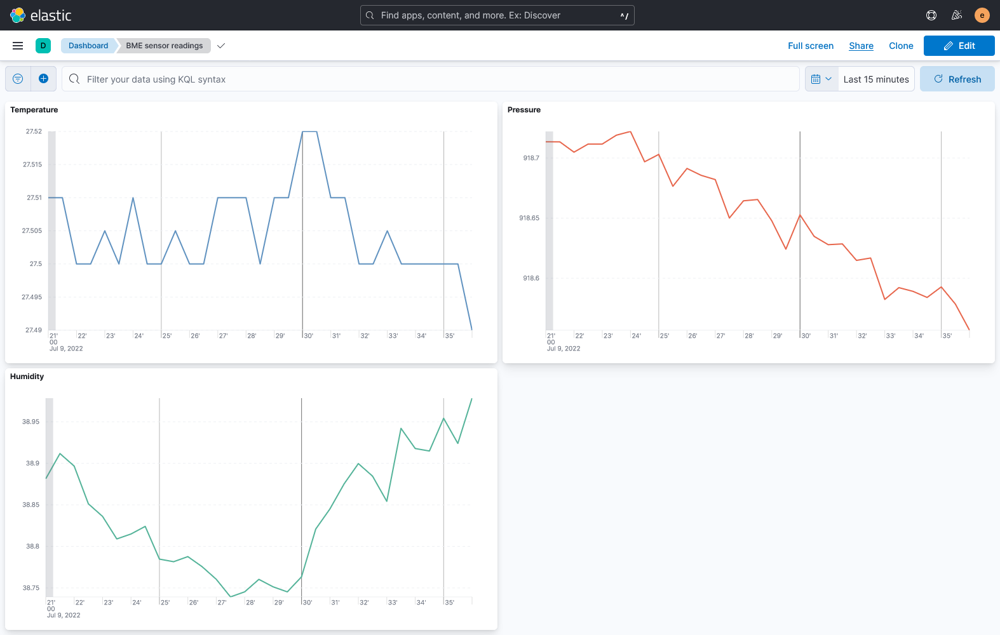
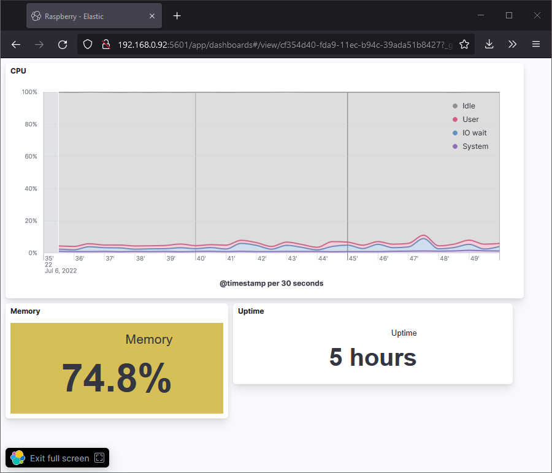
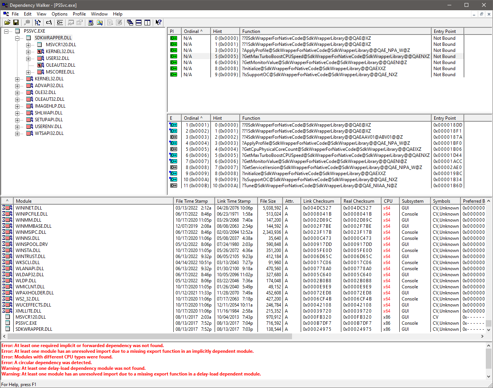

I had an ambitious plan for a long 3 day weekend. I stuck with the first item for a week. Then the next weekend I did a good progress striking out half of all that was planned. So here is the story how tiny plan stayed with me for 2 month.

## The plan

Plans for the weekend

- Install on Raspberry Pi some OS
- Connect [temperature sensor (BME280)](/make/temperature-sensor-rpi4)
- Collect data with ELK
- Send laptop sensors to Pi
- Display some nice dashboard
- Connect [Pi Camera](/make/raspberry-pi-camera)
- Stream camera feed
- Run object recognition on camera stream

## Elasticsearch

Basic install of elasticsearch with only system metrics takes 2.3GB of memory.

I'm not saying that it created a nice dashboard, it could be better. But I like that the system is very modular, so maybe I should take a look at the sources and strip it.

Can Java VM be tiny?

> you didn‘t configure the heap size I assume? by default elasticsearch assumes that it‘s the only process running on that instance / VM / container and use all the resources. if you want to have this shared, you‘ll need to configure it
>
> unfortunately there is no easy "right" default setup. for many (we'd think most) people the full instance is right and what you want. but others want something minimal (though what is minimal also really depends on the use-case). so you'll need to configure at least a bit
>
> [Philipp Krenn](https://twitter.com/xeraa/status/1544988075683618816)

Temperature spikes I can only explain by AC. I have plans to make [the whole thing remote](https://www.hackster.io/news/you-can-create-your-own-cell-network-with-a-raspberry-pi-and-sdr-238980964b5b.amp) and transmit the data by radio. Outside temp will be more adequate I guess

## Pi accessories

After few days sitting idle and only reading the sensor it started to raise the temperature. Then I started streaming blurry image from my camera, and it came to 80C 🔥

I should get better radiators and a fan.

The Pi requires so many accessories 😑

## Measuring the laptop temperature

For the next thing, CPU temperature monitoring, I was using fancy program pre-installed by Acer (`C:\Program Files (x86)\Acer\PredatorSense`). I wonder, can I quickly rewrite it and add reports? My assumption is that they use some library, that gives all data and they simply draw it.

To collect some intel I will use Dependency Walker. It might tell what libraries are important for the program.

Where can I find the Intel Overclocking SDK? No plans for overclocking, I'm just looking for a library that gives CPU/GPU temperature. This is for Windows laptop where I'm going to run compilation, GPU computation. External device will receive sensor readings and will shutdown the laptop in case of overheating.

I'm leaving review of this application for future where my plans to try C# analysis tools such as

- .Net Reflector
- NDepend

As for now I will search for sensor library, tentatively C# language. I look at [this](https://github.com/openhardwaremonitor/openhardwaremonitor), but the absence of readme has dispirited me. That's why there's an active fork of **Open Hardware Monitor** - [Libre Hardware Monitor](https://github.com/LibreHardwareMonitor/LibreHardwareMonitor)

## Pi camera

I dedicated special post to [Pi Camera](/make/raspberry-pi-camera), because it took me out of guard. Camera but without a lens. For some reason I decided to make my research about lenses instead of ordering one for $50. I found a niche in other words.

### Stream camera feed

It raises another problem: overheating. I have a simple radiator without active cooling, no case. But I become concerned when Raspberry Pi processes the camera input. It become so hot > 90C and I think it requires appropriate cooling system. Which means I need to buy proper radiators, and a fan, and [print a case](/make/3d-prints/raspberry-pi-case). At this point I [was already considering purchasing a 3D printer](/make/3d-printer-dilemma) and the project has been set on pause. ([one week I was building Prusa Original Mini](/make/prusa-mini-original))

## Further reading

- Store data in DB https://redis.io/docs/reference/patterns/
- Cell network on PI https://www.hackster.io/news/you-can-create-your-own-cell-network-with-a-raspberry-pi-and-sdr-238980964b5b.amp
- GPRS SIM800C GSM GPRS module https://shop.m5stack.com/products/com-gsm-module-sim800c?variant=35338832609444
- Collect data with Soracom Lagoon https://create.arduino.cc/projecthub/andreiflorian/unifiedwater-v1-13b168?ref=tag&ref_id=gsm&offset=13
- Robot [tools from Intel](https://www.intel.com/content/www/us/en/developer/tools/software-catalog/overview.html?s=Newest)
- [Robot kit](https://www.intel.com/content/www/us/en/develop/documentation/ei4amr-2022-2-get-started-robot-kit/top.html)
- ROS and [tutorials](https://medium.com/exploring-ros-robotics)