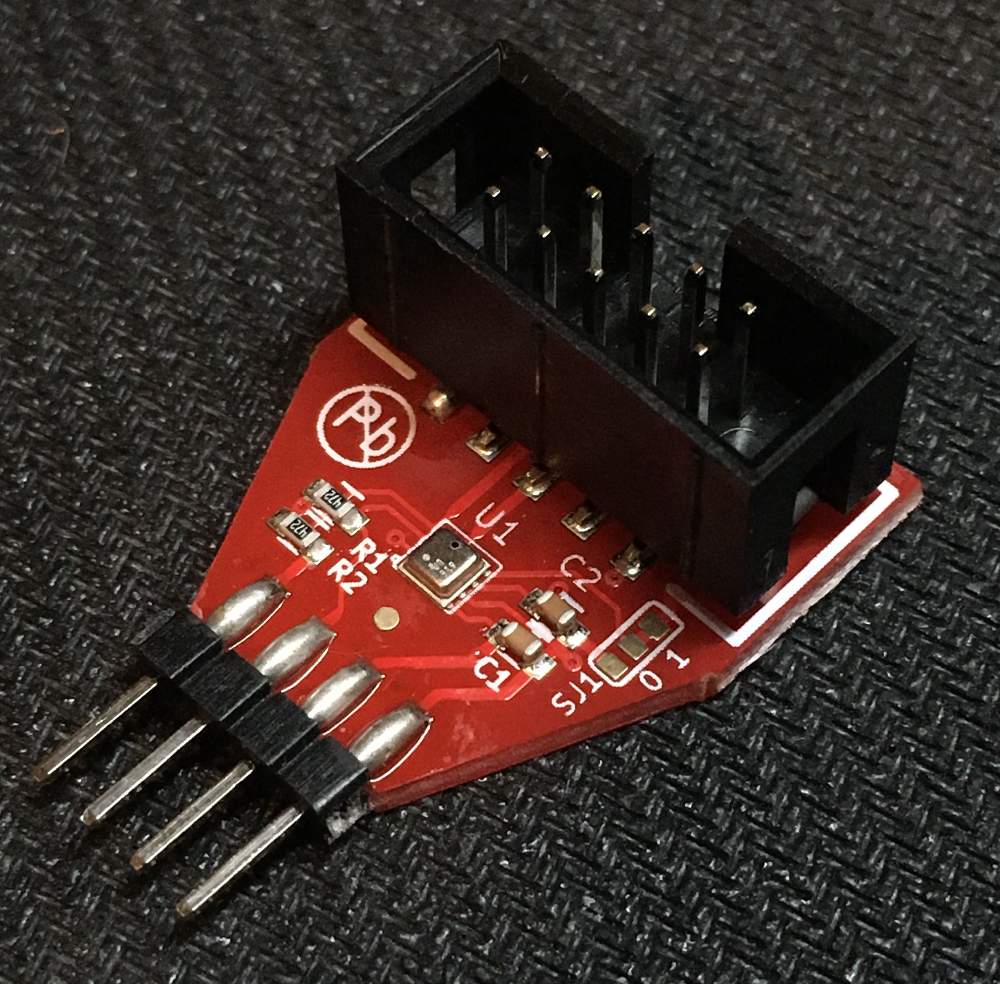
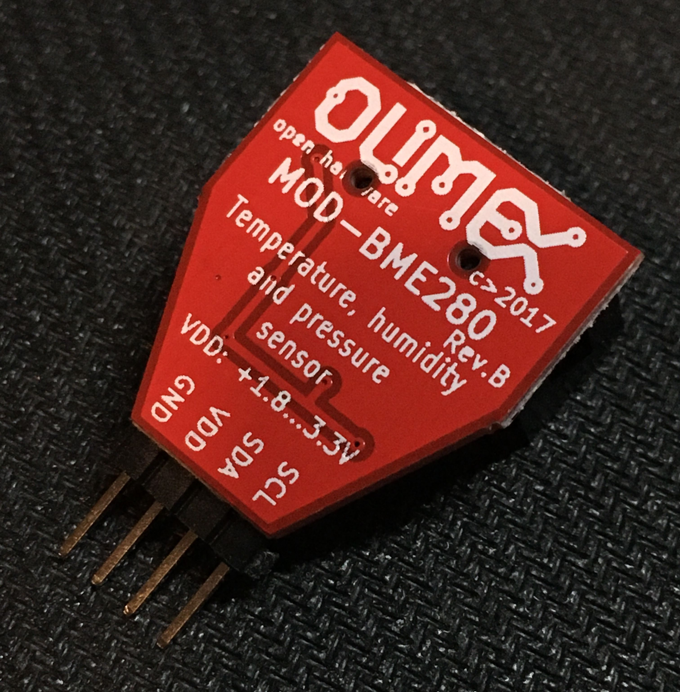

## BME 280

[Product description](https://www.olimex.com/Products/Modules/Sensors/MOD-BME280/open-source-hardware)

[Datasheet](https://github.com/OLIMEX/MOD-BME280/blob/master/HARDWARE/MOD-BME280-Rev.B/MOD-BME280_RevB.pdf)

## Connect to Raspberry Pi

I use [interactive pinout]() I mentioned in [my collection](/make/useful-links) of useful links for DIY hobbyist.

We need I2C interface.

Links

- https://www.raspberrypi-spy.co.uk/2016/07/using-bme280-i2c-temperature-pressure-sensor-in-python/
- https://bitbucket.org/MattHawkinsUK/rpispy-misc/raw/master/python/bme280.py
- https://learn.sparkfun.com/tutorials/python-programming-tutorial-getting-started-with-the-raspberry-pi/experiment-4-i2c-temperature-sensor
- https://www.raspberrypi-spy.co.uk/2018/06/create-i2c-oled-display-slideshow-python/
- https://pypi.org/project/RPi.bme280/ ?