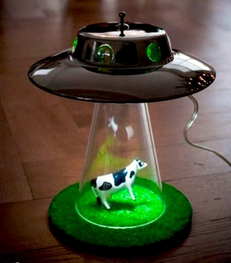
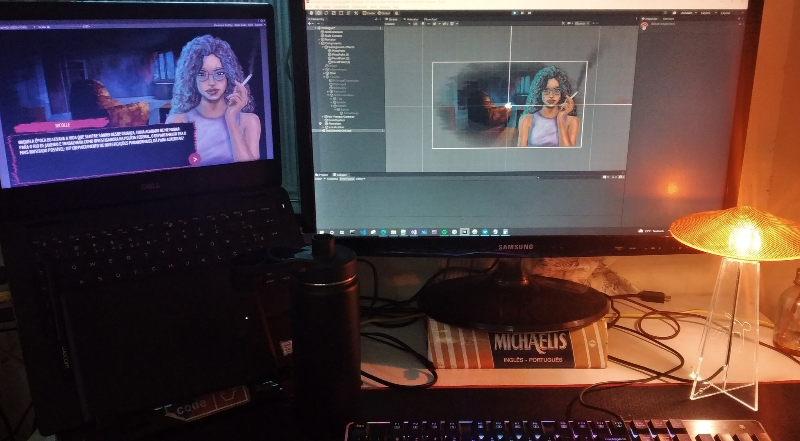

I need a lamp for my desk, so I’m [adding one project](https://twitter.com/mikolasan/status/1528078099568414721) to my todo list. Here’s a reference

Then I've started searching on 3D printing hubs for anything similar

- https://cults3d.com/en/3d-model/home/ufo-abduction-lamp-with-blinking-lights
- https://cults3d.com/en/3d-model/home/ufo-lamp-oneidmonstr
- https://twitter.com/mikolasan/status/1531475951803985921

