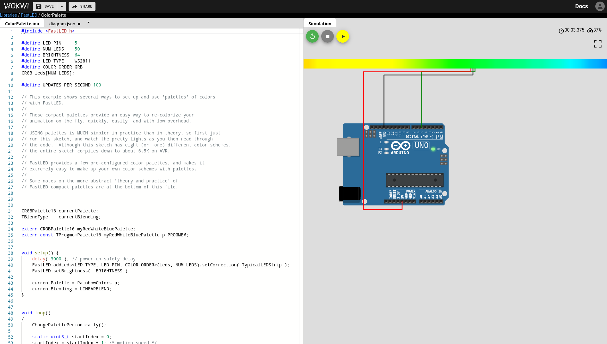
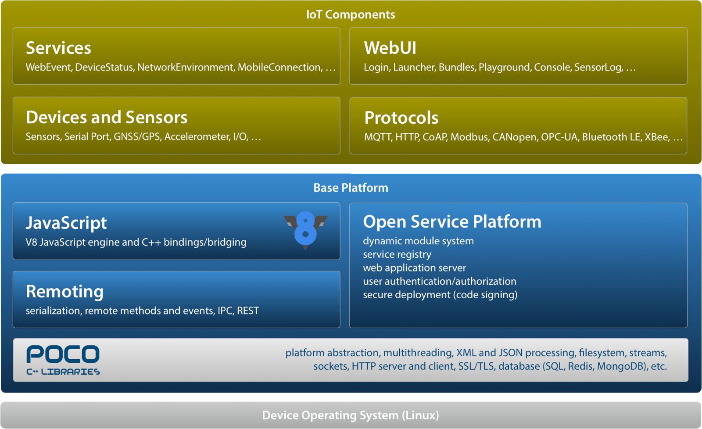

Helpful links for DIY hobbyist playing with system on a chip (SoC) and microcontrollers

## 1. WOKWI

https://wokwi.com

WOKWI - Online Arduino Simulator

## 2. macchina.io

https://macchina.io

macchina. io - JavaScript SDK for IoT (extended Poco library)

## 3. PlatformIO

https://platformio.org

PlatformIO - Arduino IDE alternative which integrates with VS Code

## 4. Fritzing

Fritzing - circuit drawing app. Nice breadboard schemes created with it.

## 5. Raspberry Pi Pinout

https://pinout.xyz

Interactive reference to the Raspberry Pi GPIO pins. Interactive!

Also hats!

## 6. ProtoPedia

https://protopedia.net/prototype/3299

Collection of fun robot projects from Japan. Similar to [hackaday](https://hackaday.io/project/181344-stack-chan-javascript-driven-super-kawaii-robot).