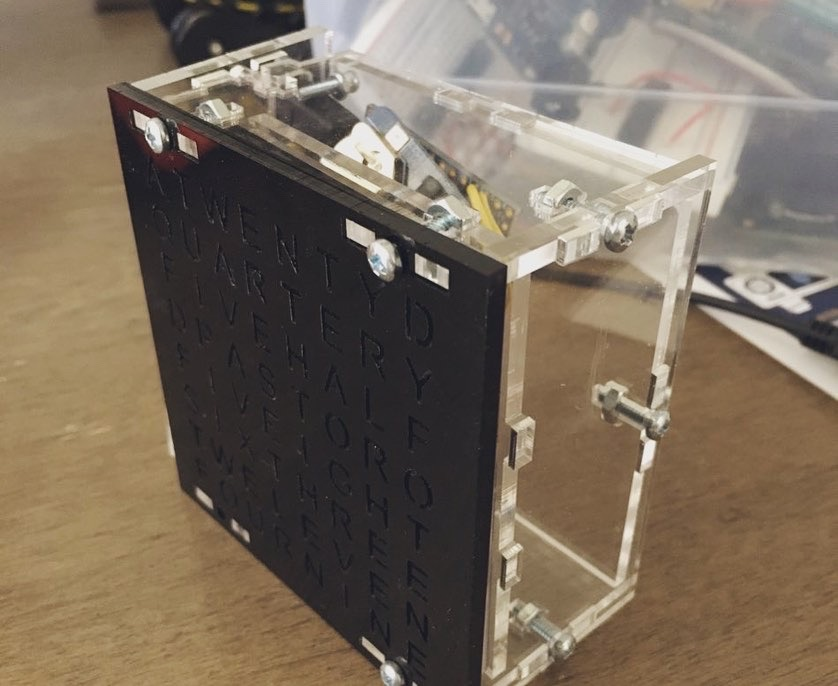
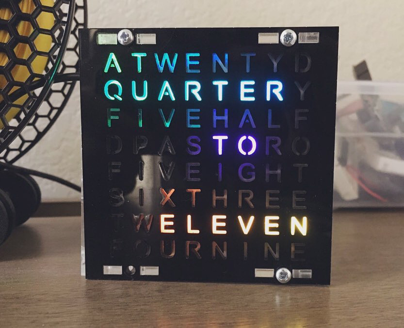

I followed instructions from Make magazine (Volume 67) and I made a word clock.

I also started a [code project](https://repl.it/@stakanmartini/WordClock#main.cpp) for discovering ways to place words on a grid. With all possible optimization like shaping words in a form of crossword.

## Why

It will stay on the table and will show time when I need to head out of the office.

## Process

Ordered laser cut

Bought screws and adafruit boards. In the original instructions it used [Trinket Pro 5V](https://www.adafruit.com/product/2000) (ATmega328), but I followed the deprecation warning and chose [Adafruit ItsyBitsy 32u4 - 5V 16MHz](https://www.adafruit.com/product/3677) (Atmega32u4). Imprtant difference between them: the latter is missing mount holes which is the only way to attach the board to the acrylic case inside. I put it inside the case loosely, thus the USB connector become impossible to connect back once you unplug it, so one USB cable took roots in this build for a long time.

How do you call screen that does not display time with digits, but tells it with words?

## Result

The clock is working.

## Links

- Laser cut layouts, Arduino code: https://github.com/andydoro/WordClock-NeoMatrix8x8
- [Add ItsyBitsy to Arduino IDE](https://learn.adafruit.com/introducting-itsy-bitsy-32u4/arduino-ide-setup). Additional Boards Manager URL: `https://adafruit.github.io/arduino-board-index/package_adafruit_index.json`