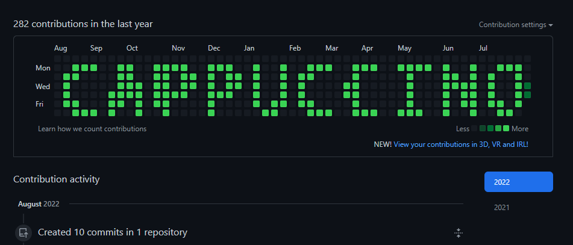

It's second name is [GutHub Brush](https://guthub-brush.netlify.app/)

The idea sounds simple and I estimated it to be done in 2 days. 

1. Choose a word. No more than 10 symbols to fit it on one screen. This word will represent your profile, so be caution in your choise

2. Find a starting week to tell the algorithm where to start painting points. Make sure that the text will not overlay with other activity in the account
3. Give access to the account. Default repository name is **activity-repo**, but it can be changed of course. The repository is automatically created. And it can be automatically deleted (!) to recreate activity with another starting date or another word.

So I started it in July 13, finished - Aug 17. Only weekday evenings, minus one week dedicated to [3D printer assembly](/make/prusa-mini-original).

Why it took 4 weeks? Here are some reasons why it took so long.

1. Totally new programming language
2. Then I focused on [mastering Rust concepts](/blog/how-i-tried-rust-for-the-first-time): Error, Result, Iterator, async
3. No documentation for cairo library
4. Extra features at the end: OAuth, GitHub API

A link in case someone wants to make a selfie: https://github.com/boooobs