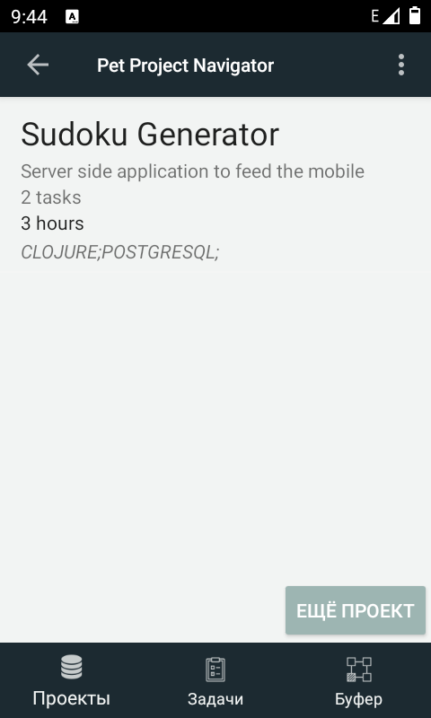

## Another todo list?

I believe that many programmers find writing a small todo list application without advertisements appealing to them.

Let's take an example of grocery shopping, where we do create lists. When I create a list with pen and paper, I know that it has many disadvantages.

I can forget the list at home, right at the place where I left it with the last item written in. On the contrary, I will never forget my phone.
I cannot sort items on the paper according to the store's plan.
Usually, I do not bother to take a pen with me, thus I cannot strike out already found items, hence I have to go through the list over and over verifying items in the cart and extracting the remaining. If not removing items, then moving items to the end would provide a workaround for this problem.

It sounds like an easy task, right? But I needed something different. 

Every day at work I am on my journey of solving problems from neverending projects and during my search I see here and there interesting stuff not related to my problem, so I save the links for later. In the morning, sipping my first cup of coffee, I scroll the news feed and see articles about aspects of programming language that I've never heard of, I see tutorials about a pattern that is interesting to try, I see a library or a great project, etc. So I save the links for later.

After a while they become dead, ideas are fading out. I save the links, but usually never go back. Not that I do not know all disadvantages here.

Links are not annotated, which means no one knows what is behind that link. If it is broken, then an idea or inspiration is gone.
They are collected together, but it does not mean that they are related, or that together they can make a project. So each list does not provide an ultimate goal.

## How I quit Evernote

First thing, I need to share this list across devices (desktop, laptop, tablet) and places (home, work). It must be a web service. I have tried to use Evernote. For different ultimate ideas I create notes. Notes can be grouped with tags. Seems like a good categorization. 

But there are big disadvantages that led me to stop using the service almost for a year. It is not controlled formatting. It is just out of control. Even "clear formatting" button does not help! Another thing is constant fear of losing my text while I am typing. 

Did you know that you can type mathematical formulas in Notion?!

To be continued...

## Plans

Finish the simple part of task management. Like in Asana: just create a list of projects and reorganize them to make a specific sorted list. Main feature first. No projects, no additional activities. Working name: 

## More about todo lists

- An online app where you create tasks only with keyboard [pomoday](https://github.com/huytd/pomoday-v2)
- [Get things done](https://hamberg.no/gtd)
- CLI todo list [Task Warrior](https://taskwarrior.org/)
- [Laverna](https://github.com/Laverna/laverna)
