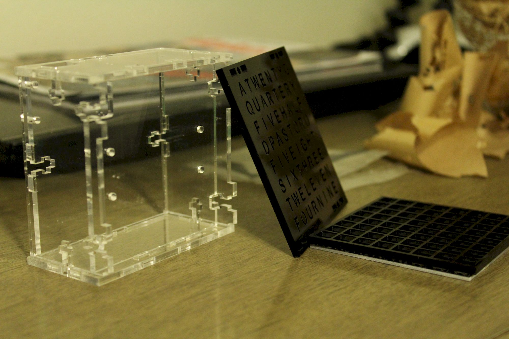

Следуя руководству из журнала Make сделал часы, которые показывают время словами. 

Приблизительно [так](https://repl.it/@stakanmartini/WordClock#main.cpp) можно прикинуть расположение слов в квадрате.

## Небольшой флэшбэк

Когда я был маленький мне нравился журнал Левша. В каждом номере там были подготовлены цветные листы, которые нужно было вырезать и склеивать. Каких моделей там только не было. Корабли, машины, танки, башни средневекового замка, Храм Христа Спасителя. Остальные советы и статьи проходили мимо. Помню из проволоки можно было сделать составной перстень, но отец сказал, что это глупости, что мне такое кольцо не нужно. Поэтому никаких инструментов и материалов я на это не получил.

В современном мире есть журнал Make, в котором рассказывают про дронов, 3D принтеры и микроконтроллеры. Они описывают разные проекты для дома, интересные механизмы.

В одном выпуске (Volume 67) у них были настольные часы. Здесь собралось вместе все, что я хотел попробовать: работа со светодиодной панелью, полезный проект на атмега, резка лазером акриловых панелей, часы для работы, чтобы уходить во время домой.

## Процесс

Заказал резку оргстекла на лазерном ЧПУ. Купил болтиков и пару микросхем.

Если циферблат - это экран с цифрами, или точнее с числами от 1 до 12, то какое должно быть название для экрана с буквами, словами?

## Результат

Часы работают, нужно только фото, видео запилить.