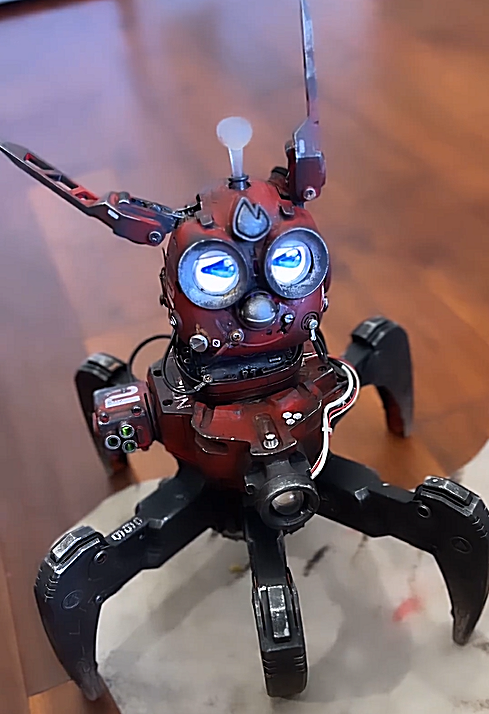
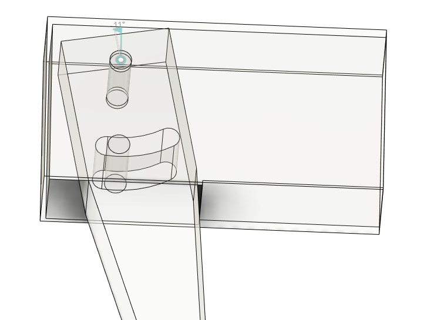
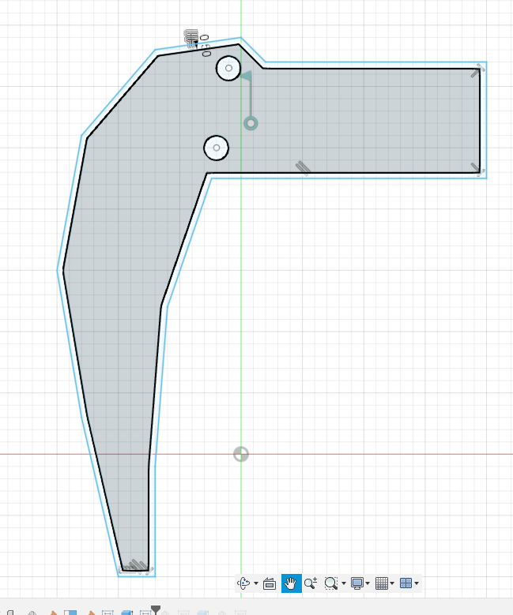
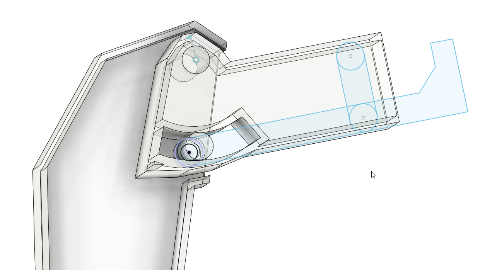

This is inspired by a wild mix of Furby and Nerf Combat Creatures from [this Instagram reel](https://www.instagram.com/p/CvsSdHaNK42/ "https://www.instagram.com/p/CvsSdHaNK42/")

[Here](https://www.youtube.com/watch?v=odvLF7lfNKU) is a teardown video where you can see how these tiny legs are made possible

I'm making slow progress with the **nerf** spider legs. It's still a draft.

More refined shape outline

And now make the structure hollow

To be completed...