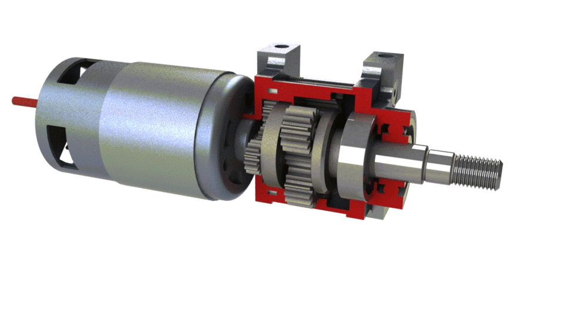
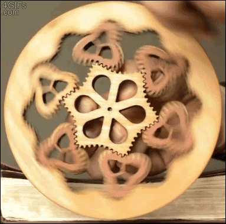
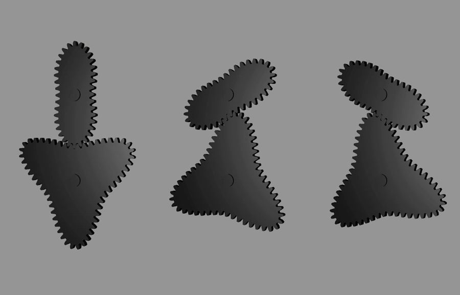
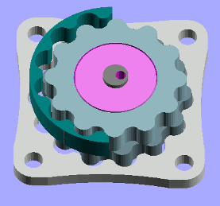
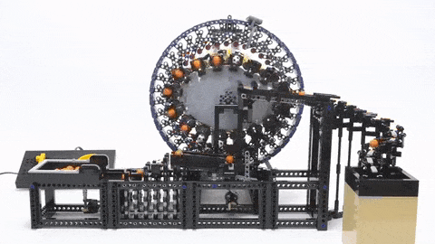
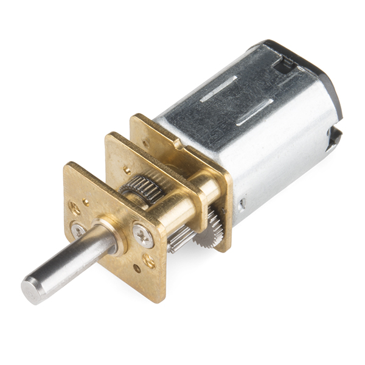

## What is the minimum unit of movement? 

- Motor command level. A single PWM pulse?
- Kinematic level. Motor position/velocity? 
- Temporal level. Control loop period?
 
When we combine these units together in a time series of movements, what is a unit higher in hierarchy?

Different patterns, like "turn left" by moving left motors in reverse and right motors forward could be considered a high hierarchy block, composed of multiple lower-level units of motor movements. 

For example, in case of slippage, in some off-road tests, we need to move only one motor. One motor is a simple unit, but its actuation in this example is a high order decision related to the specific situation of slippage. In other words we can formulate that for this situation it is important to keep other three motors static.

## What type of Neural Networks to use for training these blocks?

I will need to create a separate neural network that will understand physics like Lagrange, Euler, Newton equations. And based on required positions of the robot parts it will output the movement strategy accordingly.

I want to create a universal model that will not require creating new inverse kinematics algorithm every time robot's structure has been changed. I know that it's not possible to approximate the equations with neural networks. But how equation system can be solved with neural networks?

There will be no labeled input data, thus autoencoders will be a good choice. However, the network input will be directions or final goals like "go find mushrooms" or "find pine tree in the south" and the output will be sequences of values representing torque applied to motors of wheeled robot.

## Planetary gear train

Main question here is power and torque which is created by series of spur gears called a _gear train_. It could be simple as 2 gears or **planetary gear train** (higher gear reduction, very compact) 

and this can be implemented in non-circular form 

"Credit: YouTube channel Rail and Oak"

They are not as compact as round ones, and at specific points they hold higher stalled resistance than in others which makes movement obviously uneven.

## Epicyclic gearing

Planetary gearing (or **epicyclic gearing**) is cool, but there is also **cycloidal drive**, that eliminates a _backlash_ - it's that imperfection between gear teeth that is noticeable when rotation direction has been changed. 

## Strain wave gearing

And the last but not least in this list is **strain wave gearing** that is used in the wheels of Apollo Lunar Rover. It requires a flexible spline, but oversteps advantages of the above systems.

"Credit: YouTube channel Akiyuki Brick Channel"

## Micro gearmotors

For [the first prototype](/make/robot/prototype-1) I will try brushed DC micro gear motors with [75 RPM](https://www.digikey.com/en/products/detail/pimoroni-ltd/COM0806/6873670) and [155 RPM](https://www.digikey.com/en/products/detail/dfrobot/FIT0483/7087160).

_Note:_ voltage defines RPM, not current. 

[Brushless DC motors VS brushed DC motors](https://www.renesas.com/us/en/support/engineer-school/brushless-dc-motor-01-overview). Controlling BLDC is not a trivial task, but Field oriented control (FOC) algorithm is not that hard. Look at this [Arduino implementation](https://docs.simplefoc.com/)
