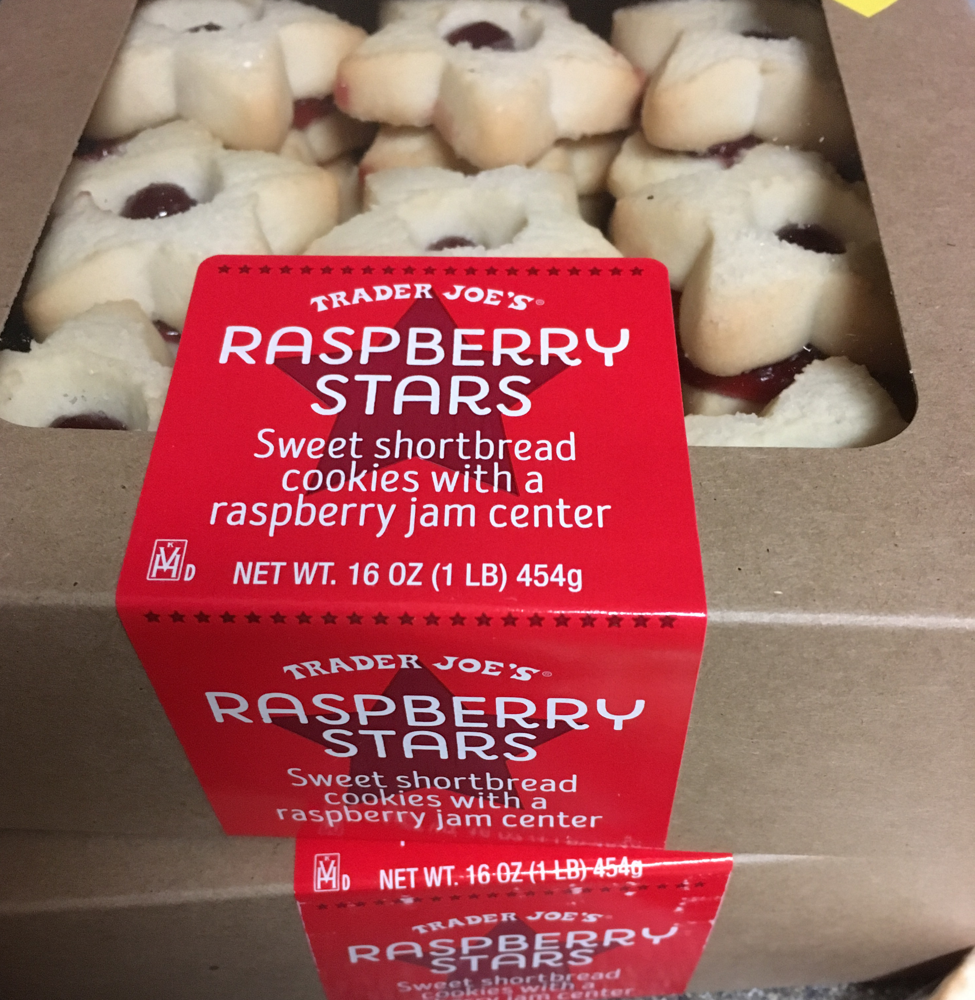

Печеньки в Traders Joe изумительные. Но заканчиваются быстро. Я бы сказал, что они просто улетают. Есть еще засушенные твердые печеньки (в Whole Foods по $10 за фунт), которые могут есть люди с крепкими зубами (вариант для любителей грызть сушки). Это те самые cookies, какими они должны быть. Но мокая в чай, они не теряют своего домашнего вкуса (вариант для любителей реанимировать засохшее овсяное печенье), отчего тоже быстро заканчиваются.

Наливаешь себе чай и грустно смотришь на пустые полки. Не веришь, что ты уже съел вторую коробку печенья за неделю. И спрашиваешь: "Кто ел мои печеньки, пока я спал?!"

Чай настолько ужасен, что всегда состоит из добавок. Чай настолько ужасен, что основным ингридиентом в пакетике становится корица. Вам, наверное, представился приятный запах корицы от булочки или пирога, вкус который растворяется на языке. Это ваши ожидания. Но вкус такой, будто в чай подсыпали перца. Пьешь чай, а такое ощущение, что ешь острое блюдо и это ощущение хочется запить.