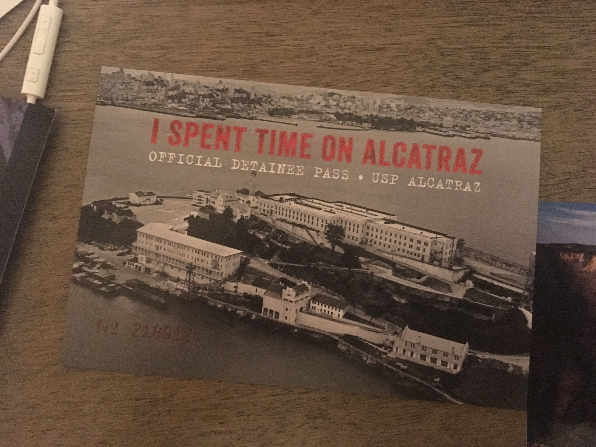
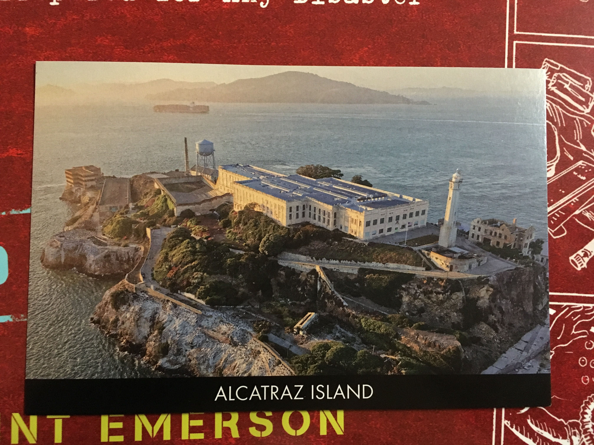
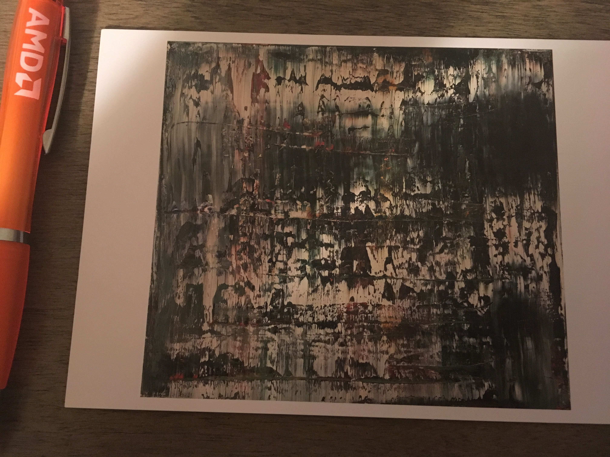
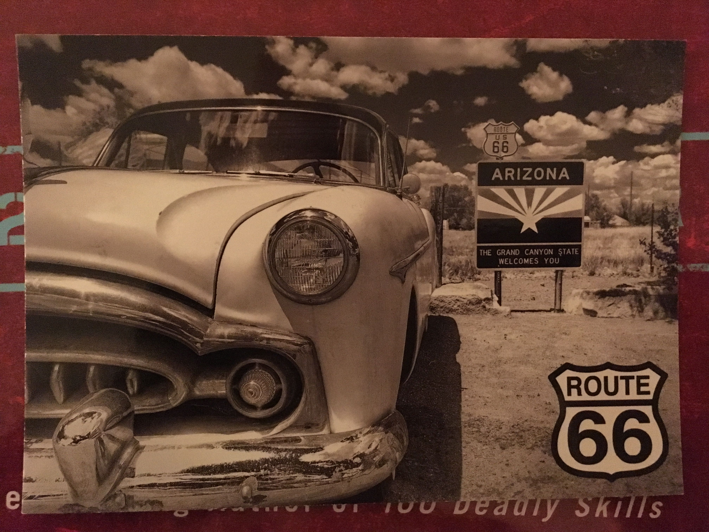
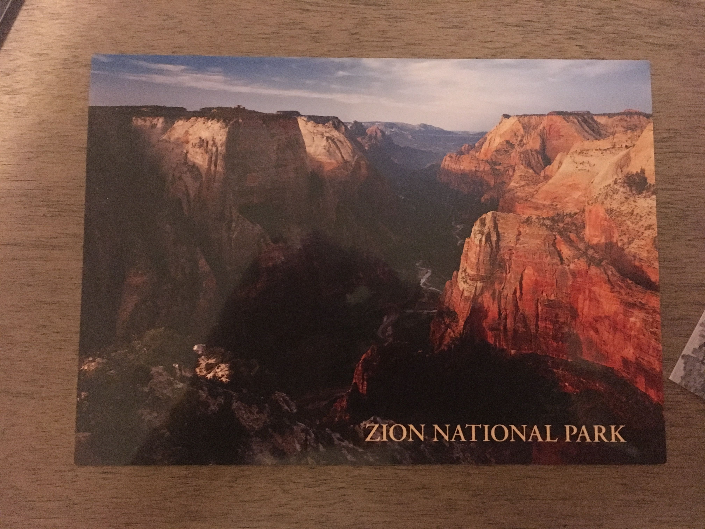

Это привет из прошлого.

Итак, тюрьма в парке. Да, там рядом с домом смотрителей есть несколько цветочных клумб. И все остановилось в 60-х.

Остается только пересморть фильм Скала и вспомнить о временах, когда кому-то еще нравился Кейдж.

Что мне нравится в Сан-Франциско, так это высоты.

Никогда еще прогулка по городу не превращалась
в тренировку с нагрузками. В разговоре я так и сказал:
It's hard to walk on the hills. На что мне дали резонный
совет: Don't walk on high heels. (Так не гулял бы на высоких
каблуках.) Игра слов получилась. Да, для Сан-Франциско
это нормально

Но настроение с этой картины больше описывает
дождливый день в Чайнатауне.

С Новым Годом, Витек!
Сугробы снега, зимняя резина - без этого в Неваде можно комфортно себя чувствовать.
А вот без чего чувствуешь себя не в своей тарелке - крем от солнца, солнцезащитные очки и машина с откидным верхом.
Держи Packard 300 из 1951-го

