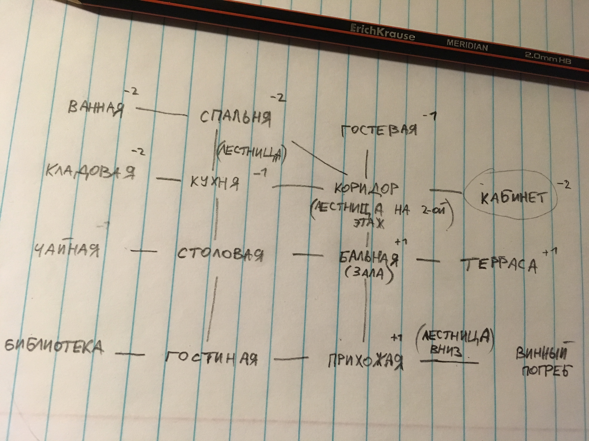

## Передвижение

Комнаты и коридор - это одни большие смежные клетки. Не нужно кидать кубик, чтобы перемещаться по ним. У игрока есть определенное число действий за ход (может отличаться среди игроков) и он может тратить их на ход.

Число действий за ход

```
2 - Краснова Miss Scarlett
3 - Горчичников Colonel Mustard
3 - Белых Mrs White
2 - Зеленович Reverend Green (преподобный)
2 - Голубева Mrs Peacock
2 - Черниченко Professor Plum
```


## Персонажи

На карте персонажа рандомно расставляются фишки с геометрическими символами (пока не придумал как назвать лучше, это просто разные не повторяющиеся формы, учавствующие в квестах. они определяют непредсказуемое со стороны других игроков развитие квеста). Впоследствии игрок будет кидать кубик и в открытую использовать числа, но не фигуры. Знание фигуры и цифры подскажет другим игрокам решение квеста.

```
1 Круг
2 Квадрат
3 Треугольник
4 Линия
5 Точка
6 Звезда (пятиугольник)
```

Изначально все гости - это просто гости в дорогих костюмах, которые пришли на званый обед, и никакой интриги нет. В одной из комнат гостей будет поджидать начало сюжета. В любой из комнат можно кинуть кубик и свериться c характеристиками игрока, которые говорят при каких резальтатах можно брать карту из колоды с квестами.

Шанс взять квест

```
4-5-6 - Краснова Miss Scarlett
любое четное число - Горчичников Colonel Mustard
любое четное число - Белых Mrs White
любое четное число - Зеленович Reverend Green (преподобный)
1-2-3 - Голубева Mrs Peacock
любое нечетное число - Черниченко Professor Plum
```

## Колода с квестами

Есть перемешанная колода с квестами. На рубашке нарисована комната, к которой этот квест применим. 
**Вариант 1** Если квест нужен для другой комнаты, то карты скидываются с колоды пока рубашка не совпадет.
**Вариант 2** Для каждой комнаты есть своя стопка сюжетных карт и обычных карт (включают в себя социальные взаимодействия, догадки и решения). В коридоре можно брать сюжеты не привязанные к комнатам.

У каждого квеста есть продолжение (ключевой предмет) в одной из комнат (другой или той же комнате). 
Продолжение квеста составляется игроком за счет броска кубика: цифра с кубика запоминается в квесте, и только игрок знает какой предмет и с какой формой подойдет к квесту (аналогичные предметы в других комнатах имеют другие сопутствующие формы и только запутывают остальных игроков - только открыватель квеста знает истинный предмет).

Найти истинный предмет не просто. Он лежит в колоде соотетствующей нужной комнате в случайном порядке. Любой игрок может брать карты из этой колоды. Карта может быть уже на руках у других игроков (как проверить,что она не попадет в сброс? а может карта уже в сбросе!) 

Если нужно подставить другого игрока, то подкидываем ему эту карту и идем завершать квест. Если другой игрок не успеет избавиться от предмета, то мы его успешно подставим. Предметы с другой формой просто не имеют никакого значения. Но чисто для смеха их можно подкидывать другим игрокам.

Если игроку нужно скинуть предмет... нужно найти специальную карту с "решением" этого квеста.


## Карты

**Внимание!** данная колода не закончена, далее идут лишь наброски того, что может быть в колоде


### Завязки

_уровень сложности квеста - завязка_

2 - Гостиная - труп на диване (если вы не были свидетелем, то кто-то из гостей сделал это во время ужина. Если оба игрока начинают квест при игре на двоих - причина самоубийство ?... в случае исчезновения вещей - паранормальная активность и параллельные измерения)

1 Круг - следы схватки на ножах. ножы можно поискать на кухне

2 Квадрат - следы схватки на ножах. ножы можно поискать в столовой

3 Треугольник - рука перевязана полотенцем. начало берет в ванной?

4 Линия- рука перевязана полотенцем. начало берет в дому для гостей?

5 Точка - неизвестный гость с ножом нападает на вас и вы защищаетесь. его труп вы оставляете на диване

6 Звезда -неизвестный гость сидит на диване. вы подкрадываетесь сзади и перерезаете ему горло

```
Обсерватория - разбитое окно
Прихожая - лужа крови на ковре
Дом для гостей - исчезнувшая картина
Столовая - 
Кухня
Терраса
Ванная комната
3 - Демонстрационный зал - за углом (за шторой) обнаруживается потайная дверь, но она заперта
```


### Догадки

_Х - очевидность докадки: 1 - очевидно. 3 - совсем не очевидно_

Гостиная - (звезда) игрок из комнаты

3 - Обсерватория - ключ. возможно от потайной двери (в обсерватории)

Прихожая

Дом для гостей - 

Столовая

3 - Кухня - (дело с трупом) в холодильнике находится нож с кровью

Терраса

Ванная комната

Демонстрационный зал


### Решение

_Гостиная - при наличии "догадки" вы доказываете убедительно для всех гостей, что данный труп не ваших рук дело и получаете лут с него_

1 Круг - инкрустированный нож

2 Квадрат- инкрустированный нож

3 Треугольник - Печатка

4 Линия - печатка

5 Точка - 

6 Звезда

```
Обсерватория
Прихожая
Дом для гостей - 
Столовая
Кухня
Терраса
Ванная комната
Демонстрационный зал
```

На карте квеста задается цвет, по которому определяется может ли карта завершить этот квест. Из колоды действий (там есть и социальные взаимодействия) на руку берутся карты, которые могут содержать необходимый цвет. На руке могут находиться несколько карт одного цвета, что добавляет очков к прохождению квеста (механика по аналогии с epic spell war of the battle wizards)


## Примеры квестов

В этой комнате вы нашли труп. Нужно узать кто это? И кто это сделал?

В этом доме произошла кража - открытый сейф, пропавшая картина (выгоревший квадрат на стене или пустая рамка). Найти этого человека. Этот человек среди нас? Например, карточка говорит, что вы видите красивую картину, никого в этой части дома нет, поэтому вы достаете нож, вырезаете ее и прячете в своей сумочке (или в предмете, который вам нужно вынести). Другие игроки не знают, что написано в карточке, им остается только гадать, что произошло в комнате.


## Социальная часть хода игроков

В основной колоде есть карты с социальными взаимоотношениями. Прием, на который все пришли, очень пафосный. А гости - это обычные люди, которые выбрались в свет, и их задача - не посрамить себя. По аналогии со шкалой жизни из игр, где происходят реальные сражения, здесь шкала отображает статус гостя. Если статус гостя опускается до нуля, до он убегает из поместья не в силах терпеть унижение. По ходу игры нужно поддерживать этот уровень у своего персонажа, чтобы оставаться в здании и быть в состоянии следовать по квесту.

Если квестовая часть проваливается, то всегда можно отыграться на социальной части броска:

- найти в комнате выпить - _добавляет статуса_
- найти в комнате сигару
- ничего не делать
- пялиться на интерьер
- выглядеть глупо и подозрительно: заглядывать под ковер, рыться в шкафу - _понижает статус_

Бонус если в комнате есть еще один персонаж - дополнительное действие описано в карточке

- подмигнуть,
- рассказать шутку,
- сделать пакость. 

Без карт в руке остается только игнорировать и принимать последствия. Карты обладают влиянием и нужно сравнять или провести контратаку, открыв карту выше по влиянию.
Комнаты добавляют поправку тем, кто в ней уже находится. Поправка может быть отрицательной, если нахождение в комнате можно найти подозрительным, или положительной, если новый человек чувствует себя менее уютно.



Естественно, самые интересные квесты находятся в комнатах с отрицательной поправкой.


## Конец игры

После завершения всех квестов (конец игры), идет подведение итогов: игроки рассказывают что произошло на самом деле, кто убийца, кто что украл. Остальные игроки сверяют правду со своими заметками и при совпадении получают дополнительные победные очки. Самые скрытные негодяи могут получть дополнительные очки также.