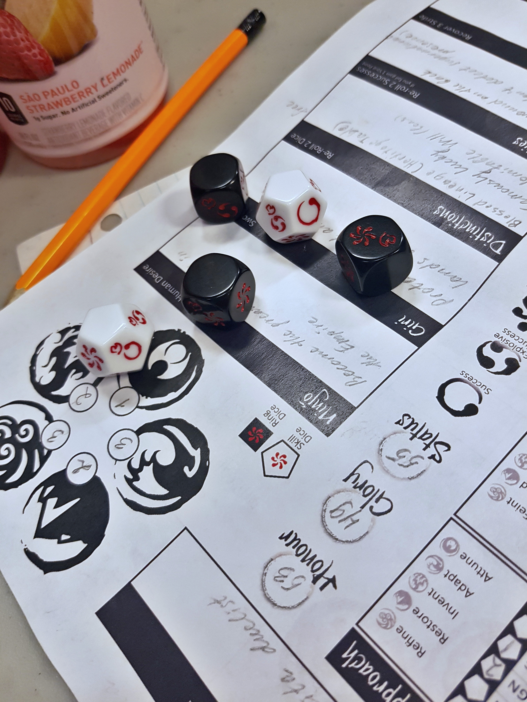

Я поделюсь впечатлениями о ролевой игре "Легенда пяти колец", в которую мы сыграли две компании на протяжении одного года. 

Компании не такие уж огромные, и они могли бы развиваться быстрее, просто мы не так часто собирались. По плану это должен был быть один день в неделю с перерывом в одну неделю. Иногда этот долгожданный день откладывался на неделю. Один раз мы много много раз так откладывали, что в итоге два месяца не было игры.

Мое первое ожидание от ролевой игры, это все вот эти вот расы, магия, монстры и квесты. Когда "Легенду пяти колец" представляют как средневековую Японию с духами - это совсем не сходится с моими ожиданиями. На самом деле все из моего списка в этой игре присутствует. Никаких эльфов, гномов или орков, но играть за человека тоже нормально.

Герои этой игры живут не бедно. Они самураи на службе у своего клана, подчиняются местному дамио и стоят на страже порядка. Мы пришли в группу как федеральный сыщик и сыщик местного масштаба (так называемые магистраты). И преступления начали крутиться в уездном городе Н.

5 колец - это пять стихий. Земля. Воздух. Огонь. Вода. И Пустота. У каждой стихии есть свой дух с которым маги могут общаться, а духи могут рассказывать информацию необходимую в расследовании.

И только в конце хотелось бы обратить внимание на механику. Кидать кубики в этой игре очень приятно. Если вы смотрели видео, как играют в подземелья и драконы, то представляете, что нужно посмотреть на свой навык, добавить бонус и кинуть кубик один раз и получить число на отрезке от 1 до 20. Некоторые ситуации позволяют кидать дважды и выбирать либо меньший результат или наибольший. Не сказать, что бросание большего числа кубиков отличается по статистике, но в этой механике есть нюанс, на который многие игроки молятся наподобие того как в подземельях и драконах выкинуть крит. Это взрывной успех, который является успехом, не приносит негативного эффекта и позволяет кинуть дополнительный кубик. Такая возможность есть на каждом кубике, но вероятность продолжать эту цепочку уменьшается с каждым броском.