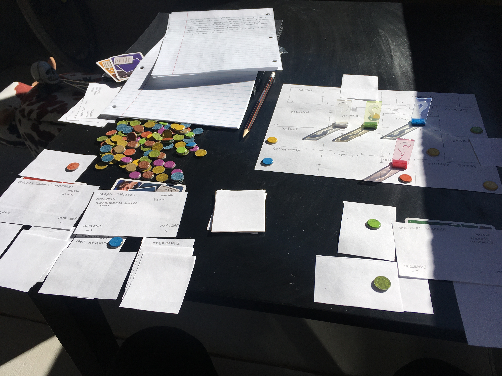

## Сюжет

Званая вечиринка в поместье

## Правила

[Подготовка](/ru/board-games/my-game/setup)

[Ход](/ru/board-games/my-game/turns)

[Навыки персонажей](/ru/board-games/my-game/abilities)

[Репутация](/ru/board-games/my-game/reputation)

[Квесты/задания](/ru/board-games/my-game/quests) (Происходящее)

[Предметы/репутация](/ru/board-games/my-game/items) (Осмотрительность)

## Заметки

- Самые сложные дела нельзя выполнить одним игроком - нужна группа или спец предмет
- Добавить возможность ликвидировать игрока ближе к концу игры, если он был замечен во многих делах.
- Какие правила действуют для увеличения числа игроков (складывание карт вместе из разных комплектов, увеличение числа комнат)?