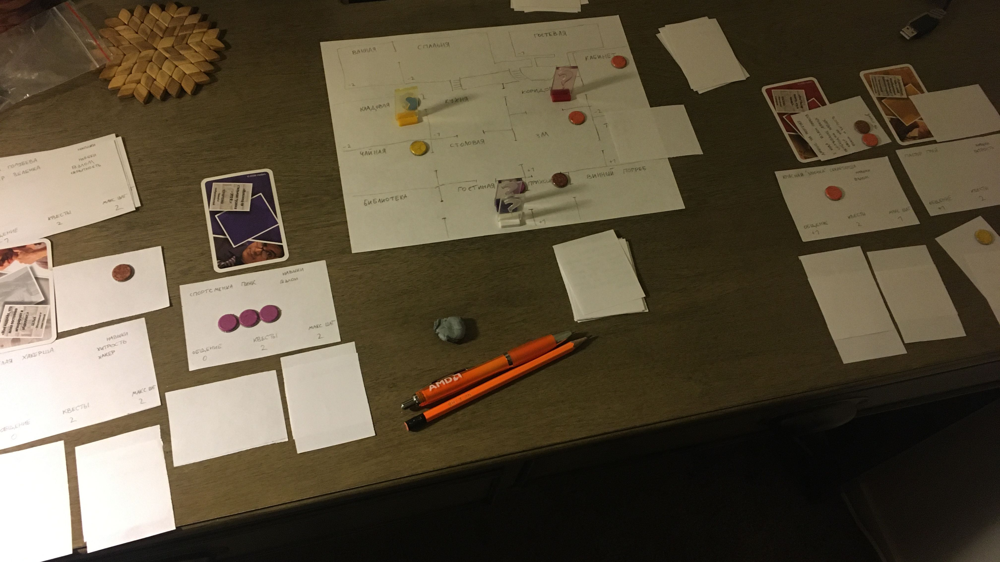

Каждый персонаж может иметь на руке не больше 3-х предметов. Это одинаковое ограничение для всех персонажей игры.

Заходя в комнату, персонаж берет карту из колоды предметов.

Предметы могут служить разгадкой к сюжетным квестам.

Карты репутации можно взять в руку, если позволяет лимит, и применить ее вместо того, чтобы тянуть новые карты. Как плюс, так и минус можно применить как на себя так и на любого персонажа в комнате.

