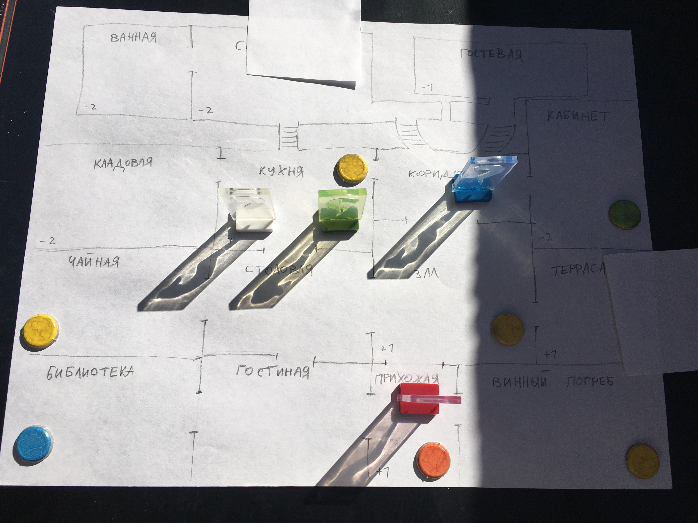

Для игры на 2 игрока каждому игроку достается по 2 персонажа - их тянут вслепую по очереди. Персонажи обладают своими [особыми навыками](./abilities)

Все персонажи помещаются в _столовую_.

Случайным образом раскладываются влияния на репутацию для каждой комнаты кроме столовой.
Перемешать колоды с картами "[Осмотрительности](./items)" (предметы) и "[Обстоятельства](./quests)" (квесты)

Каждый персонаж получает синие кубики [репутации](./reputation) равное числу, указанному на карте.

Можно переходить к тому как устроен [ход для каждого игрока](./turns)