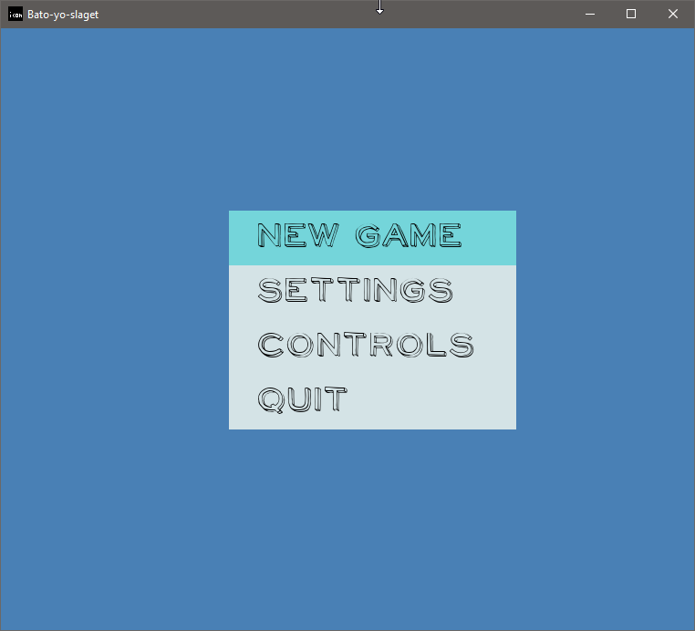
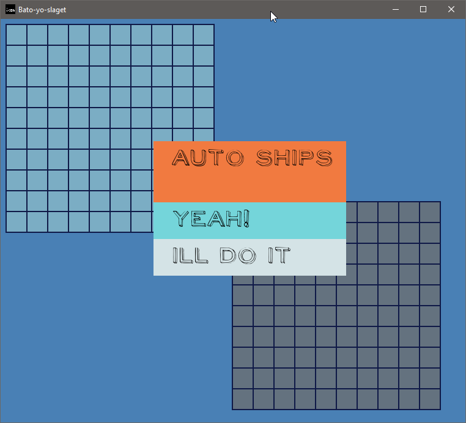
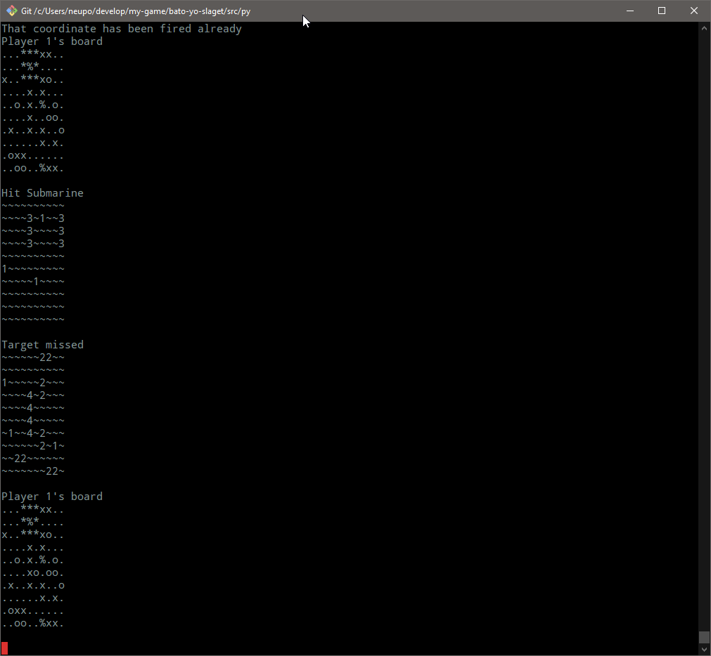
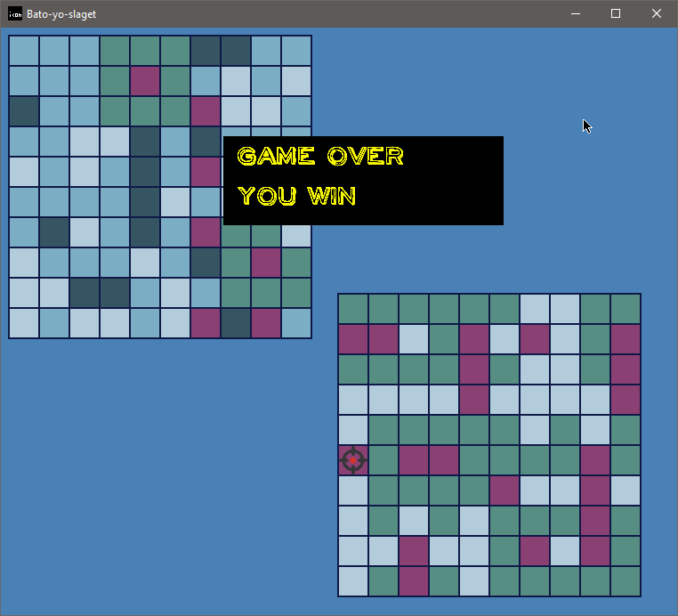

Бато йо слагет!

## Идея

Сначала появляется идея. Например, “я хочу сделать свою игру, нарисовать свой арт, написать музыку, за основу взять очень знакомую концепцию, но добавить туда оригинальных элементов”. Морской бой с дополнительными бонусными элементами, разведкой на вражеской территории и изменение позиций кораблей во время игры. Это уже звучит как много работы по проработке этих деталей еще на стадии прототипа. Но идея на этом не заканчивается. Это игра в стиле стимпанк с пиксель-арт графикой и аутентичной музыкой. Не побоюсь того, что в игре должна быть кампания с сюжетом.

Эта идея основывается на моем заключении, что тема стимпанка имеет свою привлекательную нишу; в интернете можно найти много концептуального арта, и на рынке не хватает только классических игр в этом направлении.

Это заключение меня подвело, когда я начал собирать графику [на Пинтересте](https://www.pinterest.com/nenikolay/game-design/battleship/) - хорошего арта очень мало. А пиксельного - тотальный ноль.

## Под капотом

Первая игра с питоновскими классами. Да, это игра, но я играл именно с классами. Идея была в том, чтобы сделать такую иерархию, чтобы отделить логику и сделать не зависящим от нее отображение объектов. Текстовый рендер, 2д рендер, 3д рендер (3д на питоне - это шутка).

## Этимология названия

Бато йо слагет

- **bato yo** - _морской_ с креольского на гаити
- **slaget** - _бой_ с норвежского и голландского 

## Оригинальные элементы

Фишка номер 1: [не квадратное поле](http://boardgamegeek.com/thread/605234/bravo-battleship). Если делать что-то непохожее и крутое, то на [гексах](http://www.redblobgames.com/grids/hexagons)! А если серьезно, то на гексах удобнее разворачиваться, брать радиусы.

Бонусный выстрел. Сам выстрел работает как обычно, но кроме этого в радиусе одной клетки помечает с вероятностью 50/50 наличие корабля. т.е. не факт, что покажет. может повести по ложному следу. может показать несколько точек и только одна будет истинной.

Восстановление тумана. Восстанавливать по одной не вижу, чтобы выглядело уместно. Произвольные клетки. Числом около 5-10. Клетки с подбитыми кораблями тоже считаются. Имеет смысл только, если корабли могут двигаться.

Можно открыть одну пустую клетку на своем поле взамен на дополнительный выстрел.

Противоракетная оборона. Ход противника можно отбить/остановить уже после того как известно место атаки. Поле остается не открытым.

Разведка. Можно заранее узнать что находится в нужной клетке. Если это клетка не пустая то есть шанс 50/50, что субмарина (однопалубный) будет рассекречен.

