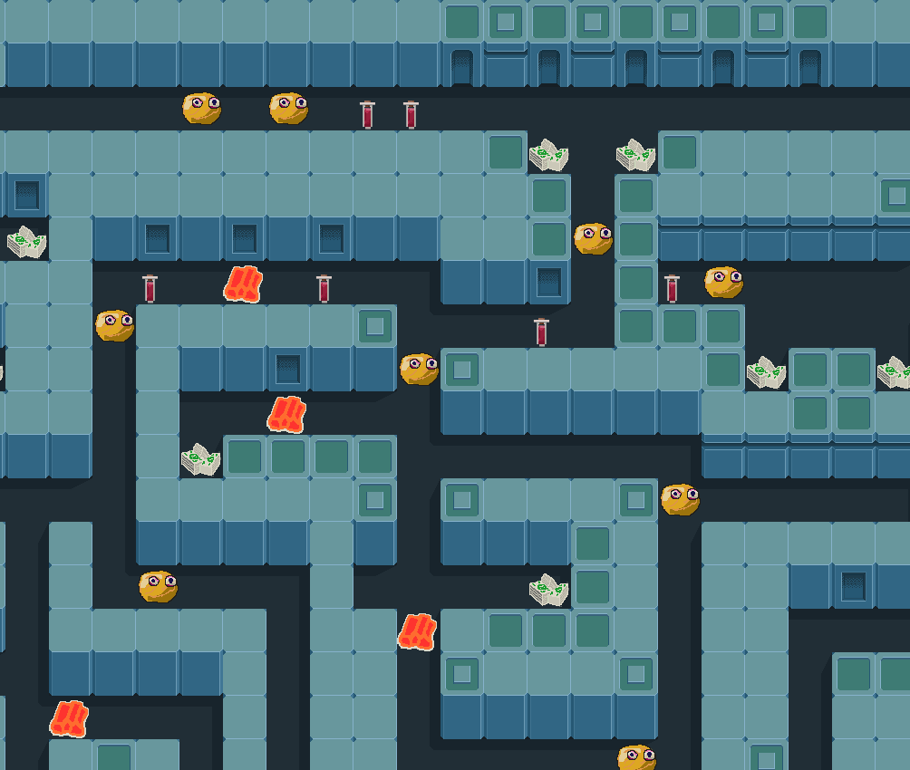

Главный герой - это ученый в институте. Его основная проблема - это девушки и отношения с ними. 

Игра начинается в кабинете ученого и его идей фикс на данный день стало пойти поговорить с девушкой, которую он встретил в холле. Она забыла свой блокнот на столике, где сидела в ожидании кого-то. Из блокнота мы узнаем, что она художник, но что важнее, это где ее можно попытаться найти в буднее время.

Если отправиться в художественную академию, то дальше вахтера нас не пропустят, а блокнот заберут. 

В институте есть одна приставучая лаборантка, которая постоянно приглашает нас съездить с ее родителями на дачу отведать солений. И это летом-то, когда нужно на свежее налегать. 

Еще есть молодой занудный тип, который только и спрашивает о прогрессе в работе, новых открытиях и вставляет одно предложение о его поездке в какую-нибудь страну на конференцию. Вроде, "Не могу больше есть персики из магазина после того, как одна бабушка на турецком пляже дала попробовать один."

Днем по коридорам института бегают крысы, ночью - собаки. Коридоры представляют собой лабиринты, по которым было бы скучно ходить если бы не...

Персонажи игры слоняющиеся по коридорам. И если они завидят вас, то непременно захотят поговорить. А нам это втягость. Своими разговорами они высасывают энергию из нас. Энергию высасывает тот у кого ее больше, а у кого энергии меньше - всегда находится в проигрошной стороне. Если у персонажа энергии под завязку, то он даже не будет затевать разговор. После плохого разговора персонаж не может бегать, наносить несколько ударов подряд.

Ничего не получилось, герой возвращается в свой кабинет и получает звонок, что нужно срочно готовиться к конференции. т.е. ночи напролет делать презентацию, подготавливать данные эксперимента.